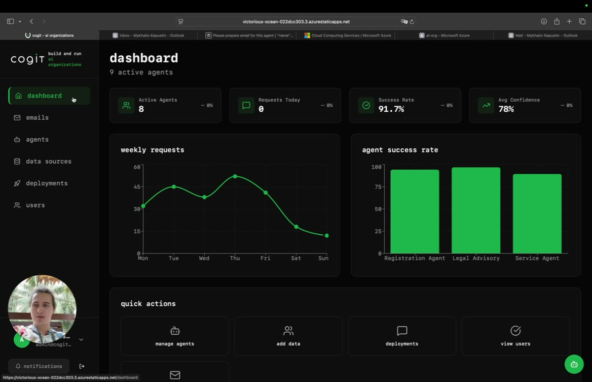

# Cogit — AI-organizations dashboard

**EN:** Overview of the Cogit console: active agents, request volume, and per-agent success rates.
**RU:** Обзор консоли Cogit: активные агенты, объём запросов и success rate по каждому агенту.

▶ **[Download / watch the video (MP4)](https://github.com/AdvancedScientificResearchProjects/asrp-portfolio-public/raw/main/demos/cogit-ai-organizations-overview/cogit-ai-organizations-overview.mp4)** — GitHub can't preview large videos inline, so this link downloads the file. / GitHub не воспроизводит крупные видео в браузере — ссылка скачивает файл.
