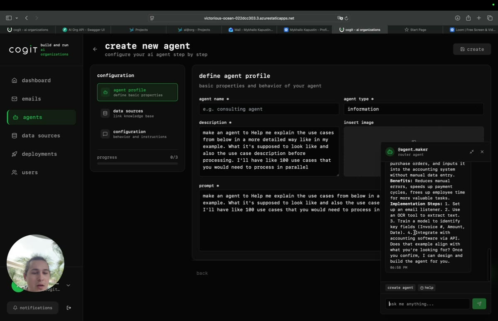

# Cogit — create an agent (router agent)

**EN:** Describing an agent in plain language; the router agent drafts a validated, deployable configuration.
**RU:** Описание агента на естественном языке; router-агент собирает провалидированную, готовую к развёртыванию конфигурацию.

▶ **[Download / watch the video (MP4)](https://github.com/AdvancedScientificResearchProjects/asrp-portfolio-public/raw/main/demos/cogit-create-agent-router/cogit-create-agent-router.mp4)** — GitHub can't preview large videos inline, so this link downloads the file. / GitHub не воспроизводит крупные видео в браузере — ссылка скачивает файл.
