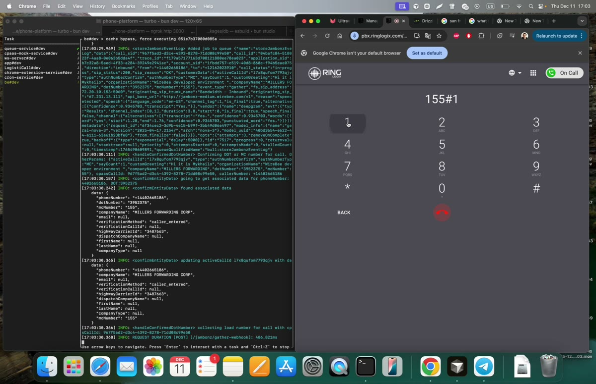

# Voice Agent — load found

**EN:** Inbound call (with audio) where the agent identifies a single load, confirms it, and transfers the qualified call to a human.
**RU:** Входящий звонок (со звуком): агент находит единственный груз, подтверждает и переводит квалифицированный звонок на человека.

▶ **[Download / watch the video (MP4)](https://github.com/AdvancedScientificResearchProjects/asrp-portfolio-public/raw/main/demos/voice-agent-load-found/voice-agent-load-found.mp4)** — GitHub can't preview large videos inline, so this link downloads the file. / GitHub не воспроизводит крупные видео в браузере — ссылка скачивает файл.
