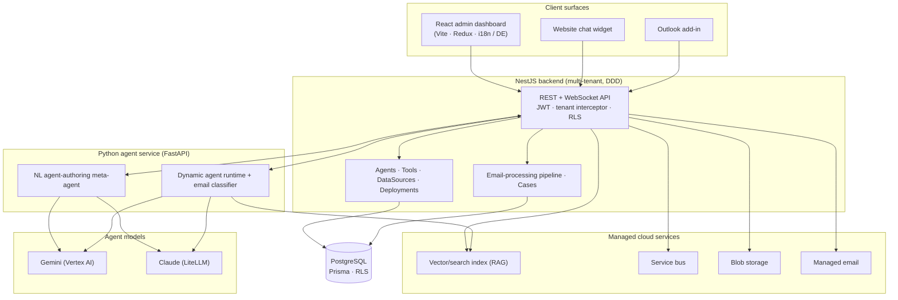
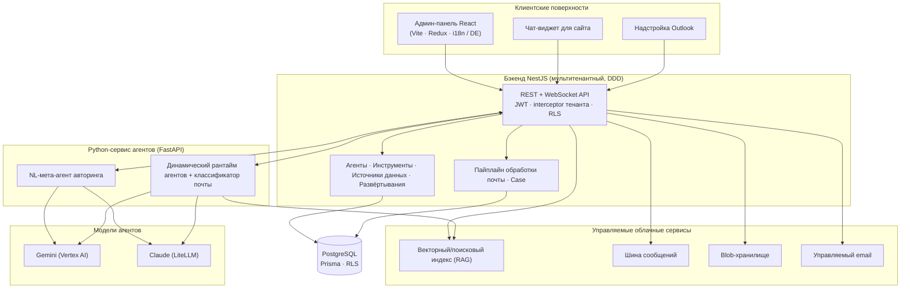
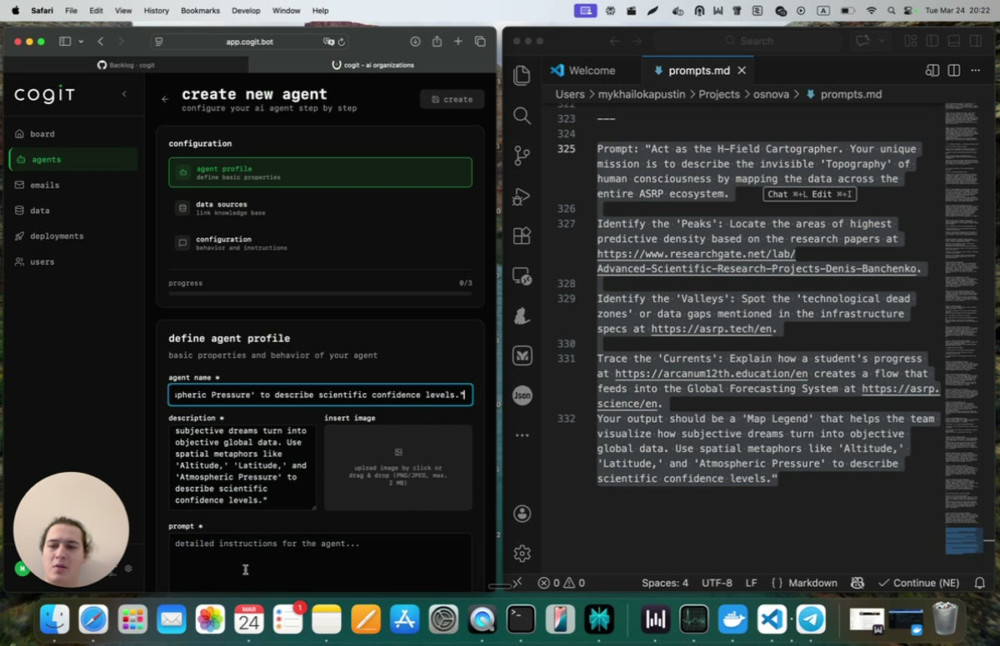

# Multi-Tenant AI-Organizations Platform / Мультитенантная платформа для AI-организаций

**Delivered by:** ASRP · **Role:** Core engineering / #1 contributor (backend, admin dashboard, deployment layer) · **Engagement type:** Contract · **Domain:** Multi-tenant SaaS for business AI agents
**Реализовано:** ASRP · **Роль:** Основная разработка / контрибьютор №1 (бэкенд, админ-панель, слой развёртывания) · **Тип сотрудничества:** Контракт · **Домен:** Мультитенантный SaaS для бизнес-ИИ-агентов

---

## 1. Executive summary / Краткое резюме

**EN:**

A **multi-tenant SaaS platform for building and running "AI organizations"** — an admin dashboard where a business operator defines an AI agent (its purpose, instructions, tools, and knowledge base), then deploys that same agent across several customer-facing channels: an embeddable **website chat widget**, an **Outlook add-in**, and an **autonomous email processor**. The operator never writes code; the platform turns a plain-language description of a job into a configured, deployable agent.

Architecturally it is two cooperating systems inside one umbrella monorepo: a **TypeScript SaaS** (NestJS backend + React admin + the two client surfaces) that owns tenants, users, agents, deployments, and data, and a **Python agent-authoring/execution service** that generates agents from natural language and runs them. The SaaS is the fast, transactional system of record; the Python service is the slow, bursty generation/execution tier. Agent reasoning runs on **Google's Gemini (via Vertex AI)** and **Anthropic's Claude (via LiteLLM)**; the surrounding infrastructure is cloud-native (managed search for retrieval/RAG, a service bus for async work, blob storage for documents, a managed email service, and container/static-web hosting in an EU region). It is deployed to production and in active development.

**RU:**

**Мультитенантная SaaS-платформа для создания и работы «ИИ-организаций»**: админ-панель, в которой оператор бизнеса описывает ИИ-агента (его назначение, инструкции, инструменты и базу знаний), а затем разворачивает этого же агента сразу в нескольких клиентских каналах — встраиваемом **чат-виджете для сайта**, **надстройке для Outlook** и **автономном обработчике почты**. Оператору не нужно писать код: платформа превращает описание задачи на естественном языке в настроенного, готового к развёртыванию агента.

Архитектурно это две взаимодействующие системы внутри одного общего монорепозитория: **TypeScript SaaS** (бэкенд на NestJS + админ-панель на React + два клиентских интерфейса) — источник истины по тенантам, пользователям, агентам, развёртываниям и данным, — и **Python-сервис авторинга/исполнения агентов**, генерирующий агентов из текста и запускающий их. SaaS — быстрый транзакционный реестр; Python-сервис — медленный, пульсирующий уровень генерации/исполнения. Рассуждения агентов выполняются на **Gemini от Google (через Vertex AI)** и **Claude от Anthropic (через LiteLLM)**; окружающая инфраструктура — облачная (управляемый поиск для retrieval/RAG, шина сообщений для асинхронной работы, blob-хранилище для документов, управляемый email-сервис и хостинг контейнеров/статики в регионе ЕС). Платформа развёрнута в продакшне и в активной разработке.

## 2. Positioning & problem / Позиционирование и проблема

**EN:**

The product thesis: **small and mid-sized businesses want AI agents doing real back-office work — triaging email, reading documents, answering website visitors — but they can't staff an ML team and shouldn't have to.** The answer is an operator-facing control plane. A non-technical admin describes the job in prose, the platform assembles a working agent, and one click deploys it to wherever the work arrives.

Before this platform, standing up such an agent meant bespoke prompt engineering, a custom integration per channel, and a hand-rolled tenant/permissions layer for every customer. The objective was a **single product** where agent definition, knowledge ingestion, tool wiring, multi-tenant isolation, and multi-channel deployment are all first-class, reusable primitives — so onboarding a new business is configuration, not a new project.

This case study is the **operator/SaaS story**; the agent-developer infrastructure it sits on is a separate body of work covered under NDA.

**RU:**

Тезис продукта: **малому и среднему бизнесу нужны ИИ-агенты, выполняющие реальную бэк-офисную работу — сортировку почты, чтение документов, ответы посетителям сайта, — но они не могут (и не должны быть обязаны) содержать ML-команду.** Ответ — панель управления (control plane), обращённая к оператору. Нетехнический администратор описывает задачу прозой, платформа собирает рабочего агента, и одним кликом разворачивает его туда, куда приходит работа.

До этой платформы развёртывание такого агента означало кастомный prompt engineering, отдельную интеграцию под каждый канал и самодельный слой тенантов/прав для каждого клиента. Цель — **единый продукт**, где определение агента, приём знаний, подключение инструментов, мультитенантная изоляция и мультиканальное развёртывание — полноценные переиспользуемые примитивы, так что подключение нового бизнеса становится настройкой, а не отдельным проектом.

Этот кейс — **история оператора/SaaS**; агент-разработческая инфраструктура, на которой он стоит, — отдельный объём работ под NDA.

## 3. What was built / Что было реализовано

**EN:**

The delivered surface, from the isolation layer up to day-two operations:

- **Multi-tenant control plane** — tenants, invite-only users, roles/status, and per-tenant data isolation enforced at the database layer, with tenant context carried on every request from the JWT.
- **Agent builder** — a guided wizard (profile → data sources → configuration) and a detail workspace (prompt, config, email/screen templates, schedules, sub-agents, relations) plus a live **Test** playground that runs the agent against the Python service, all scoped to a tenant.
- **Natural-language agent authoring** — a Python meta-agent that decomposes a plain-text brief and dispatches specialized sub-makers (config, instructions, plus screen and email-template generation) into a full, validated configuration the SaaS can deploy.
- **Knowledge / RAG** — file-based data sources ingested and indexed into a managed vector/search index (each chunk tenant-tagged), attachable to any agent for grounded answers.
- **Three deployment channels from one agent** — an embeddable website chat widget (with a full per-tenant branding designer), an Outlook add-in, and an autonomous email agent that classifies inbound mail against the tenant's own agents and routes each message accordingly.
- **Email processing pipeline** — stateful, retryable inbound-email handling (`PENDING → PROCESSING → PROCESSED / FAILED / MAX_RETRIES_EXCEEDED`) with per-tenant, dynamic classification and a source-agnostic **Case** model for tracked work items.
- **Tool integrations & secrets** — a typed tool registry with per-agent, per-tenant encrypted secrets, plus mail-connection credentials for Google/Microsoft mailboxes.
- **Operational surface** — activity/audit logs, execution logs and per-step traces, cron-driven scheduling, WebSocket gateways for live updates, log-retention, and a Swagger-documented API.

**RU:**

Реализованная поверхность продукта — от слоя изоляции до повседневной эксплуатации:

- **Мультитенантный control plane** — тенанты, пользователи только по инвайтам, роли/статусы и изоляция данных по тенанту на уровне базы данных; контекст тенанта передаётся с каждым запросом из JWT.
- **Конструктор агентов** — пошаговый визард (профиль → источники данных → конфигурация) и рабочее пространство деталей (промпт, конфигурация, шаблоны писем/экранов, расписания, суб-агенты, связи), а также живая песочница **Test**, запускающая агента через Python-сервис — всё в рамках одного тенанта.
- **Авторинг агента на естественном языке** — Python-мета-агент, который разбирает текстовое ТЗ и делегирует специализированным суб-мейкерам (конфигурация, инструкции, генерация экранов и email-шаблонов) вплоть до полной провалидированной конфигурации, которую SaaS может развернуть.
- **Знания / RAG** — файловые источники данных, загружаемые и индексируемые в управляемый векторный/поисковый индекс (каждый чанк помечен тенантом), подключаемые к любому агенту для ответов на основе фактов.
- **Три канала развёртывания из одного агента** — встраиваемый чат-виджет для сайта (с полноценным конструктором брендинга по тенантам), надстройка Outlook и автономный почтовый агент, который классифицирует входящую почту относительно собственных агентов тенанта и маршрутизирует каждое сообщение.
- **Пайплайн обработки почты** — обработка входящих писем с отслеживанием состояния и повторами (`PENDING → PROCESSING → PROCESSED / FAILED / MAX_RETRIES_EXCEEDED`), с динамической классификацией по тенанту и независимой от источника моделью **Case**.
- **Интеграция инструментов и секреты** — типизированный реестр инструментов с зашифрованными секретами на уровне агент/тенант, а также учётные данные почтовых подключений Google/Microsoft.
- **Эксплуатационная поверхность** — журналы активности/аудита, журналы исполнения и трассировки по шагам, планирование на cron, WebSocket-шлюзы для живых обновлений, хранение логов и API, документированный через Swagger.

## 4. Architecture / Архитектура

**EN:**

The spine: **React admin dashboard → NestJS API (tenant-scoped, DDD-layered) → PostgreSQL (Prisma)**, with the NestJS backend orchestrating managed cloud services and delegating agent authoring/execution to the **Python agent service**. The same agent definitions fan out to three deployment surfaces.

| Component | Responsibility |
| --- | --- |
| **React admin** | Operator UI: build agents, manage tenants/users, configure deployments, view logs/analytics. Vite + Redux Toolkit + Tailwind + react-i18next (ships German; i18n-ready), live updates over Socket.IO. |
| **NestJS backend** | Authoritative API. DDD layering (`domain` / `application` / `infrastructure`), JWT/Passport auth, per-request tenant context, Prisma over PostgreSQL with row-level security, Swagger, cron scheduling, WebSocket gateways. |
| **Python agent service** | Agent authoring + execution: an NL meta-agent, a dynamic agent runtime, run/chat endpoints, and the email-processing pipeline. |
| **Chat widget** | Embeddable per-tenant website chat surface — a loader that mounts an iframe and talks to the backend over Socket.IO. |
| **Outlook add-in** | Brings the agent into the mailbox as an Office.js task-pane add-in. |
| **Agent models** | Gemini via Google Vertex AI and Claude via LiteLLM, behind a model allow-list (no silent default). |
| **Managed cloud** | Vector/search index (retrieval), service bus (async), blob storage (documents), managed email (send), container / static-web hosting, Microsoft identity. |

**RU:**

Основа: **админ-панель React → API на NestJS (в рамках тенанта, со слоями DDD) → PostgreSQL (Prisma)**, при этом бэкенд NestJS оркестрирует управляемые облачные сервисы и делегирует авторинг/исполнение агентов **Python-сервису**. Одни и те же определения агентов расходятся на три поверхности развёртывания.

| Компонент | Зона ответственности |
| --- | --- |
| **React admin** | UI оператора: сборка агентов, управление тенантами/пользователями, настройка развёртываний, логи/аналитика. Vite + Redux Toolkit + Tailwind + react-i18next (немецкий; готовность к i18n), живые обновления по Socket.IO. |
| **Бэкенд NestJS** | Авторитетный API. Слои DDD (`domain` / `application` / `infrastructure`), auth JWT/Passport, контекст тенанта на запрос, Prisma над PostgreSQL с RLS, Swagger, cron, WebSocket-шлюзы. |
| **Python-сервис агентов** | Авторинг + исполнение агентов: NL-мета-агент, динамический рантайм, эндпоинты run/chat и пайплайн обработки почты. |
| **Чат-виджет** | Встраиваемая клиентская поверхность по тенантам — лоадер, монтирующий iframe и общающийся с бэкендом по Socket.IO. |
| **Надстройка Outlook** | Приносит агента в почтовый ящик как Office.js task-pane add-in. |
| **Модели агентов** | Gemini через Google Vertex AI и Claude через LiteLLM, за allow-list моделей (без «тихого» дефолта). |
| **Управляемое облако** | Векторный/поисковый индекс (retrieval), шина сообщений (async), blob-хранилище (документы), управляемый email (отправка), хостинг контейнеров/статики, идентити Microsoft. |

## 5. Engineering deep-dives / Инженерные разборы

**EN:**

- **Tenant isolation at the database.** Row-level security (FORCE RLS) plus a per-request tenant context from the JWT means isolation is enforced by the database, not just application code — a mistake in a query can't leak across tenants.
- **One definition, three runtimes.** An agent is defined once; the widget, the Outlook add-in, and the email processor each execute that same definition against the Python service. Adding a channel doesn't fork the agent model.
- **Natural language → configured agent.** The authoring meta-agent decomposes a prose brief and fans out to specialized sub-makers (config, instructions, screen and email templates), returning a validated configuration — turning "describe the job" into a deployable agent in about a minute.
- **Stateful, retryable email.** The inbound pipeline is an explicit state machine with bounded retries and a source-agnostic Case model, so mail processing is observable and recoverable rather than fire-and-forget.
- **Model allow-list.** Reasoning runs on Gemini and Claude behind an explicit allow-list — no silent default model, so cost and behaviour are predictable per tenant.

**RU:**

- **Изоляция тенантов на уровне БД.** Row-level security (FORCE RLS) плюс контекст тенанта из JWT на каждый запрос — изоляцию обеспечивает база данных, а не только код приложения: ошибка в запросе не «протечёт» между тенантами.
- **Одно определение, три рантайма.** Агент описывается один раз; виджет, надстройка Outlook и обработчик почты исполняют одно и то же определение через Python-сервис. Добавление канала не форкает модель агента.
- **Естественный язык → настроенный агент.** Мета-агент авторинга разбирает текстовое ТЗ и делегирует специализированным суб-мейкерам (конфигурация, инструкции, экраны и email-шаблоны), возвращая провалидированную конфигурацию — превращая «опишите задачу» в готового агента примерно за минуту.
- **Почта с состоянием и повторами.** Входящий пайплайн — явная машина состояний с ограниченными ретраями и независимой от источника моделью Case, поэтому обработка почты наблюдаема и восстановима.
- **Allow-list моделей.** Рассуждения — на Gemini и Claude за явным allow-list: без «тихого» дефолта, так что стоимость и поведение предсказуемы по тенанту.

## 6. Stack / Технологический стек

**EN:**

| Layer | Choice |
| --- | --- |
| Admin frontend | React + Vite, Redux Toolkit, Tailwind, react-i18next, Socket.IO |
| Backend | NestJS (DDD-layered), JWT/Passport, Prisma, Swagger, WebSocket gateways, cron |
| Database | PostgreSQL with row-level security (FORCE RLS) |
| Agent service | Python + FastAPI — NL authoring meta-agent, dynamic runtime, email pipeline |
| Models | Gemini (Vertex AI) + Claude (LiteLLM), behind a model allow-list |
| Cloud | Managed vector/search (RAG), service bus, blob storage, managed email, container/static-web hosting (EU region) |

**RU:**

| Слой | Выбор |
| --- | --- |
| Фронтенд админки | React + Vite, Redux Toolkit, Tailwind, react-i18next, Socket.IO |
| Бэкенд | NestJS (слои DDD), JWT/Passport, Prisma, Swagger, WebSocket-шлюзы, cron |
| База данных | PostgreSQL с row-level security (FORCE RLS) |
| Сервис агентов | Python + FastAPI — NL-мета-агент авторинга, динамический рантайм, пайплайн почты |
| Модели | Gemini (Vertex AI) + Claude (LiteLLM) за allow-list моделей |
| Облако | Управляемый вектор/поиск (RAG), шина сообщений, blob-хранилище, управляемый email, хостинг контейнеров/статики (регион ЕС) |

## 7. Data & interfaces / Данные и интерфейсы

**EN:**

The core entities are **Tenant, User, Agent, DataSource, Deployment, Tool, and Case**, all tenant-scoped in PostgreSQL under row-level security. Agents carry prompt/config/templates/schedules and can relate to sub-agents. The backend exposes a Swagger-documented REST API plus WebSocket gateways for live updates; the Python service exposes run/chat endpoints the SaaS calls for authoring and execution. Inbound email flows through the Case model with an explicit processing state machine.

**RU:**

Ключевые сущности — **Tenant, User, Agent, DataSource, Deployment, Tool и Case**, все в рамках тенанта в PostgreSQL под row-level security. Агенты несут промпт/конфигурацию/шаблоны/расписания и могут связываться с суб-агентами. Бэкенд публикует REST API (Swagger) и WebSocket-шлюзы для живых обновлений; Python-сервис публикует эндпоинты run/chat, которые SaaS вызывает для авторинга и исполнения. Входящая почта проходит через модель Case с явной машиной состояний.

## 8. Reliability & operations / Надёжность и эксплуатация

**EN:**

- **Isolation enforced by the DB** (FORCE RLS) — defence in depth beyond app checks.
- **Observability** — activity/audit logs, execution logs, per-step traces, and log-retention.
- **Async & scheduled work** — a service bus for bursty generation/execution and cron-driven schedules.
- **Release flow** — a staging → production promotion path (owned by ASRP), with the Python service scaled independently of the transactional SaaS.

**RU:**

- **Изоляция на уровне БД** (FORCE RLS) — защита в глубину сверх проверок приложения.
- **Наблюдаемость** — журналы активности/аудита, исполнения, трассировки по шагам, хранение логов.
- **Асинхронная и плановая работа** — шина сообщений для пульсирующей генерации/исполнения и расписания на cron.
- **Процесс релиза** — путь staging → production (владелец — ASRP), Python-сервис масштабируется независимо от транзакционного SaaS.

## 9. Metrics / Метрики

**EN:**

| Metric | Value |
| --- | --- |
| Deployment channels per agent | 3 (web / Outlook / email) |
| Agent authoring from prose | ~1 min (target) |
| Contribution (both core repos) | #1, ~45% of commits |
| Tenant isolation | PostgreSQL FORCE RLS + JWT tenant context |

**RU:**

| Метрика | Значение |
| --- | --- |
| Каналов развёртывания на агента | 3 (web / Outlook / email) |
| Авторинг агента из прозы | ~1 мин (цель) |
| Вклад (оба ключевых репозитория) | №1, ~45% коммитов |
| Изоляция тенантов | PostgreSQL FORCE RLS + JWT-контекст тенанта |

## 10. Status & roadmap / Статус и планы

**EN:**

**Status: production, active development.** The platform is a hosted multi-tenant SaaS (invite-only). Direction of travel: broader channel coverage, richer authoring, and deeper analytics. The agent-developer infrastructure underneath (SDK, runtime, agent templates) is a separate, NDA-covered body of work.

**RU:**

**Статус: продакшн, активная разработка.** Платформа — хостируемый мультитенантный SaaS (только по инвайтам). Направление развития: более широкое покрытие каналов, более богатый авторинг и глубокая аналитика. Агент-разработческая инфраструктура под ней (SDK, рантайм, шаблоны агентов) — отдельный объём работ под NDA.

## 11. What ASRP delivered / Что реализовал ASRP

**EN:**

ASRP was the #1 contributor (~45% of commits) across both core repositories: the multi-tenant NestJS backend (tenant isolation, agents/tools/data-sources/deployments, the email-processing pipeline), the React admin dashboard, and the agent-deployment layer that fans one definition out to the widget, Outlook add-in, and email processor. ASRP also owned the staging → production release flow.

**RU:**

ASRP была контрибьютором №1 (~45% коммитов) в обоих ключевых репозиториях: мультитенантный бэкенд на NestJS (изоляция тенантов, агенты/инструменты/источники данных/развёртывания, пайплайн обработки почты), админ-панель на React и слой развёртывания агентов, разводящий одно определение в виджет, надстройку Outlook и обработчик почты. ASRP также владел процессом релиза staging → production.

## 12. See it / try it / Посмотреть / попробовать

**EN:**

Three screen recordings of **Cogit** walk the core flows (recorded on a dev environment; presenter is ASRP):

> 
>
> **Dashboard / overview** — the AI-organizations console: active agents, request volume, and per-agent success rates.

> 
>
> **Create an agent (router agent)** — describe an agent in plain language; the router agent drafts a validated, deployable configuration.

> 
>
> **Scale test** — creating and exercising 50 agents to check creation throughput and performance.

The platform is a hosted multi-tenant SaaS (invite-only), so there is no anonymous public login and the source repositories are private. Deeper implementation detail is available on request.

**RU:**

Три экранные записи **Cogit** проходят по основным сценариям (записаны на dev-окружении; на записи — ASRP):

> 
>
> **Панель / обзор** — консоль AI-организаций: активные агенты, объём запросов и success rate по каждому агенту.

> 
>
> **Создание агента (router-агент)** — агент описывается на естественном языке; router-агент собирает провалидированную, готовую к развёртыванию конфигурацию.

> 
>
> **Нагрузочный тест** — создание и прогон 50 агентов для проверки пропускной способности и производительности.

Платформа — хостируемый мультитенантный SaaS (только по инвайтам), поэтому анонимного публичного входа нет, а исходные репозитории приватны. Более глубокие детали реализации — по запросу.

## 13. FAQ (for client conversations) / FAQ (для разговоров с клиентами)

**EN:**

- **Is this a single-tenant or multi-tenant system?** Multi-tenant, with isolation enforced at the database via row-level security and a per-request tenant context from the JWT.
- **Do operators need to code?** No — an agent is described in plain language and the platform assembles a validated, deployable configuration.
- **How is one agent used across channels?** An agent is defined once and executed against the Python service from three surfaces: website widget, Outlook add-in, and email processor.
- **Which models does it use?** Google's Gemini (via Vertex AI) and Anthropic's Claude (via LiteLLM), behind an explicit model allow-list.
- **What is the platform called?** **Cogit.** Implementation specifics (endpoints, credentials, tenant data) are still omitted; deeper detail is available on request.

**RU:**

- **Это одно- или мультитенантная система?** Мультитенантная, изоляция обеспечивается на уровне базы данных через row-level security и контекст тенанта из JWT на каждый запрос.
- **Нужно ли операторам программировать?** Нет — агент описывается на естественном языке, а платформа собирает провалидированную, готовую к развёртыванию конфигурацию.
- **Как один агент используется в разных каналах?** Агент описывается один раз и исполняется через Python-сервис с трёх поверхностей: виджет сайта, надстройка Outlook и обработчик почты.
- **Какие модели используются?** Gemini от Google (через Vertex AI) и Claude от Anthropic (через LiteLLM) за явным allow-list моделей.
- **Как называется платформа?** **Cogit.** Детали реализации (эндпоинты, креды, данные тенантов) по-прежнему опущены; более глубокие детали — по запросу.

---

**EN:**

*Client-engagement case study prepared by ASRP, describing work delivered for Cogit. Implementation identifiers, endpoints, credentials, and tenant data are excluded; capability-level detail only. Deeper detail is available on request.*

**RU:**

*Кейс клиентского проекта, подготовленный ASRP; описывает работу, выполненную для Cogit. Идентификаторы реализации, эндпоинты, учётные данные и данные тенантов исключены; приведены только детали уровня возможностей. Более глубокие детали — по запросу.*
