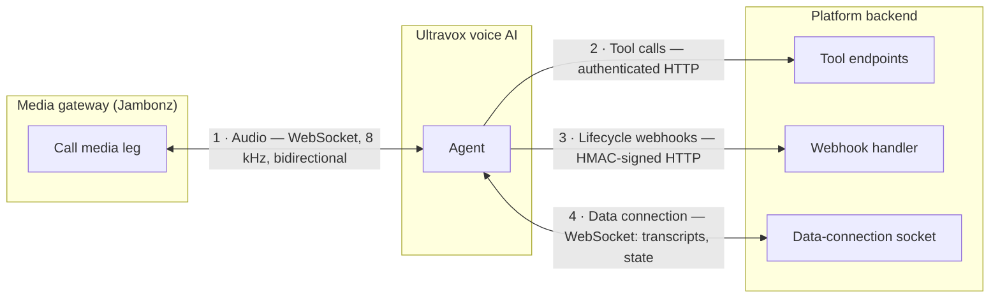
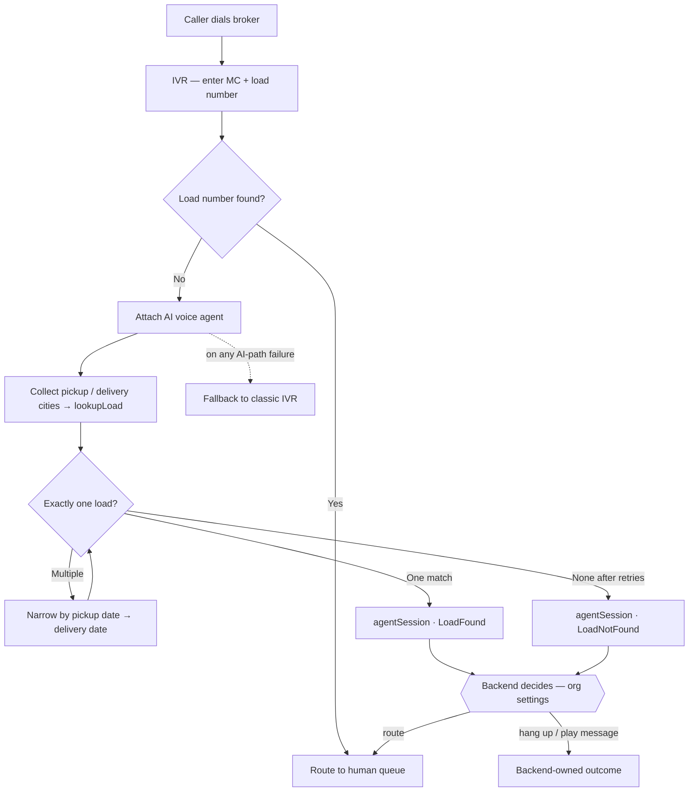
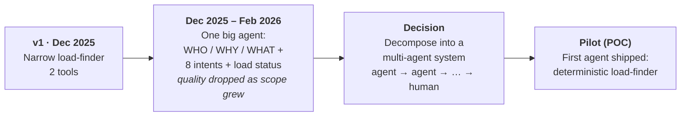
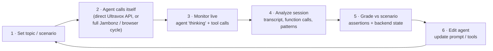

# AI Voice Agent for Inbound Carrier Call Handling / AI-голосовой агент для обработки входящих звонков перевозчиков

**Delivered by:** ASRP · **Role:** ASRP owned the voice-AI feature (design, implementation, roadmap) · **Engagement type:** Independent contractor · **Domain:** Cloud telephony for freight logistics
**Исполнитель:** ASRP · **Роль:** ASRP полностью владела фичей голосового ИИ (проектирование, реализация, дорожная карта) · **Тип сотрудничества:** независимый подрядчик · **Домен:** облачная телефония для грузовой логистики

**EN:**

> **Public case study.** Work delivered by ASRP for **WireBee**. Proprietary source, internal
> identifiers, and security-sensitive operational details are omitted; deeper technical detail is
> available on request.

**RU:**

> **Публичный кейс-стади.** Работа выполнена ASRP для **WireBee**. Проприетарный исходный код, внутренние идентификаторы и чувствительные операционные детали безопасности опущены; более глубокие технические подробности — по запросу.

---

## 1. Executive summary / Резюме

**EN:**

The client is a cloud telephony platform for freight logistics, sitting between **carriers** (trucking companies hauling freight) and **brokers** (who arrange it). On every inbound carrier call, the platform already enriches the call with business context: it looks the calling number up against its databases, checks whether it's tied to a known carrier, and runs a traditional IVR ("enter your MC number", "enter the load number") before the call reaches a human.

ASRP designed and built the **voice-AI agent** that upgrades that IVR. When a caller's load number can't be matched, the call hands off to a conversational agent that identifies the shipment by voice — reference number, or origin/destination and dates — and then reports a structured result so the backend can route a qualified call into the human queue. The agent is **conversational to the caller but strictly deterministic under the hood**: it never invents shipment data, it never decides the call's fate on its own, and it degrades gracefully back to the classic IVR if anything fails.

The system integrates the speech-native AI platform **Ultravox**[^ultravox] into the platform's existing **Jambonz**[^jambonz] **+ Bandwidth**[^bandwidth] telephony stack over four independent communication channels, with real-time transcription, event-driven routing, and a dedicated testing / self-evolution harness.

**RU:**

Клиент — это облачная платформа телефонии для грузовой логистики, работающая между **перевозчиками** (транспортными компаниями, перевозящими грузы) и **брокерами** (которые организуют перевозку). При каждом входящем звонке от перевозчика платформа уже обогащает звонок бизнес-контекстом: сверяет номер звонящего с базами данных, проверяет, привязан ли он к известному перевозчику, и прогоняет звонок через классическое IVR-меню ("введите ваш MC-номер", "введите номер груза"), прежде чем звонок доходит до человека.

ASRP спроектировала и построила **голосового ИИ-агента**, который апгрейдит это IVR. Когда номер груза, названный звонящим, не удаётся сопоставить, звонок передаётся диалоговому агенту, который идентифицирует отгрузку по голосу — по референс-номеру либо по городам отправления/назначения и датам — а затем сообщает структурированный результат, чтобы бэкенд мог направить квалифицированный звонок в очередь на живого оператора. Агент **диалоговый для звонящего, но строго детерминированный внутри**: он никогда не выдумывает данные о грузе, никогда не решает судьбу звонка самостоятельно и корректно откатывается к классическому IVR при любом сбое.

Система интегрирует речевую нативную ИИ-платформу **Ultravox**[^ultravox-ru] в уже существующий стек телефонии платформы на базе **Jambonz**[^jambonz-ru] **+ Bandwidth**[^bandwidth-ru] по четырём независимым каналам коммуникации, с транскрипцией в реальном времени, событийно-ориентированной маршрутизацией и выделенным контуром для тестирования и самообучения.

## 2. Business context & the problem / Бизнес-контекст и проблема

**EN:**

The platform's value is turning a raw phone call into an **enriched, verified business event** — *who* is calling, from *which* carrier company, about *which* load, and *why*. Caller ID alone proves little, so the platform ties the number to MC/DOT identity, carrier authority status, associated carriers, prior calls, and compliance state before a human ever has to work it out.

The weak point was the **first stage of the call**. Baseline flow: the carrier calls a broker's number → enters an MC number and a load number in the IVR → gets routed to a human. By the time a human answers, they know **WHO** is calling (from the MC) and **WHAT** load (from the number entered) — but **not WHY**, and there is no continuity between calls. In practice that produced:

- **A missing "why" at handoff** — the human picks up without knowing the reason for the call.
- **No continuity** — "hey, transfer me back to the person I was just talking to" has no answer; callers phone back repeatedly to clarify or follow up.
- **Dead ends** — a rigid menu can't handle a carrier who doesn't have the exact load number, or a natural request like "I'm the driver for the Chicago pickup tomorrow."

The objective: replace the rigid first stage with an agent that establishes the missing facts **before** a human is involved, and carries that context across the handoff.

**RU:**

Ценность платформы — превращать обычный телефонный звонок в **обогащённое, верифицированное бизнес-событие**: *кто* звонит, *от какой* транспортной компании, *по какому* грузу и *зачем*. Один только номер звонящего мало что доказывает, поэтому платформа связывает номер с идентичностью MC/DOT, статусом полномочий перевозчика, связанными перевозчиками, историей звонков и статусом комплаенса — ещё до того, как это придётся выяснять человеку.

Слабым местом была **первая стадия звонка**. Базовый сценарий: перевозчик звонит на номер брокера → вводит MC-номер и номер груза в IVR → его направляют к человеку. К моменту, когда человек берёт трубку, он знает **КТО** звонит (по MC) и **ПО КАКОМУ** грузу (по введённому номеру) — но **не ЗАЧЕМ**, и нет никакой преемственности между звонками. На практике это приводило к следующему:

- **Отсутствие «зачем» при передаче** — человек берёт трубку, не зная причины звонка.
- **Отсутствие преемственности** — на просьбу «переключите меня обратно на человека, с которым я только что говорил» нет ответа; звонящие перезванивают снова и снова, чтобы что-то уточнить или узнать статус.
- **Тупики** — жёсткое меню не может обработать перевозчика, у которого нет точного номера груза, или естественный запрос вроде «я водитель, который забирает груз в Чикаго завтра».

Задача: заменить жёсткую первую стадию агентом, который устанавливает недостающие факты **до** подключения человека и переносит этот контекст через передачу звонка.

## 3. What ASRP was asked to do / Что было поручено ASRP

**EN:**

The client already had a **call model** implemented in their backend (call state, legs, IVR). ASRP's mandate was to extend it and make the front of the call intelligent:

1. **Extend the call model** so the backend can carry a call **classification — WHO / WHY / WHAT** — not just call plumbing.
2. **Make the IVR intelligent.** At the database level, associate the calling **number with a specific carrier** (so a future call can proactively ask *"are you calling on behalf of X?"*), track WHO/WHY/WHAT across calls, and on a **repeat call** immediately ask *"same carrier? same load?"* — giving the continuity the old flow lacked.
3. **Insert a switch-to-agent step** into the standard call flow: a voice agent the caller can tell *what* and *why* they're calling, whose structured result lets the backend route the call to the right human.

**RU:**

У клиента уже была реализована **модель звонка** в бэкенде (состояние звонка, «ноги» (legs) звонка, IVR). Мандат ASRP заключался в том, чтобы расширить эту модель и сделать начало звонка интеллектуальным:

1. **Расширить модель звонка**, чтобы бэкенд мог нести **классификацию звонка — КТО / ЗАЧЕМ / ЧТО** — а не только техническую механику звонка.
2. **Сделать IVR интеллектуальным.** На уровне базы данных связать звонящий **номер с конкретным перевозчиком** (чтобы будущий звонок мог проактивно спросить *«вы звоните от лица X?»*), отслеживать КТО/ЗАЧЕМ/ЧТО между звонками и при **повторном звонке** сразу спрашивать *«тот же перевозчик? тот же груз?»* — давая ту самую преемственность, которой не хватало старому потоку.
3. **Встроить шаг перехода к агенту** в стандартный поток звонка: голосовой агент, которому звонящий может сообщить *что* и *зачем* он звонит, чей структурированный результат позволяет бэкенду направить звонок нужному человеку.

## 4. System architecture / Архитектура системы

**EN:**

The call spine is `Caller → Bandwidth (telco/SIP) → Jambonz (media gateway) → platform backend`. The backend attaches the AI agent to the live call and mediates every interaction with it.

```
Caller ──▶ Bandwidth ──▶ Jambonz ──▶ Platform backend
                                          │
                              attaches AI voice agent
                                          ▼
                                Ultravox (voice AI)
                                          │
                     structured load result (HTTP tools)
                                          ▼
                          route qualified call → human queue
```

### The four-channel integration (core design)

The essential design insight is that the AI and the backend communicate over **four independent channels**, each a different protocol with a different job. Cleanly separating them is what makes the integration robust.



| # | Channel | Protocol | Purpose |
| --- | --- | --- | --- |
| 1 | **Audio** | WebSocket, 8 kHz, bidirectional | Voice media between gateway and AI |
| 2 | **Tool calls** | HTTP POST, Bearer-authenticated | Agent looks up loads/carriers and reports events; backend owns all data |
| 3 | **Lifecycle webhooks** | HTTP POST, HMAC-SHA256 signed | Backend tracks call state (`call.started`/`joined`/`ended`) independently of the conversation |
| 4 | **Data connection** | WebSocket | Real-time transcripts + control messages; transcripts persisted and broadcast live to the human-agent UI |

**RU:**

Хребет звонка — `Звонящий → Bandwidth (телефония/SIP) → Jambonz (медиа-шлюз) → бэкенд платформы`. Бэкенд подключает ИИ-агента к живому звонку и опосредует каждое взаимодействие с ним.

```
Caller ──▶ Bandwidth ──▶ Jambonz ──▶ Platform backend
                                          │
                              attaches AI voice agent
                                          ▼
                                Ultravox (voice AI)
                                          │
                     structured load result (HTTP tools)
                                          ▼
                          route qualified call → human queue
```

### Интеграция по четырём каналам (ключевое проектное решение)

Ключевая идея дизайна в том, что ИИ и бэкенд общаются по **четырём независимым каналам**, каждый — отдельный протокол со своей задачей. Чёткое разделение этих каналов — то, что делает интеграцию надёжной.


| # | Канал | Протокол | Назначение |
| --- | --- | --- | --- |
| 1 | **Аудио** | WebSocket, 8 кГц, двунаправленный | Голосовой медиапоток между шлюзом и ИИ |
| 2 | **Вызовы инструментов (Tool calls)** | HTTP POST, аутентификация Bearer | Агент ищет грузы/перевозчиков и сообщает о событиях; всеми данными владеет бэкенд |
| 3 | **Webhook'и жизненного цикла** | HTTP POST, подпись HMAC-SHA256 | Бэкенд отслеживает состояние звонка (`call.started`/`joined`/`ended`) независимо от диалога |
| 4 | **Соединение данных (Data connection)** | WebSocket | Транскрипты и управляющие сообщения в реальном времени; транскрипты сохраняются и транслируются вживую в интерфейс человека-оператора |

## 5. The pilot agent / Пилотный агент

**EN:**

The pilot agent is deliberately **narrow and on-rails**. It is attached to a call **only when a caller has already provided a load number in the IVR and it was not found in the system** — so it joins mid-IVR, not as a general chatbot.



Its single job is to **identify exactly one shipment by voice**:

- Ask for pickup and delivery **cities/states**, then search.
- If multiple loads match, **narrow by pickup date, then delivery date**; if still ambiguous, read out the candidates and let the caller pick. Natural date expressions ("tomorrow", "next Friday") are normalized to `YYYY-MM-DD`.
- Product insight baked into the flow: find *a matching* load, not necessarily one exact record.

It runs on **two tools** — `lookupLoad` (search) and `agentSession` (event reporter) — and two guiding principles that make it trustworthy:

- **Report, don't decide.** The agent only *reports* what happened (`LoadFound`, `LoadNotFound`, and edge events); the **backend** decides whether to transfer or hang up, based on organization settings. The agent may not end the call.
- **Voice and tools are separate channels.** On a terminal result the agent calls the tool **silently and stops speaking** — the backend owns every caller-facing message. (A small touch: it says *"Found it, one second."* purely to mask tool-call latency.)

**Edge cases** map to defined events rather than agent improvisation: `CallerCannotProvideInfo`, `Silence`, `CallerRequestedHangup`, `AbusiveCaller`, and `OffTopicQuestion` (rates/tracking/dispatch/payments are deflected once, then the flow continues).

**RU:**

Пилотный агент намеренно **узкий и работает строго «по рельсам»**. Он подключается к звонку **только когда звонящий уже назвал номер груза в IVR, и он не был найден в системе** — то есть агент включается в середине IVR-потока, а не как универсальный чат-бот.


Его единственная задача — **идентифицировать ровно одну отгрузку по голосу**:

- Спросить города/штаты отправления и назначения, затем выполнить поиск.
- Если совпадает несколько грузов, **сузить по дате отправления, затем по дате доставки**; если неоднозначность сохраняется — озвучить варианты и дать звонящему выбрать. Естественные выражения дат («завтра», «в следующую пятницу») нормализуются в формат `YYYY-MM-DD`.
- Продуктовое наблюдение, заложенное в логику: найти *подходящий* груз, а не обязательно одну точную запись.

Агент работает всего на **двух инструментах** — `lookupLoad` (поиск) и `agentSession` (репортёр событий) — и на двух руководящих принципах, которые делают его надёжным:

- **Сообщай, а не решай.** Агент только *сообщает* о том, что произошло (`LoadFound`, `LoadNotFound` и граничные события); **бэкенд** решает, переводить звонок или завершать его, основываясь на настройках организации. Агент не имеет права завершить звонок.
- **Голос и инструменты — разные каналы.** При терминальном результате агент вызывает инструмент **молча и перестаёт говорить** — всеми сообщениями, обращёнными к звонящему, владеет бэкенд. (Небольшая деталь: агент говорит *«Нашёл, секунду»* исключительно для маскировки задержки вызова инструмента.)

**Граничные случаи** отображаются в заранее определённые события, а не в импровизацию агента: `CallerCannotProvideInfo`, `Silence`, `CallerRequestedHangup`, `AbusiveCaller` и `OffTopicQuestion` (вопросы о тарифах/трекинге/диспетчеризации/оплатах отклоняются один раз, после чего поток продолжается).

## 6. What an actual call sounds like / Как звучит реальный звонок

**EN:**

*(Every name, city, and reference number below is invented for this illustration — no real caller, carrier, or load data.)*

The caller has already been through the IVR and entered a load number that didn't match — that's the trigger described in §5. Bandwidth and Jambonz hand the call to the agent mid-flow; the caller has no idea a different system just picked up the line.

**Agent:** "Sorry, I wasn't able to find a load with that number. Can you give me the pickup and delivery cities instead?"

**Caller:** "Uh, yeah — picking up in Modesto, dropping in Reno."

*(silently: `lookupLoad({ pickupCity: "Modesto", deliveryCity: "Reno" })` — two candidates come back)*

**Agent:** "I've got two loads on that lane. Do you know the pickup date?"

**Caller:** "Tomorrow."

*("Tomorrow" is anchored to the call's actual date and converted to `YYYY-MM-DD` before it ever reaches a tool call — never passed through as-is. Re-queried, narrowed to one match.)*

**Agent:** "Found it, one second."

*(The agent starts the `agentSession(LoadFound)` tool call the instant it starts that sentence, not after — so the caller hears speech, not dead air, while the backend records the result and prepares the transfer. Then the agent goes silent: the backend speaks next, not the agent.)*

**Backend (queue transfer):** "Connecting you now."

A second excerpt shows the agent holding the rails when the caller drifts off-topic:

**Caller:** "Hey, while I've got you — what's the rate on this one?"

**Agent:** "I can't get into rates on this line, but let's get your load squared away first — what are the pickup and delivery cities?"

*(`OffTopicQuestion` is logged and deflected once; the flow continues. The agent doesn't refuse the topic forever, and it doesn't wander into a conversation it has no authority over.)*

> [](../../demos/voice-agent-load-found/) [](../../demos/voice-agent-load-not-found/)
>
> **Demo (with audio).** Two call recordings — made on a dev environment with seeded, non-real data — capture both terminal paths of the pilot agent end to end, and are included in the portfolio (they load from the repo): [`demos/voice-agent-load-found.mp4`](../../demos/voice-agent-load-found/) and [`demos/voice-agent-load-not-found.mp4`](../../demos/voice-agent-load-not-found/). The **found** path: the agent identifies a single load, fires `agentSession(LoadFound)`, speaks its bridging line, then goes silent while the backend transfers the qualified call to the human queue. The **not-found** path: search resolves to no single load after retries, the agent fires `agentSession(LoadNotFound)`, and the backend hands the caller to a human with a graceful message. A broader engagement evidence archive — 20-plus further screen/phone recordings, call transcripts, and UI screenshots — remains available under NDA.

**RU:**

*(Каждое имя, город и референс-номер ниже вымышлены исключительно для иллюстрации — никаких реальных данных о звонящем, перевозчике или грузе.)*

Звонящий уже прошёл через IVR и ввёл номер груза, который не совпал — это триггер, описанный в §5. Bandwidth и Jambonz передают звонок агенту прямо посреди потока; звонящий не подозревает, что трубку только что взяла другая система.

**Агент:** «Извините, я не смог найти груз с таким номером. Можете назвать города отправления и назначения?»

**Звонящий:** «Э-э, да — забираю в Модесто, везу в Рино».

*(молча: `lookupLoad({ pickupCity: "Modesto", deliveryCity: "Reno" })` — приходит два кандидата)*

**Агент:** «На этом направлении у меня два груза. Знаете дату отправления?»

**Звонящий:** «Завтра».

*(«Завтра» привязывается к фактической дате звонка и преобразуется в `YYYY-MM-DD` до того, как попадёт в вызов инструмента — никогда не передаётся «как есть». После повторного запроса остаётся один вариант.)*

**Агент:** «Нашёл, секунду».

*(Агент запускает вызов инструмента `agentSession(LoadFound)` в тот же момент, когда начинает произносить эту фразу, а не после неё — так звонящий слышит речь, а не тишину, пока бэкенд фиксирует результат и готовит перевод. После этого агент замолкает: дальше говорит бэкенд, а не агент.)*

**Бэкенд (перевод в очередь):** «Соединяю вас».

Второй отрывок показывает, как агент удерживает «рельсы», когда звонящий уходит от темы:

**Звонящий:** «Слушай, раз уж я на связи — какой тариф на этот груз?»

**Агент:** «По этой линии я не могу обсуждать тарифы, но давайте сначала разберёмся с грузом — какие города отправления и назначения?»

*(`OffTopicQuestion` логируется и отклоняется один раз; поток продолжается. Агент не отказывается от темы навсегда и не уходит в разговор, на который у него нет полномочий.)*

> [](../../demos/voice-agent-load-found/) [](../../demos/voice-agent-load-not-found/)
>
> **Демо (со звуком).** Две записи звонков — сделаны на dev-окружении с фейковыми (не реальными) данными — фиксируют оба терминальных пути пилотного агента от начала до конца и включены в портфолио (грузятся из репозитория): [`demos/voice-agent-load-found.mp4`](../../demos/voice-agent-load-found/) и [`demos/voice-agent-load-not-found.mp4`](../../demos/voice-agent-load-not-found/). Путь **«найдено»**: агент идентифицирует единственный груз, вызывает `agentSession(LoadFound)`, произносит связующую фразу и замолкает, пока бэкенд переводит квалифицированный звонок в очередь на человека. Путь **«не найдено»**: поиск не сводится к единственному грузу после повторов, агент вызывает `agentSession(LoadNotFound)`, и бэкенд передаёт звонящего человеку с корректным сообщением. Более широкий архив доказательств проекта — 20+ прочих экранных/телефонных записей, транскрипты звонков и скриншоты UI — остаётся доступным по NDA.

## 7. From one big agent to a multi-agent system / От одного большого агента к мультиагентной системе

**EN:**

The pilot's load-finder is one focused agent carved out of a much richer agent that ASRP built and exercised during the engagement. The evolution — and the key architectural decision behind it — went like this:



Along the way ASRP built the full first-stage capability set — initially inside one agent:

- **WHO — carrier identity.** MC number (primary), carrier name, caller name, and caller **type** (`driver` / `dispatcher` / `third_party_dispatch` / `owner_operator`). Carrier and caller are modeled **separately** (like *company* vs *contact* in a CRM), because one caller can represent multiple carriers. Known numbers are confirmed ("is this ABC Freight?"); unknown numbers are asked for the MC.
- **WHY — intent classification.** An 8-value intent taxonomy — `LOAD_INQUIRY` (the majority of calls), `CALLBACK`, `POST_BOOKING_SUPPORT`, `ONBOARDING_COMPLIANCE`, `IN_TRANSIT_STATUS`, `BILLING_PAYMENT`, `EXCEPTION_URGENT`, `OTHER_UNKNOWN` — each with a **confidence score**; below 0.70 the agent asks one clarifying question instead of guessing.
- **WHAT — load identification** with the multi-match narrowing funnel described above, plus **load-status handling**: `POSTED` (available → proceed), `UNPOSTED` (unavailable), `DELETED` (already covered) — the agent only completes on an available load.
- **Incremental events** that update backend call-state while the conversation continues, with a terminal completion event that triggers routing.

**Why the pilot is a single load-finder.** As that one agent's responsibility grew — classify the intent, identify the carrier, find the load, handle every edge case — its quality on each individual task got *worse*. A bigger remit made a weaker agent. So rather than push one monolithic agent to do everything, the design decision was to **decompose it into a multi-agent system**: each agent owns a narrow job and can **hand the call off to another agent** when the task changes — agent to agent, until the call reaches a human. That decomposition is partially built (including a stage-based split explored in the framework); the product's proof-of-concept **launched on the first agent in that system — the deterministic load-finder**. (Real-call analysis independently reinforced the case for narrow agents: a broad agent was brittle in a noisy phone channel — e.g. mis-transcribed MC numbers and conversational dates.)

### Guardrails (why it's trustworthy)

- The agent **may not end the call** — the backend controls termination.
- The agent **may not store load data** in its own memory.
- The agent **may not introduce facts** the caller didn't state — every reported value is grounded in a backend lookup (a strict "use only what the caller said" data policy).
- Search is via the platform's own REST/DB, **not** a vector store — deterministic, auditable results.

**RU:**

Пилотный «искатель груза» — это один сфокусированный агент, вычлененный из гораздо более богатого агента, который ASRP построила и опробовала в ходе проекта. Эволюция — и ключевое архитектурное решение за ней — выглядела так:


По ходу дела ASRP построила полный набор возможностей первой стадии — изначально внутри одного агента:

- **КТО — идентичность перевозчика.** MC-номер (основной идентификатор), название перевозчика, имя звонящего и его **тип** (`driver` / `dispatcher` / `third_party_dispatch` / `owner_operator`). Перевозчик и звонящий моделируются **раздельно** (как *компания* и *контакт* в CRM), потому что один звонящий может представлять несколько перевозчиков. Известные номера подтверждаются («это ABC Freight?»); у неизвестных номеров запрашивается MC.
- **ЗАЧЕМ — классификация намерения.** Таксономия из 8 значений намерения — `LOAD_INQUIRY` (большинство звонков), `CALLBACK`, `POST_BOOKING_SUPPORT`, `ONBOARDING_COMPLIANCE`, `IN_TRANSIT_STATUS`, `BILLING_PAYMENT`, `EXCEPTION_URGENT`, `OTHER_UNKNOWN` — каждое с **оценкой уверенности**; ниже 0.70 агент задаёт один уточняющий вопрос вместо того, чтобы гадать.
- **ЧТО — идентификация груза** с описанной выше воронкой сужения при множественных совпадениях, плюс **обработка статуса груза**: `POSTED` (доступен → продолжить), `UNPOSTED` (недоступен), `DELETED` (уже закрыт) — агент завершает работу только по доступному грузу.
- **Инкрементальные события**, обновляющие состояние звонка в бэкенде по ходу диалога, с терминальным событием завершения, запускающим маршрутизацию.

**Почему пилот — это один-единственный «искатель груза».** По мере того как зона ответственности этого единого агента росла — классифицировать намерение, идентифицировать перевозчика, найти груз, обработать все граничные случаи — качество выполнения каждой отдельной задачи *ухудшалось*. Более широкий мандат давал более слабого агента. Поэтому вместо того, чтобы заставлять один монолитный агент делать всё, было принято проектное решение **декомпозировать его в мультиагентную систему**: каждый агент владеет узкой задачей и может **передать звонок другому агенту**, когда задача меняется — от агента к агенту, пока звонок не дойдёт до человека. Эта декомпозиция реализована частично (включая разбиение по стадиям, опробованное во фреймворке); продуктовый proof-of-concept **был запущен на первом агенте этой системы — детерминированном «искателе груза»**. (Анализ реальных звонков независимо подтвердил правильность выбора узких агентов: широкий агент оказался хрупким в зашумлённом телефонном канале — например, на неверно распознанных MC-номерах и разговорных датах.)

### Защитные механизмы (почему агенту можно доверять)

- Агент **не может завершить звонок** — завершением управляет бэкенд.
- Агент **не может хранить данные о грузе** в собственной памяти.
- Агент **не может привносить факты**, которые звонящий не называл — каждое сообщаемое значение обосновано поиском в бэкенде (строгая политика данных «использовать только то, что сказал звонящий»).
- Поиск идёт через собственный REST/БД платформы, **а не** через векторное хранилище — результаты детерминированы и проверяемы.

## 8. War stories — the hardest problems in development / Военные истории — самые сложные проблемы в разработке

**EN:**

Four things came up in real usage and testing that the architecture sections above don't show on their own.

**1. MC numbers didn't survive the phone line.**
Spoken digit strings — MC numbers especially — are exactly the kind of input a phone-audio channel garbles: dropped digits, transposed digits, static. Real-call session analysis (captured by the testing framework in §13) surfaced this as a recurring failure mode, and it directly informed the decision in §7 to keep the shipped agent narrow rather than push a broad classifier at a noisy channel: a broad agent asked to get an MC number *and* an intent *and* a load right in one pass had nowhere to absorb that error. The mitigation baked into the prompt is a confidence threshold — below 0.70 the agent asks a clarifying question instead of guessing — rather than any attempt at audio-level correction.

**2. Natural dates didn't parse the way callers said them.**
"Tomorrow," "next Friday," "day after tomorrow" — deceptively simple to a human, ambiguous to a model unless it's anchored. Early behavior sometimes passed the caller's words straight into a tool call, or resolved a relative date against the wrong reference point. The fix: the prompt carries an explicit `{{ todayDate }}` anchor plus a worked table of conversions (`"tomorrow"` → today + 1 day → `YYYY-MM-DD`) and paired correct/incorrect examples, so date normalization happens as a hard rule before any tool sees the value — never as an inference the agent makes on the fly.

**3. The agent invented details the caller never said.**
The clearest hallucination risk wasn't fabricated load data — the guardrails in §7 already rule that out structurally — it was smaller: the agent would sometimes fill in a destination state the caller hadn't actually mentioned, inferring it from context or from a bare origin. The fix is a blunt data policy enforced in the prompt: use *only* the fields the caller explicitly said, field by field — "load from New Mexico" populates `originState` and nothing else, even though a destination might seem obvious.

**4. Tool-call latency created dead air — solved by talking through it, not waiting through it.**
Every `lookupLoad` / `agentSession` call is a network round trip, and a silent multi-hundred-millisecond gap on a phone call reads as a hang or a dropped line. Instead of waiting for the tool result before speaking, the agent is prompted to speak a short bridging phrase ("Found it, one second.") **while** firing the tool call in parallel — voice and tool call run concurrently, not sequentially. Get the order wrong — call the tool silently and only speak after — and it's called out as wrong behavior directly in the prompt's own worked examples: silence during a tool call reads as latency to a caller, even when the underlying call itself is fast.

**RU:**

Четыре момента всплыли в реальном использовании и тестировании, которые разделы архитектуры выше сами по себе не показывают.

**1. MC-номера не переживали телефонную линию.**
Произнесённые голосом цифровые последовательности — особенно MC-номера — это ровно тот тип входных данных, который телефонный аудиоканал искажает: пропущенные цифры, переставленные цифры, помехи. Анализ реальных звонков (зафиксированный тестовым фреймворком из §13) выявил это как повторяющийся сбой и напрямую повлиял на решение из §7 держать поставленного в продакшн агента узким, а не бросать широкий классификатор на зашумлённый канал: широкому агенту, которому нужно было правильно получить MC-номер, *и* намерение, *и* груз за один проход, было некуда «поглотить» эту ошибку. Смягчение, заложенное в промпт — порог уверенности: ниже 0.70 агент задаёт уточняющий вопрос вместо того, чтобы гадать, — а не какая-либо попытка коррекции на уровне аудио.

**2. Естественные даты не разбирались так, как их произносили звонящие.**
«Завтра», «в следующую пятницу», «послезавтра» — обманчиво просто для человека, неоднозначно для модели, если не заякорено. Ранее поведение иногда передавало слова звонящего напрямую в вызов инструмента или разрешало относительную дату относительно неверной точки отсчёта. Решение: промпт несёт явный якорь `{{ todayDate }}` плюс разобранную таблицу преобразований (`"tomorrow"` → сегодня + 1 день → `YYYY-MM-DD`) и парные примеры «правильно/неправильно», так что нормализация дат происходит как жёсткое правило до того, как значение увидит хоть один инструмент — а не как вывод, который агент делает на лету.

**3. Агент выдумывал детали, которых звонящий не называл.**
Самым явным риском галлюцинации была не выдумка данных о грузе — это структурно исключено защитными механизмами из §7 — а нечто более мелкое: агент иногда сам заполнял штат назначения, который звонящий фактически не упоминал, выводя его из контекста или из голого пункта отправления. Решение — прямолинейная политика данных, закреплённая в промпте: использовать *только* те поля, которые звонящий явно назвал, поле за полем — «груз из Нью-Мексико» заполняет только `originState» и ничего больше, даже если пункт назначения кажется очевидным.

**4. Задержка вызова инструмента создавала «мёртвый эфир» — решено разговором во время ожидания, а не молчаливым ожиданием.**
Каждый вызов `lookupLoad` / `agentSession` — это сетевой round-trip, и молчаливый разрыв в несколько сотен миллисекунд на телефонном звонке воспринимается как обрыв или потеря связи. Вместо того чтобы ждать результата инструмента перед тем, как заговорить, агенту предписано произносить короткую связующую фразу («Нашёл, секунду») **одновременно** с запуском вызова инструмента — голос и вызов инструмента идут параллельно, а не последовательно. Если перепутать порядок — вызвать инструмент молча и заговорить только после — это прямо обозначено как неверное поведение в собственных разобранных примерах промпта: тишина во время вызова инструмента воспринимается звонящим как задержка, даже если сам вызов на самом деле быстрый.

## 9. Technology stack / Технологический стек

**EN:**

| Layer | Technology |
| --- | --- |
| Conversational voice AI | **Ultravox** (speech-native model, STT+LLM fused; model `ultravox-v0.7`) |
| Text-to-speech | **InWorld**, voice "Sarah" — matched to the platform's Jambonz IVR voice for a seamless handoff |
| Programmable voice / media | **Jambonz** |
| Telco / SIP | **Bandwidth** |
| Backend | **TypeScript**, **Node.js** with the **Hono** web framework |
| Realtime transport | **WebSockets** (audio + data connection) |
| Event relay to UI | **NATS** pub/sub → WebSocket server → frontend |
| Persistence | **MySQL** via the **Drizzle ORM** — **PlanetScale serverless** in production, **mysql2** (MySQL 9) for local dev; caching/queues on **Redis** |
| Testing harness | Standalone **Bun/TypeScript** project (Puppeteer for browser-driven full-voice tests) |

**On the AI model:** Ultravox uses its own open-source, LLaMA-based model that understands voice tokens directly (speech-to-text and reasoning are fused, which cuts latency). The choice of underlying LLM is not user-selectable on the Ultravox platform — this was an accepted platform constraint, mitigated by strict prompt/tool determinism and backend-owned data.

**RU:**

| Слой | Технология |
| --- | --- |
| Диалоговый голосовой ИИ | **Ultravox** (речевая нативная модель, STT+LLM слиты воедино; модель `ultravox-v0.7`) |
| Синтез речи (Text-to-speech) | **InWorld**, голос «Sarah» — подобран в соответствии с голосом IVR платформы на Jambonz для бесшовной передачи |
| Программируемая голосовая связь / медиа | **Jambonz** |
| Телефония / SIP | **Bandwidth** |
| Бэкенд | **TypeScript**, **Node.js** с веб-фреймворком **Hono** |
| Транспорт реального времени | **WebSockets** (аудио + соединение данных) |
| Ретрансляция событий в UI | **NATS** pub/sub → сервер WebSocket → фронтенд |
| Персистентность | **MySQL** через **Drizzle ORM** — **PlanetScale serverless** в продакшне, **mysql2** (MySQL 9) для локальной разработки; кэширование/очереди на **Redis** |
| Тестовый контур | Отдельный проект на **Bun/TypeScript** (Puppeteer для полноценных голосовых тестов через браузер) |

**О модели ИИ:** Ultravox использует собственную открытую модель на базе LLaMA, которая понимает голосовые токены напрямую (распознавание речи и рассуждение слиты воедино, что снижает задержку). Выбор базовой LLM недоступен пользователю на платформе Ultravox — это принятое ограничение платформы, компенсированное строгой детерминированностью промпта/инструментов и тем, что данными владеет бэкенд.

## 10. Data model / Модель данных

**EN:**

The integration is backed by a relational SQL schema (Drizzle ORM). Three tables are central:

- **`active_calls`** — the central call-state row, keyed to the Ultravox session via an indexed `aiSessionId` correlation key. Holds org/routing context, call legs, carrier/caller/load fields populated by the agent's tool flow (company name, load number, MC/DOT numbers), a human-readable `currentStatus`, and compliance/metadata columns. Collected data is also serialized as JSON on the call record.
- **`ultravox_webhooks`** — append-only log of lifecycle webhook events (`ultravoxCallId`, `webhookEvent`, full JSON payload), written **idempotently**, indexed by call id / event / time.
- **`ultravox_transcripts`** — the real-time transcript store: `role` (user/agent), `medium` (voice/text), `text`, `ordinal`, `final` flag, keyed by call id. Idempotency enforced on `(ultravoxCallId, ordinal)`.

> **"Which database did you use?"** → **MySQL**, accessed through the Drizzle ORM in TypeScript from a shared schema package. The platform runs a dual connection strategy: **PlanetScale serverless** (MySQL) in production and the **mysql2** driver (MySQL 9) for local development. ASRP added the tables above for the voice-AI feature and extended the existing call-state table.

**RU:**

Интеграция опирается на реляционную SQL-схему (Drizzle ORM). Три таблицы центральны:

- **`active_calls`** — центральная строка состояния звонка, привязанная к сессии Ultravox через индексированный корреляционный ключ `aiSessionId`. Содержит контекст организации/маршрутизации, «ноги» звонка, поля перевозчика/звонящего/груза, заполняемые потоком вызовов инструментов агента (название компании, номер груза, номера MC/DOT), человекочитаемый `currentStatus` и колонки комплаенса/метаданных. Собранные данные также сериализуются в JSON в записи звонка.
- **`ultravox_webhooks`** — журнал событий жизненного цикла типа append-only (`ultravoxCallId`, `webhookEvent`, полный JSON-payload), записываемый **идемпотентно**, индексированный по id звонка / событию / времени.
- **`ultravox_transcripts`** — хранилище транскриптов в реальном времени: `role` (пользователь/агент), `medium` (голос/текст), `text`, `ordinal`, флаг `final`, ключ — id звонка. Идемпотентность обеспечивается по паре `(ultravoxCallId, ordinal)`.

> **«Какую базу данных вы использовали?»** → **MySQL**, доступ через Drizzle ORM на TypeScript из общего пакета схемы. Платформа работает по стратегии двойного подключения: **PlanetScale serverless** (MySQL) в продакшне и драйвер **mysql2** (MySQL 9) для локальной разработки. ASRP добавила указанные выше таблицы для фичи голосового ИИ и расширила существующую таблицу состояния звонка.

## 11. API & integration surface / API и поверхность интеграции

**EN:**

**Agent tools (AI → backend, authenticated HTTP POST):**

| Tool | Status | Purpose |
| --- | --- | --- |
| `lookupLoad` | **pilot** | Load search by reference / cities / dates; returns candidate loads with status (posted/unposted/deleted) |
| `agentSession` | **pilot** | Reports classification & lifecycle events; the terminal event triggers backend routing |
| `lookupEntity` | built (broader config) | Carrier lookup by MC or DOT number; updates carrier fields on the call record |

**Lifecycle webhooks (AI → backend):** `call.started`, `call.joined`, `call.ended`. The endpoint acknowledges immediately and processes in the background, writing each event idempotently. The `call.ended` handler reconciles the final state and ensures the call is queued even on fallback paths.

**Security:** webhooks are verified with **HMAC-SHA256** over `timestamp + "." + body`, with a signed-timestamp freshness window and **key-rotation support** (multiple valid signatures accepted during rotation). Tool calls are Bearer-token authenticated.

**RU:**

**Инструменты агента (ИИ → бэкенд, аутентифицированный HTTP POST):**

| Инструмент | Статус | Назначение |
| --- | --- | --- |
| `lookupLoad` | **пилот** | Поиск груза по референс-номеру / городам / датам; возвращает грузы-кандидаты со статусом (posted/unposted/deleted) |
| `agentSession` | **пилот** | Сообщает о классификации и событиях жизненного цикла; терминальное событие запускает маршрутизацию в бэкенде |
| `lookupEntity` | построен (более широкая конфигурация) | Поиск перевозчика по MC или DOT номеру; обновляет поля перевозчика в записи звонка |

**Webhook'и жизненного цикла (ИИ → бэкенд):** `call.started`, `call.joined`, `call.ended`. Эндпоинт подтверждает получение немедленно и обрабатывает событие в фоне, записывая каждое событие идемпотентно. Обработчик `call.ended` сверяет финальное состояние и гарантирует, что звонок попадёт в очередь даже на путях отката (fallback).

**Безопасность:** webhook'и верифицируются через **HMAC-SHA256** над `timestamp + "." + body`, с окном свежести подписанной метки времени и **поддержкой ротации ключей** (во время ротации принимается несколько валидных подписей). Вызовы инструментов аутентифицируются по Bearer-токену.

## 12. Reliability & operations / Надёжность и эксплуатация

**EN:**

- **Feature-flagged end to end** — a single flag toggles the whole AI path; when off, the platform transparently uses the classic IVR.
- **Automatic fallback** — configurable per phone number; on any AI-path failure the call falls back to the rigid IVR automatically.
- **Idempotent writes** — webhook and transcript persistence are idempotent, so retried/duplicate deliveries never corrupt state.
- **Low-latency handoff** — a fast queue-placement path starts the human handoff the instant the load is identified, minimizing dead air.

**RU:**

- **Полностью управляется фича-флагом** — единый флаг переключает весь ИИ-путь целиком; когда он выключен, платформа прозрачно использует классическое IVR.
- **Автоматический откат (fallback)** — настраивается на уровне телефонного номера; при любом сбое на ИИ-пути звонок автоматически откатывается к жёсткому IVR.
- **Идемпотентная запись** — сохранение webhook'ов и транскриптов идемпотентно, поэтому повторные/дублирующиеся доставки никогда не портят состояние.
- **Передача с низкой задержкой** — быстрый путь постановки в очередь запускает передачу человеку в момент идентификации груза, минимизируя «мёртвый эфир».

## 13. The AI development loop (self-evolution framework) / Контур разработки ИИ (фреймворк самообучения)

**EN:**

Iterating on a voice agent by hand is slow: place a call, talk to it, guess what went wrong, edit the prompt, call again. ASRP built a standalone **Bun/TypeScript framework** that closes that loop and lets an AI in the IDE **develop the agent by itself** — a small meta-learning system where the agent is edited, called, and graded programmatically. It is a **separate repository** from the production platform (zero production dependency; it *extends* the shared Ultravox package with agent-update and prompt/tool utilities), so this tooling never ships into production code.

The loop is fully closed — the AI can edit the agent, call it, evaluate the call, and apply the fix, then repeat:



- **The agent calls and talks to itself.** A run sets a conversation topic or a predefined test case, then the agent places a call — either **direct to Ultravox** (bypassing the PBX; fast, for debugging behavior and tool calls) or through the **full Jambonz / browser pipeline** (creating a real call record + webhooks for end-to-end verification). A direct-WebSocket mode and a Puppeteer-driven full-voice mode round out the methods.
- **It watches the agent think.** Sessions are monitored in real time — chat history, tool/function calls, and tool-usage patterns — so failures are diagnosed from the agent's actual reasoning, not guessed.
- **It grades against scenarios.** Named scenarios script the caller's lines and carry explicit **assertions**: expected intent classification, extracted fields (load number, cities, MC), the tool calls that should fire, "the agent went silent after the terminal event," and — for full-cycle runs — the resulting backend state (call queued, records written). Test cases span the intent taxonomy.
- **It edits the agent from the project.** Agent prompts and tools are updated programmatically from the framework, and an analysis pass can propose the changes to apply — so the diagnose → fix → re-test cycle runs without leaving the codebase.
- **Session corpus.** Every run is recorded (full transcript, events, and the complete system prompt in force) for offline analysis and regression review. This corpus is what surfaced the MC-digit and date-parsing issues covered in §8.

**RU:**

Итерировать голосового агента вручную медленно: позвонить, поговорить с ним, догадаться, что пошло не так, отредактировать промпт, позвонить снова. ASRP построила отдельный **фреймворк на Bun/TypeScript**, который замыкает этот контур и позволяет ИИ прямо в IDE **развивать агента самостоятельно** — небольшую мета-обучающуюся систему, где агент программно редактируется, вызывается и оценивается. Это **отдельный репозиторий** от продакшн-платформы (нулевая зависимость от продакшна; фреймворк *расширяет* общий пакет Ultravox утилитами обновления агента и работы с промптом/инструментами), поэтому этот инструментарий никогда не попадает в продакшн-код.

Контур полностью замкнут — ИИ может отредактировать агента, вызвать его, оценить звонок и применить исправление, а затем повторить:


- **Агент звонит и разговаривает сам с собой.** Прогон задаёт тему разговора или заранее заданный тест-кейс, затем агент совершает звонок — либо **напрямую в Ultravox** (в обход PBX; быстро, для отладки поведения и вызовов инструментов), либо через **полный конвейер Jambonz / браузер** (создавая настоящую запись звонка и webhook'и для сквозной проверки). Режим прямого WebSocket-подключения и режим на основе Puppeteer для полноценного голоса дополняют набор методов.
- **Он наблюдает за «мышлением» агента.** Сессии отслеживаются в реальном времени — история чата, вызовы инструментов/функций и паттерны их использования — так что сбои диагностируются по реальным рассуждениям агента, а не угадываются.
- **Он оценивает по сценариям.** Именованные сценарии прописывают реплики звонящего и несут явные **утверждения (assertions)**: ожидаемая классификация намерения, извлечённые поля (номер груза, города, MC), инструменты, которые должны сработать, «агент замолчал после терминального события» и — для полноцикловых прогонов — результирующее состояние бэкенда (звонок поставлен в очередь, записи записаны). Тест-кейсы охватывают всю таксономию намерений.
- **Он редактирует агента прямо из проекта.** Промпты и инструменты агента обновляются программно из фреймворка, а этап анализа может предложить изменения для применения — так что цикл диагностика → исправление → повторный тест проходит без выхода из кодовой базы.
- **Корпус сессий.** Каждый прогон записывается (полный транскрипт, события и полный системный промпт, действовавший в момент сессии) для офлайн-анализа и регрессионного разбора. Именно этот корпус выявил проблемы с цифрами MC и разбором дат, описанные в §8.

## 14. Design targets / Целевые показатели проектирования

**EN:**

The integration was engineered toward these voice-UX and accuracy goals (see §15 for pilot outcome):

| Dimension | Target |
| --- | --- |
| Intent-classification latency | < 2 s |
| First agent response | < 3 s |
| Whole qualification phase | < 30 s |
| Tool-call latency | < 1 s |
| Intent-classification accuracy | > 90% |
| Caller/load capture rate | > 85% |
| Routing accuracy | > 95% |
| Uptime | > 99.5% |

**RU:**

Интеграция проектировалась с прицелом на следующие цели по голосовому UX и точности (см. §15 об итогах пилота):

| Показатель | Цель |
| --- | --- |
| Задержка классификации намерения | < 2 с |
| Первый ответ агента | < 3 с |
| Вся фаза квалификации | < 30 с |
| Задержка вызова инструмента | < 1 с |
| Точность классификации намерения | > 90% |
| Доля успешного захвата данных звонящего/груза | > 85% |
| Точность маршрутизации | > 95% |
| Аптайм | > 99.5% |

## 15. Results & outcome / Результаты и итоги

**EN:**

The proof-of-concept worked. In live testing the agent handled real inbound calls end to end — conversing with callers, identifying loads by voice, and handing qualified calls to the human queue.

The system was delivered **production-ready but has not yet been switched on for live customer traffic**. Turning it on is a go-to-market decision on the client's side that had not happened by the end of the engagement — the build is complete and ready to enable whenever they choose to. The remaining step is a business decision, not further engineering.

**RU:**

Proof-of-concept сработал. В живом тестировании агент обрабатывал реальные входящие звонки от начала до конца — вёл диалог со звонящими, идентифицировал грузы по голосу и передавал квалифицированные звонки в очередь на человека.

Система была поставлена **готовой к продакшну, но пока не включена для реального клиентского трафика**. Включение — это решение о выходе на рынок (go-to-market), которое остаётся за клиентом, и оно не было принято к моменту завершения проекта — сборка полностью завершена и готова к активации в любой момент, когда клиент решится. Оставшийся шаг — бизнес-решение, а не дальнейшая инженерная работа.

## 16. Maturity & roadmap / Зрелость и дорожная карта

**EN:**

**Pilot scope (Phase 1 — deterministic):** when a caller cannot provide a valid load number through the IVR, the call switches to the AI agent, which identifies the load by voice (reference number, or origin/destination + dates) and places the call in the human queue. Behavior is deliberately narrow and on-rails: minimal questions, no off-topic conversation.

**Partially built — multi-agent decomposition:** the target architecture is a set of focused agents that hand the call off agent-to-agent (until a human), rather than one monolithic agent whose quality degrades as its scope grows (see §7). The load-finder is the first agent; the handoff framework is partially built.

**Designed but not yet shipped:**

- **Backend routing decision engine** — ACCEPT / REJECT / HOLD based on compliance status, carrier-block state, load availability, org settings, and anti-spam (e.g. rate-limiting repeat callers). Rejection messages generated by the backend, not the agent.
- **ANI intelligence** — a caller-ID lookup cache and dedicated intent-classification tables, so a known number is recognized instantly and prior calls inform the conversation.

**Future phases:**

- **Phase 2 (conversational):** negotiation, bids, status updates once WHO/WHY/WHAT are known.
- **Phase 3 (outbound):** the agent initiates calls.

**RU:**

**Пилотный охват (Фаза 1 — детерминированная):** когда звонящий не может назвать валидный номер груза через IVR, звонок переключается на ИИ-агента, который идентифицирует груз по голосу (по референс-номеру либо по пункту отправления/назначения и датам) и ставит звонок в очередь на человека. Поведение намеренно узкое и «на рельсах»: минимум вопросов, никакого разговора не по теме.

**Частично построено — мультиагентная декомпозиция:** целевая архитектура — это набор узкоспециализированных агентов, передающих звонок друг другу (пока он не дойдёт до человека), вместо одного монолитного агента, качество которого падает по мере роста его зоны ответственности (см. §7). «Искатель груза» — первый агент; фреймворк передачи звонка построен частично.

**Спроектировано, но пока не поставлено:**

- **Движок принятия решений о маршрутизации на бэкенде** — ACCEPT / REJECT / HOLD на основе статуса комплаенса, состояния блокировки перевозчика, доступности груза, настроек организации и анти-спама (например, ограничение частоты повторных звонков). Сообщения об отказе генерирует бэкенд, а не агент.
- **Интеллект по ANI (caller ID)** — кэш поиска по номеру звонящего и выделенные таблицы классификации намерений, чтобы известный номер распознавался мгновенно, а предыдущие звонки информировали текущий диалог.

**Будущие фазы:**

- **Фаза 2 (диалоговая):** переговоры, ставки, обновления статуса, когда КТО/ЗАЧЕМ/ЧТО уже известны.
- **Фаза 3 (исходящая):** агент сам инициирует звонки.

## 17. What ASRP delivered / Что поставила ASRP

**EN:**

ASRP owned the **entire voice-AI workstream** on top of the client's existing call platform:

- Authored the **strategic roadmap** for the two-phase (deterministic → conversational) voice architecture and the WHO/WHY/WHAT model.
- Designed and implemented all four AI↔backend communication channels (audio attach, HTTP tools, signed webhooks, live data connection).
- Extended the backend call model to carry call classification, and built the agent tool interface (`lookupLoad`, `agentSession`, `lookupEntity`).
- Built and iterated the agent behavior — from the full 8-intent classifier down to the deterministic pilot load-finder — authoring the system prompt and tool configuration against recorded sessions.
- Implemented real-time transcript capture with idempotent persistence and live broadcast to the human-agent UI.
- Built the standalone testing / self-evolution framework.

**RU:**

ASRP полностью владела **всем воркстримом голосового ИИ** поверх существующей платформы звонков клиента:

- Разработала **стратегическую дорожную карту** для двухфазной (детерминированная → диалоговая) архитектуры голосового ИИ и модели КТО/ЗАЧЕМ/ЧТО.
- Спроектировала и реализовала все четыре канала коммуникации ИИ↔бэкенд (подключение аудио, HTTP-инструменты, подписанные webhook'и, соединение данных в реальном времени).
- Расширила модель звонка бэкенда для переноса классификации звонка и построила интерфейс инструментов агента (`lookupLoad`, `agentSession`, `lookupEntity`).
- Построила и итеративно дорабатывала поведение агента — от полного 8-интентного классификатора до детерминированного пилотного «искателя груза» — написав системный промпт и конфигурацию инструментов на основе записанных сессий.
- Реализовала захват транскриптов в реальном времени с идемпотентной персистентностью и трансляцией вживую в интерфейс человека-оператора.
- Построила отдельный фреймворк тестирования / самообучения.

## 18. FAQ (for client conversations) / Часто задаваемые вопросы (для разговоров с клиентами)

**EN:**

**Q: What's actually running in the pilot?**
A narrow, deterministic agent: it takes over only when a caller's load number wasn't found, identifies the shipment by voice, and reports the result so the backend can route the call. The fuller intent classifier was built and iterated but held behind this reliable subset.

**Q: What database did you use?**
MySQL via the Drizzle ORM in TypeScript — PlanetScale serverless in production, the mysql2 driver (MySQL 9) locally. Dedicated tables for call state, webhook logging, and transcripts, with Redis for caching/queues.

**Q: Which LLM powers the agent?**
Ultravox's own speech-native model (LLaMA-based, voice-token-aware). The platform doesn't expose LLM choice; we compensated with strict prompt determinism, a fixed tool interface, and backend-owned data so the model converses but never fabricates.

**Q: How do you stop it from hallucinating shipment data?**
Hard guardrails: the agent can only report values returned by backend lookups, cannot invent details, and cannot store data in its own memory. Search is deterministic (backend REST/DB, not a vector store).

**Q: What happens if the AI fails mid-call?**
Automatic per-number fallback to the classic IVR. The whole feature is behind a single flag, so it can be disabled instantly without a deploy.

**Q: Is it secure?**
Webhooks are HMAC-SHA256 signed with a freshness window and key rotation; tool calls are Bearer-authenticated; all event/transcript writes are idempotent.

**Q: How is it tested?**
A dedicated framework with four test methods (from direct-socket to full browser-driven voice), scripted scenarios with assertions, and a recorded session corpus for regression analysis.

**RU:**

**В: Что реально работает в пилоте?**
Узкий, детерминированный агент: он подключается только тогда, когда номер груза, названный звонящим, не найден, идентифицирует отгрузку по голосу и сообщает результат, чтобы бэкенд мог направить звонок. Более полный классификатор намерений был построен и доработан, но придержан за этим надёжным подмножеством функциональности.

**В: Какую базу данных вы использовали?**
MySQL через Drizzle ORM на TypeScript — PlanetScale serverless в продакшне, драйвер mysql2 (MySQL 9) локально. Выделенные таблицы для состояния звонка, логирования webhook'ов и транскриптов, Redis для кэширования/очередей.

**В: Какая LLM управляет агентом?**
Собственная речевая нативная модель Ultravox (на базе LLaMA, понимающая голосовые токены). Платформа не раскрывает выбор LLM; мы компенсировали это строгой детерминированностью промпта, фиксированным интерфейсом инструментов и тем, что данными владеет бэкенд, — так что модель ведёт диалог, но никогда не выдумывает.

**В: Как вы не даёте ему галлюцинировать данные об отгрузке?**
Жёсткие защитные механизмы: агент может сообщать только значения, возвращённые поисками бэкенда, не может выдумывать детали и не может хранить данные в собственной памяти. Поиск детерминирован (REST/БД бэкенда, а не векторное хранилище).

**В: Что происходит, если ИИ сбоит посреди звонка?**
Автоматический откат к классическому IVR, настраиваемый по номеру. Вся фича управляется единым флагом, поэтому её можно отключить мгновенно без деплоя.

**В: Это безопасно?**
Webhook'и подписаны HMAC-SHA256 с окном свежести и ротацией ключей; вызовы инструментов аутентифицированы по Bearer-токену; все записи событий/транскриптов идемпотентны.

**В: Как это тестируется?**
Выделенный фреймворк с четырьмя методами тестирования (от прямого сокета до полноценного голосового теста через браузер), сценарии со скриптованными утверждениями и записанный корпус сессий для регрессионного анализа.

---

**EN:**

*Case study prepared by ASRP, describing work delivered for WireBee. Proprietary source paths, internal identifiers, and production-infrastructure details are omitted; deeper technical detail is available on request.*

**RU:**

*Описание проекта подготовлено ASRP; описывает работу, выполненную для WireBee. Пути к проприетарному исходному коду, внутренние идентификаторы и детали продакшн-инфраструктуры опущены; более глубокие технические подробности — по запросу.*

---

[^ultravox]: **Ultravox** — a speech-native voice-AI platform whose model consumes audio directly (speech recognition and reasoning are fused rather than piped through a separate transcription step), which lowers conversational latency. <https://www.ultravox.ai>

[^jambonz]: **Jambonz** — an open-source programmable-voice / CPaaS platform that bridges telephony (SIP/PSTN carriers) to applications and voice bots, acting as the media gateway between the phone network and the AI. <https://jambonz.org>

[^bandwidth]: **Bandwidth** — a US communications carrier / CPaaS providing SIP trunking and PSTN connectivity (phone numbers and voice) — the telco layer that carries the actual phone call. <https://www.bandwidth.com>

[^ultravox-ru]: **Ultravox** — речевая нативная голосовая ИИ-платформа, модель которой потребляет аудио напрямую (распознавание речи и рассуждение слиты воедино, а не проходят через отдельный этап транскрипции), что снижает задержку диалога. <https://www.ultravox.ai>

[^jambonz-ru]: **Jambonz** — платформа программируемой голосовой связи / CPaaS с открытым исходным кодом, соединяющая телефонию (SIP/PSTN-операторов) с приложениями и голосовыми ботами, выступающая медиа-шлюзом между телефонной сетью и ИИ. <https://jambonz.org>

[^bandwidth-ru]: **Bandwidth** — американский оператор связи / CPaaS-провайдер, предоставляющий SIP-транкинг и подключение к PSTN (номера и голос) — телефонный слой, который несёт сам звонок. <https://www.bandwidth.com>
