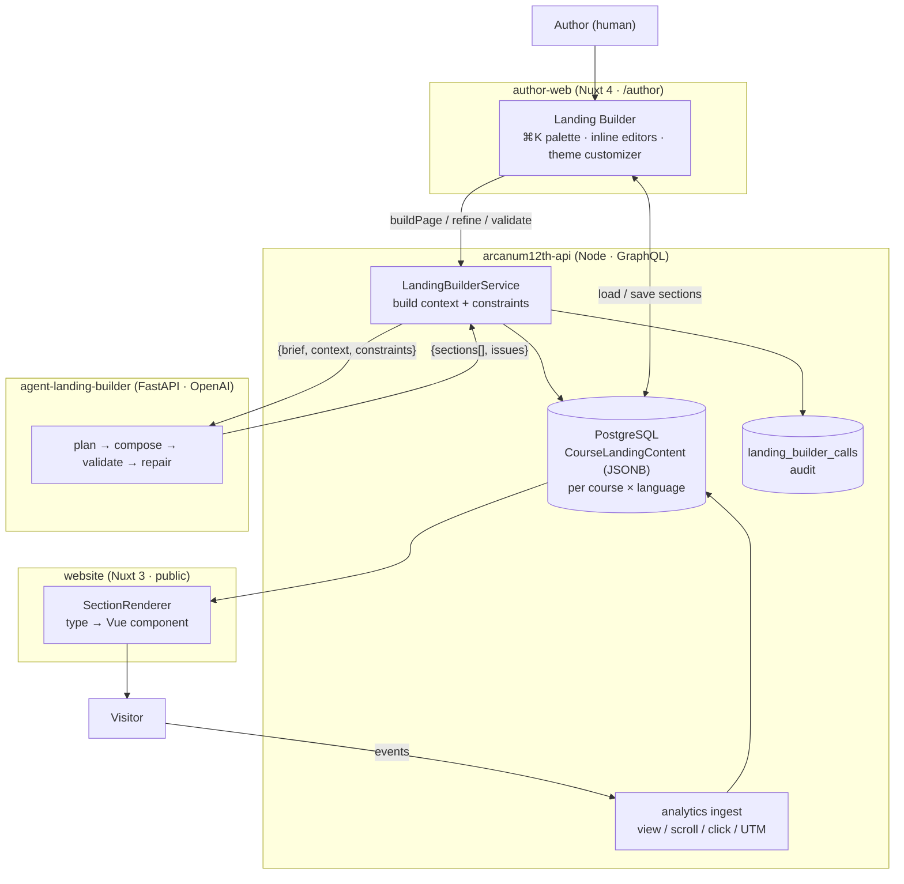
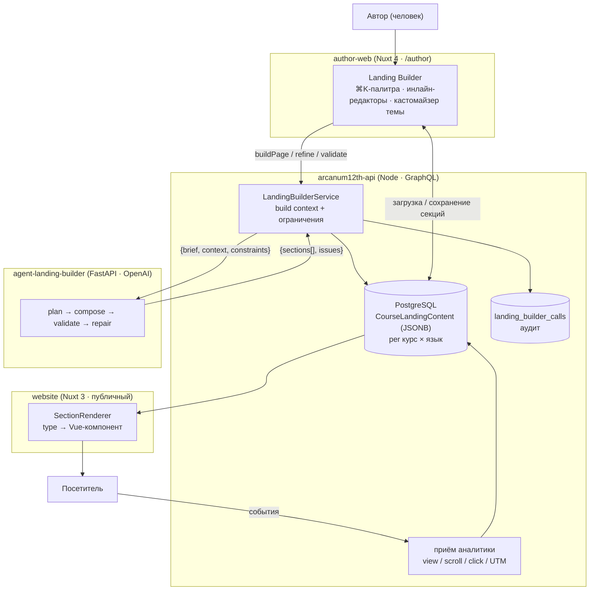

# Arcanum Landing Engine — AI Course-Landing Generation for an Online School / Arcanum Landing Engine — AI-генерация лендингов курсов для онлайн-школы

**Delivered by:** ASRP · **Product:** Arcanum 12th (arcanum12th.education) · **Role:** Full-cycle design & build (agent · API · authoring editor · public renderer) · **Engagement type:** Own product · **Domain:** AI content automation for a multilingual education platform
**Реализовано:** ASRP · **Продукт:** Arcanum 12th (arcanum12th.education) · **Роль:** Проектирование и разработка полного цикла (агент · API · редактор авторов · публичный рендерер) · **Тип сотрудничества:** Собственный продукт · **Домен:** AI-автоматизация контента для мультиязычной образовательной платформы

---

## 1. Executive summary / Краткое резюме

**EN:**

Arcanum Landing Engine is ASRP's **full-cycle, AI-assisted system for building course landing pages** for its own online school, **Arcanum 12th** (live at [arcanum12th.education](https://arcanum12th.education), 14 courses, 14 UI locales). It turns structured course data into a published marketing page with almost no manual layout work — and leaves a human fully in control of the result.

The cycle spans four cooperating parts, all built by ASRP: a **GraphQL backend** (`arcanum12th-api`) assembles a "build context" from real course data and a structural contract; a **headless AI agent** (`agent-landing-builder`, FastAPI + OpenAI) plans a layout, writes the copy, validates it against a block catalog, and self-repairs — emitting a JSON payload of typed sections; a **Nuxt authoring editor** (`arcanum12th-author-web`) lets an author refine that payload visually — reorder, add blocks from a ⌘K palette, edit each block inline, tune light/dark theme tokens, switch language; and a **public Nuxt renderer** (`website`) maps each section type to a Vue component and paints the live page. The unit of exchange throughout is a single **landing payload**: `{ sections: [{ id, type, props }], themeStyles }`.

It runs in production, generating the live course landing pages at arcanum12th.education.

**RU:**

Arcanum Landing Engine — это **AI-система полного цикла для сборки лендингов курсов** собственной онлайн-школы ASRP **Arcanum 12th** (живой сайт [arcanum12th.education](https://arcanum12th.education), 14 курсов, 14 языков интерфейса). Она превращает структурированные данные курса в опубликованную маркетинговую страницу почти без ручной вёрстки — и при этом оставляет человека полностью управляющим результатом.

Цикл состоит из четырёх взаимодействующих частей, все созданы ASRP: **GraphQL-бэкенд** (`arcanum12th-api`) собирает «build context» из реальных данных курса и структурный контракт; **headless-AI-агент** (`agent-landing-builder`, FastAPI + OpenAI) планирует раскладку, пишет текст, валидирует по каталогу блоков и сам себя чинит — выдавая JSON-payload типизированных секций; **Nuxt-редактор авторов** (`arcanum12th-author-web`) позволяет автору дорабатывать этот payload визуально — переставлять, добавлять блоки из ⌘K-палитры, редактировать каждый блок инлайн, настраивать токены темы light/dark, переключать язык; а **публичный Nuxt-рендерер** (`website`) сопоставляет тип каждой секции с Vue-компонентом и рисует живую страницу. Единица обмена по всему циклу — один **landing payload**: `{ sections: [{ id, type, props }], themeStyles }`.

Она работает в продакшне и генерирует живые лендинги курсов на arcanum12th.education.

## 2. Positioning & problem / Позиционирование и проблема

**EN:**

An online school with a growing course catalog needs a **marketing landing page per course** — hero, program, stats, pricing, FAQ, contacts — in several languages. Hand-building each one is slow and drifts in quality; generating one from a single "make me a landing" prompt yields unstructured HTML nobody can safely edit or translate.

Arcanum's answer treats a landing as **structured data, not markup**, and splits the job across a machine and a human. The machine (the agent) is good at drafting a complete, on-catalog layout from facts; the human (the author) is good at judgment — the final wording, ordering, imagery, and brand feel. By making the hand-off a typed **section payload** rather than HTML, the same artifact can be generated, refined in an editor, translated per language, stored, audited, and rendered — each stage owning its concern, none of them re-parsing the others' output.

**RU:**

Онлайн-школе с растущим каталогом курсов нужен **маркетинговый лендинг на каждый курс** — hero, программа, статистика, цены, FAQ, контакты — на нескольких языках. Собирать каждый вручную медленно и качество «плывёт»; сгенерировать из одного промпта «сделай лендинг» — получить неструктурированный HTML, который никто не может безопасно редактировать или переводить.

Ответ Arcanum трактует лендинг как **структурированные данные, а не разметку**, и делит работу между машиной и человеком. Машина (агент) хорошо набрасывает полную раскладку по каталогу из фактов; человек (автор) хорош в суждении — финальные формулировки, порядок, изображения, ощущение бренда. Поскольку передача — это типизированный **payload секций**, а не HTML, один и тот же артефакт можно сгенерировать, доработать в редакторе, перевести по языкам, сохранить, аудировать и отрендерить — каждая стадия владеет своей заботой и не разбирает заново вывод соседей.

## 3. What was built / Что было реализовано

**EN:**

Four cooperating components, all ASRP-built:

- **`agent-landing-builder` — the AI generator.** A FastAPI microservice (OpenAI `gpt-4o-mini`) exposing `/build-page`, `/refine-page`, `/validate-page`. It plans a layout, composes copy into each block's props, validates against a block catalog, and runs a bounded repair loop — with a deterministic fallback for every LLM stage so it works with no API key.
- **`arcanum12th-api` — the backend & orchestrator.** A Node.js GraphQL API (Apollo Server 4, Sequelize/PostgreSQL) with four application overlays (public / admin / author / partner). Its `LandingBuilderService` assembles the build context and structural contract from real course data, calls the agent, normalizes and persists the payload, and logs every call for audit. It also ingests landing analytics (views, scrolls, clicks, UTM).
- **`arcanum12th-author-web` — the authoring editor.** A Nuxt 4 admin app served at `/author`. Beyond full content management (articles, courses, lessons), its flagship is the **Landing Builder**: a ⌘K add-section palette (~60 section types), per-section inline editors, a light/dark theme customizer, per-language switching, templates, and import/export JSON.
- **`website` — the public renderer.** A Nuxt 3 site that reads the stored payload for the visitor's locale and maps each `section.type` to a Vue component, injecting `themeStyles` as CSS variables and streaming analytics back to the API.
- **Wider ecosystem.** The same platform (shared GraphQL API) also powers a **Telegram-bot** channel — course-catalog browsing, an education flow, an AI dream-diary, and payments — a second consumer of the same course data alongside the public website.

**RU:**

Четыре взаимодействующих компонента, все созданы ASRP:

- **`agent-landing-builder` — AI-генератор.** FastAPI-микросервис (OpenAI `gpt-4o-mini`) с эндпоинтами `/build-page`, `/refine-page`, `/validate-page`. Планирует раскладку, наполняет props каждого блока текстом, валидирует по каталогу блоков и запускает ограниченный цикл починки — с детерминированным fallback на каждой LLM-стадии, поэтому работает и без API-ключа.
- **`arcanum12th-api` — бэкенд и оркестратор.** Node.js GraphQL-API (Apollo Server 4, Sequelize/PostgreSQL) с четырьмя оверлеями приложений (public / admin / author / partner). Его `LandingBuilderService` собирает build context и структурный контракт из реальных данных курса, зовёт агента, нормализует и сохраняет payload и логирует каждый вызов для аудита. Также принимает аналитику лендинга (просмотры, скроллы, клики, UTM).
- **`arcanum12th-author-web` — редактор авторов.** Nuxt 4 админ-приложение на `/author`. Помимо полного управления контентом (статьи, курсы, уроки), его флагман — **Landing Builder**: ⌘K-палитра добавления секций (~60 типов), инлайн-редакторы секций, кастомайзер темы light/dark, переключение языков, шаблоны и импорт/экспорт JSON.
- **`website` — публичный рендерер.** Nuxt 3 сайт, читающий сохранённый payload для локали посетителя и сопоставляющий каждый `section.type` с Vue-компонентом, внедряя `themeStyles` как CSS-переменные и отправляя аналитику обратно в API.
- **Более широкая экосистема.** Та же платформа (общий GraphQL-API) также питает канал **Telegram-бот** — просмотр каталога курсов, обучающий поток, AI-дневник снов и платежи — второй потребитель тех же данных курса рядом с публичным сайтом.

> _[ screenshot / скриншот: `assets/arcanum-home.png` — Arcanum 12th home / главная страница школы ]_
>
> _[ screenshot / скриншот: `assets/arcanum-courses.png` — course catalog (14 courses) / каталог курсов (14 курсов) ]_

## 4. Architecture / Архитектура

**EN:**

The four parts form a loop around one payload. The API is the hub: it owns the contract and the storage; the agent drafts; the editor refines; the site renders.

| Component | Responsibility |
| --- | --- |
| **author-web** (Nuxt 4) | Authoring UX: the Landing Builder editor, the block catalog + default props, theme customization, per-language switching, and the "generate with AI" trigger. |
| **arcanum12th-api** (Node/GraphQL) | The hub: assembles the build context + structural contract, orchestrates the agent, normalizes & persists the payload (JSONB per course×language), audit logging, analytics ingest. |
| **agent-landing-builder** (FastAPI/OpenAI) | The generator: layout planning, copywriting, catalog validation, and bounded self-repair — deterministic fallbacks throughout. |
| **website** (Nuxt 3) | Public rendering: `type → component` registry, theme tokens as CSS variables, analytics events. |

**RU:**

Четыре части образуют петлю вокруг одного payload. API — это хаб: он владеет контрактом и хранением; агент набрасывает; редактор дорабатывает; сайт рендерит.

| Компонент | Зона ответственности |
| --- | --- |
| **author-web** (Nuxt 4) | UX авторинга: редактор Landing Builder, каталог блоков + дефолтные props, кастомизация темы, переключение языков и триггер «сгенерировать через AI». |
| **arcanum12th-api** (Node/GraphQL) | Хаб: собирает build context + структурный контракт, оркестрирует агента, нормализует и сохраняет payload (JSONB per курс×язык), аудит-лог, приём аналитики. |
| **agent-landing-builder** (FastAPI/OpenAI) | Генератор: планирование раскладки, копирайтинг, валидация по каталогу и ограниченная самопочинка — с детерминированными fallback. |
| **website** (Nuxt 3) | Публичный рендер: реестр `type → компонент`, токены темы как CSS-переменные, события аналитики. |

## 5. The generation pipeline / Конвейер генерации

**EN:**

Inside the agent, `build_landing()` runs four stages, each with a deterministic fallback so the service degrades gracefully when OpenAI is unavailable (gated by `_should_use_llm()`):

1. **Planner** — chooses an ordered section plan (`{family, type, required, …}`) from the block catalog, honouring the API's constraints (`must_include`, `preferred_order`, `max_sections`). LLM prompt `@landing-planner`; deterministic fallback `plan_sections()`.
2. **Composer** — writes each planned section's props from the supplied course context. LLM prompt `@landing-copywriter`; deterministic fallback `compose_payload()`.
3. **Validator** — checks the payload against the catalog + constraints (`validate_payload()`), with an LLM quality evaluator (`@landing-evaluator`) and a deterministic quality score.
4. **Repair** — an LLM reflection pass (`@landing-reflector`) plus deterministic `repair_payload()`. The orchestrator **only keeps a repair if it reduces the issue count** (`if len(repaired_issues) <= len(issues)`) — bounded, never worse.

The backend shapes the agent's freedom with **layout hints**: per block, a `mode` of `llm_content` (the model writes it) or `deterministic_props` (filled from context, e.g. pricing, stats), plus `fill_from_context` sources. So facts stay factual and only the persuasive copy is model-generated.

**RU:**

Внутри агента `build_landing()` выполняет четыре стадии, у каждой детерминированный fallback, поэтому сервис деградирует мягко, когда OpenAI недоступен (через `_should_use_llm()`):

1. **Planner** — выбирает упорядоченный план секций (`{family, type, required, …}`) из каталога блоков, соблюдая ограничения API (`must_include`, `preferred_order`, `max_sections`). LLM-промпт `@landing-planner`; детерминированный fallback `plan_sections()`.
2. **Composer** — пишет props каждой запланированной секции из переданного контекста курса. LLM-промпт `@landing-copywriter`; детерминированный fallback `compose_payload()`.
3. **Validator** — проверяет payload по каталогу + ограничениям (`validate_payload()`), с LLM-оценщиком качества (`@landing-evaluator`) и детерминированной оценкой качества.
4. **Repair** — LLM-проход рефлексии (`@landing-reflector`) плюс детерминированный `repair_payload()`. Оркестратор **оставляет починку, только если она снижает число проблем** (`if len(repaired_issues) <= len(issues)`) — ограниченно, никогда не хуже.

Бэкенд формирует свободу агента через **layout hints**: на каждый блок — `mode` `llm_content` (пишет модель) или `deterministic_props` (заполняется из контекста, напр. цены, статистика), плюс источники `fill_from_context`. Так факты остаются фактами, а моделью генерируется только продающий текст.

## 6. The landing contract & block catalog / Контракт лендинга и каталог блоков

**EN:**

The contract is one payload — `{ sections: [{ id, type, props }], themeStyles: { light, dark } }` — and a vocabulary of section `type`s grouped into families (Header, Hero, About, Features, Stats, Timeline, Steps, Blog, Pricing, FAQ, Social proof, CTA, Contact, Map, Footer, and platform-aware blocks like dynamic course cards). Many families have **versioned variants** (e.g. `stats-v1..v6`, `features-v1..v6`, `timeline-v1..v4`, `faq-v1..v4`), so a layout can vary visually without changing the data shape.

A candid engineering note: this contract is **replicated by convention in three places** — the agent's catalog (`agent/catalog/defaults/**`), the editor's catalog (`useLandingSections.ts` + `landingDefaultProps.ts` + `landingSectionComponents.ts`), and the public renderer's `type → component` map (`SectionRenderer.vue`). The wire type is opaque JSON, so nothing machine-checks it end-to-end. The commit **"Sync catalog with frontend landing contracts"** (agent, 2026-06-09) is exactly the moment the agent's catalog was pinned to the frontend's real block/prop shapes. The trade-off is real: if a section `type` exists in the editor but not the renderer, the public page silently renders nothing for it — a known drift risk inherent to a convention-enforced contract.

**RU:**

Контракт — это один payload — `{ sections: [{ id, type, props }], themeStyles: { light, dark } }` — и словарь `type` секций, сгруппированных в семейства (Header, Hero, About, Features, Stats, Timeline, Steps, Blog, Pricing, FAQ, Social proof, CTA, Contact, Map, Footer и платформенные блоки вроде динамических карточек курсов). У многих семейств есть **версионированные варианты** (напр. `stats-v1..v6`, `features-v1..v6`, `timeline-v1..v4`, `faq-v1..v4`), поэтому раскладка может меняться визуально без изменения формы данных.

Честная инженерная заметка: этот контракт **реплицируется по соглашению в трёх местах** — каталог агента (`agent/catalog/defaults/**`), каталог редактора (`useLandingSections.ts` + `landingDefaultProps.ts` + `landingSectionComponents.ts`) и мапа `type → компонент` публичного рендерера (`SectionRenderer.vue`). Тип на проводе — непрозрачный JSON, поэтому ничто не проверяет его сквозной машинно. Коммит **«Sync catalog with frontend landing contracts»** (агент, 2026-06-09) — как раз момент, когда каталог агента пришпилили к реальным формам блоков/props фронтенда. Компромисс реален: если тип секции есть в редакторе, но нет в рендерере, публичная страница молча ничего для неё не рисует — известный риск дрейфа, присущий контракту «по соглашению».

> _[ screenshot / скриншот: `assets/arcanum-author-section-library.png` — ⌘K section/template palette / палитра секций и шаблонов ]_

## 7. Progress & iteration / Прогресс и итерации

**EN:**

The engine visibly improved over successive runs. The `artifacts/` folder captures two parallel v1→v7 series (build responses and extracted payloads) from **2026-06-08 → 06-09**. The section count holds steady at 12, so the gains show in **structure and prop richness** — populated prop-keys climb from ~139–153 early to **170 (v5) and 179 (v7)**, empty props fall to single digits mid-series, sections get reordered (contact up, FAQ earlier), and later versions swap in refined variants (`features-v2`, `faq-v1`). That is the repair/evaluation loop tightening output, run over run.

The git history tells the same story as milestones:

| Phase | What landed |
| --- | --- |
| Scaffold & core pipeline (06-06) | Initial builder, LLM planning pipeline, tests, curl examples |
| Ops & catalog metadata (06-06→07) | Docker CI, quality roadmap, enriched catalog, semantic validation + golden tests, request tracing |
| Context genericization (06-07→08) | Generic/raw course context input, structured course context |
| Pricing determinism & catalog split (06-08) | Pricing-aware planning, deterministic pricing, catalog split into manifest families |
| Layout planning + LLM eval/reflection (06-08→09) | Abstract layout plan, LLM evaluation, reflection prompts, positioning memo |
| Contract cleanup (06-08→09) | Stop generating theme styles, backend-driven mandatory sections, documented layout-driven contract |
| Catalog sync & hardening (06-09→12) | Catalog linting + benchmark harness, planner/copywriter split, **sync catalog with frontend contracts**, tighter copy heuristics |

The surrounding stack matured on the same timeline: the API's landing feature (`CourseLandingContent`) landed **2026-05-13**, and author-web's Landing Builder epic ran **May–Jul 2026**.

**RU:**

Движок заметно улучшался от прогона к прогону. Папка `artifacts/` фиксирует две параллельные серии v1→v7 (ответы сборки и извлечённые payload) за **2026-06-08 → 06-09**. Число секций держится на 12, поэтому прирост виден в **структуре и богатстве props** — число заполненных ключей props растёт с ~139–153 в начале до **170 (v5) и 179 (v7)**, пустые props падают до единиц к середине серии, секции переставляются (contact выше, FAQ раньше), а поздние версии подставляют улучшенные варианты (`features-v2`, `faq-v1`). Это цикл починки/оценки, ужимающий вывод от прогона к прогону.

Git-история рассказывает то же как майлстоуны:

| Фаза | Что появилось |
| --- | --- |
| Каркас и ядро пайплайна (06-06) | Первичный билдер, LLM-пайплайн планирования, тесты, curl-примеры |
| Ops и метаданные каталога (06-06→07) | Docker CI, roadmap качества, обогащённый каталог, семантическая валидация + golden-тесты, трассировка запросов |
| Генерализация контекста (06-07→08) | Приём общего/сырого контекста курса, структурированный контекст курса |
| Детерминизм цен и разбивка каталога (06-08) | Планирование с учётом цен, детерминированные цены, разбивка каталога на manifest-семейства |
| Планирование раскладки + LLM eval/reflection (06-08→09) | Абстрактный план раскладки, LLM-оценка, промпты рефлексии, positioning-memo |
| Чистка контракта (06-08→09) | Прекратить генерацию темы, обязательные секции от бэкенда, документированный layout-driven-контракт |
| Синхронизация каталога и харденинг (06-09→12) | Линтинг каталога + benchmark-харнесс, разделение planner/copywriter, **синхронизация каталога с контрактами фронтенда**, более строгие эвристики текста |

Окружающий стек созревал в тот же период: фича лендинга в API (`CourseLandingContent`) появилась **2026-05-13**, а эпик Landing Builder в author-web шёл **май–июль 2026**.

## 8. Stack / Технологический стек

**EN:**

| Layer | Choice |
| --- | --- |
| Agent | Python 3.13, FastAPI + Uvicorn, Pydantic v2, OpenAI (`gpt-4o-mini`, env-driven, `temperature 0`, JSON mode) |
| Backend API | Node.js, Apollo Server 4 + Express, GraphQL, Sequelize + PostgreSQL, Redis (sessions/cache), pg-boss; JWT/API-key auth; four application overlays |
| Authoring editor | Nuxt 4 (Vue 3, TypeScript, SSR/Nitro), Pinia, shadcn-vue + Tailwind v4, Apollo Client + GraphQL codegen, TipTap v3, xstate, 14 locales |
| Public renderer | Nuxt 3 (Vue 3), Tailwind v4, Apollo Client, i18n; `type → component` section registry, theme tokens as CSS variables |
| Ops | Docker Compose, images to GHCR, Nginx + certbot (TLS), PM2 cluster; submodule monorepo (`arcanum12th-core`) |

**RU:**

| Слой | Выбор |
| --- | --- |
| Агент | Python 3.13, FastAPI + Uvicorn, Pydantic v2, OpenAI (`gpt-4o-mini`, из env, `temperature 0`, JSON-режим) |
| Бэкенд API | Node.js, Apollo Server 4 + Express, GraphQL, Sequelize + PostgreSQL, Redis (сессии/кэш), pg-boss; авторизация JWT/API-key; четыре оверлея приложений |
| Редактор авторов | Nuxt 4 (Vue 3, SSR/Nitro), Pinia, shadcn-vue + Tailwind v4, Apollo Client + GraphQL codegen, TipTap v3, xstate, 14 языков |
| Публичный рендерер | Nuxt 3 (Vue 3), Tailwind v4, Apollo Client, i18n; реестр секций `type → компонент`, токены темы как CSS-переменные |
| Эксплуатация | Docker Compose, образы в GHCR, Nginx + certbot (TLS), PM2-кластер; submodule-монорепо (`arcanum12th-core`) |

## 9. Data & interfaces / Данные и интерфейсы

**EN:**

- **Storage.** `CourseLandingContent { courseId, languageId, sections: JSONB }` — **one payload per (course, language)**, soft-deleted (paranoid). The website eager-loads it via the public `course` query; there is no separate "get landing" endpoint.
- **GraphQL surface.** Author overlay: `courseLandingContentBuildPage / refinePage / validatePage`, `courseLandingContentBuildContext` (preview the assembled context), plus CRUD `courseLandingContentCreate / Update / Delete`. Public overlay: analytics mutations `courseLandingView / Click / Scroll / Utm`. Admin overlay: `landingBuilderCalls` audit query.
- **Agent API.** `POST /build-page`, `POST /refine-page` (requires `previous_draft`), `POST /validate-page`, `GET /health`.
- **Audit.** Every agent call is written to `landing_builder_calls` (request, response, issues, context, timing, status) — a full generation trail.

**RU:**

- **Хранение.** `CourseLandingContent { courseId, languageId, sections: JSONB }` — **один payload на (курс, язык)**, мягкое удаление (paranoid). Сайт подгружает его через публичный запрос `course`; отдельного эндпоинта «получить лендинг» нет.
- **GraphQL-поверхность.** Оверлей author: `courseLandingContentBuildPage / refinePage / validatePage`, `courseLandingContentBuildContext` (предпросмотр собранного контекста), плюс CRUD `courseLandingContentCreate / Update / Delete`. Оверлей public: мутации аналитики `courseLandingView / Click / Scroll / Utm`. Оверлей admin: аудит-запрос `landingBuilderCalls`.
- **API агента.** `POST /build-page`, `POST /refine-page` (требует `previous_draft`), `POST /validate-page`, `GET /health`.
- **Аудит.** Каждый вызов агента пишется в `landing_builder_calls` (запрос, ответ, проблемы, контекст, тайминги, статус) — полный след генерации.

## 10. Reliability & operations / Надёжность и эксплуатация

**EN:**

- **Graceful degradation.** Every LLM stage has a deterministic fallback; without an OpenAI key the agent still emits a valid on-catalog payload.
- **Bounded repair.** A repair is kept only if it reduces the issue count — the loop can't make a page worse.
- **Human in the loop.** The AI output is a *draft*; nothing publishes until an author saves in the editor.
- **Auditability.** `landing_builder_calls` records every generation; `X-Request-Id` tracing runs through the agent.
- **Analytics.** Views, scrolls, clicks, and UTM stream from the public page back into the API.
- **Deployment.** Docker Compose behind Nginx + certbot TLS; images in GHCR; PM2 cluster inside the app containers; Postgres 17 + Redis. The agent runs as an internal-only service the author-API depends on. The stack is composed as a submodule monorepo with `manifest.json` pinning each submodule SHA.

**RU:**

- **Мягкая деградация.** У каждой LLM-стадии есть детерминированный fallback; без ключа OpenAI агент всё равно выдаёт валидный payload по каталогу.
- **Ограниченная починка.** Починка сохраняется, только если снижает число проблем — цикл не может ухудшить страницу.
- **Человек в контуре.** Вывод AI — это *черновик*; ничто не публикуется, пока автор не сохранит в редакторе.
- **Аудируемость.** `landing_builder_calls` фиксирует каждую генерацию; сквозная трассировка `X-Request-Id` идёт через агента.
- **Аналитика.** Просмотры, скроллы, клики и UTM летят с публичной страницы обратно в API.
- **Развёртывание.** Docker Compose за Nginx + certbot TLS; образы в GHCR; PM2-кластер внутри контейнеров; Postgres 17 + Redis. Агент — внутренний сервис, от которого зависит author-API. Стек собран как submodule-монорепо с `manifest.json`, пинящим SHA каждого сабмодуля.

## 11. See it live / Посмотреть вживую

**EN:**

- **Live product:** [arcanum12th.education](https://arcanum12th.education) — the school, 14 courses, multiple locales. Course landing pages are the rendered output of this engine.
- **Author panel:** [arcanum12th.education/author](https://arcanum12th.education/author) — the Landing Builder editor and the wider authoring platform (rich Markdown editor, multi-format articles/courses/lessons, AI assistant, 500+ authors).

Screenshots below show the authoring side (the AI-drafted section payload being refined) and the rendered public landings.

> _[ screenshot / скриншот: `assets/arcanum-author-web-builder.png` — Landing Builder: section list + live preview / список секций + живой превью ]_
>
> _[ screenshot / скриншот: `assets/arcanum-author-hero.png` — Hero section inline editor (CTA + stats) / инлайн-редактор Hero (CTA + статы) ]_
>
> _[ screenshot / скриншот: `assets/arcanum-author-about.png` — About section editor (image + principle cards) / редактор About (картинка + карточки-принципы) ]_
>
> _[ screenshot / скриншот: `assets/arcanum-author-timeline.png` — Timeline: course program by module / программа курса по модулям ]_
>
> _[ screenshot / скриншот: `assets/arcanum-course-landing.png` — rendered course landing (public) / отрендеренный лендинг курса (публично) ]_

**RU:**

- **Живой продукт:** [arcanum12th.education](https://arcanum12th.education) — школа, 14 курсов, несколько локалей. Лендинги курсов — это отрендеренный вывод этого движка.
- **Панель автора:** [arcanum12th.education/author](https://arcanum12th.education/author) — редактор Landing Builder и более широкая авторская платформа (богатый Markdown-редактор, мульти-формат статьи/курсы/уроки, ИИ-ассистент, 500+ авторов).

Скриншоты ниже показывают авторскую сторону (доработку AI-черновика payload секций) и отрендеренные публичные лендинги.

*(EN captions above apply to both languages.)*

## 12. Status & roadmap / Статус и планы

**EN:**

**Status: production.** The API, author-web, and public website are deployed and live at arcanum12th.education across 14 courses. The agent is a well-structured engine at `0.1.0` — strong test coverage (API, LLM pipeline, live smoke, semantic validation, golden briefs, catalog lint, evaluation harness), CI Docker builds, and request tracing, with integration-hardening (auth/rate-limiting on the agent endpoints) still on the roadmap. Natural next steps: a single shared catalog package to remove the three-way contract drift, per-type prop schemas (today `props` is free-form), and closing the editor↔renderer variant gap.

**RU:**

**Статус: продакшн.** API, author-web и публичный сайт развёрнуты и работают на arcanum12th.education по 14 курсам. Агент — хорошо структурированный движок версии `0.1.0`: сильное покрытие тестами (API, LLM-пайплайн, live smoke, семантическая валидация, golden-брифы, линт каталога, харнесс оценки), CI Docker-сборки и трассировка запросов; харденинг интеграции (auth/rate-limiting на эндпоинтах агента) ещё в планах. Естественные следующие шаги: единый общий пакет каталога, чтобы убрать трёхсторонний дрейф контракта, схемы props по типам (сейчас `props` свободной формы) и закрытие расхождения вариантов редактор↔рендерер.

## 13. What ASRP delivered / Что реализовала ASRP

**EN:**

ASRP designed and built the entire system end to end — all four components (`agent-landing-builder`, `arcanum12th-api` landing feature + `LandingBuilderService`, `arcanum12th-author-web` Landing Builder, and the `website` renderer), the shared landing-payload contract and block catalog, the deployment topology, and the AI generation pipeline — as its own product for its own online school.

**RU:**

ASRP спроектировала и построила всю систему целиком — все четыре компонента (`agent-landing-builder`, фичу лендинга в `arcanum12th-api` + `LandingBuilderService`, Landing Builder в `arcanum12th-author-web` и рендерер `website`), общий контракт landing-payload и каталог блоков, топологию развёртывания и конвейер AI-генерации — как собственный продукт для собственной онлайн-школы.

---

**EN:**

*Own-product case study prepared by ASRP for portfolio use. Arcanum 12th and arcanum12th.education are ASRP's own product and are named accordingly. Figures reflect the system as of 2026-07; the public site is live. Source repositories are private; capability-level detail only.*

**RU:**

*Кейс-стади собственного продукта, подготовленный ASRP для портфолио. Arcanum 12th и arcanum12th.education — собственный продукт ASRP и названы соответственно. Цифры отражают систему по состоянию на 2026-07; публичный сайт работает. Исходные репозитории приватны; приведены только детали уровня возможностей.*
