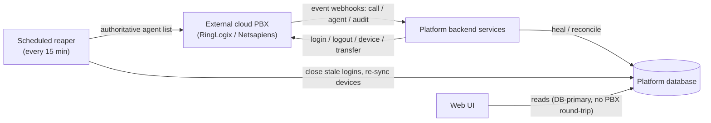
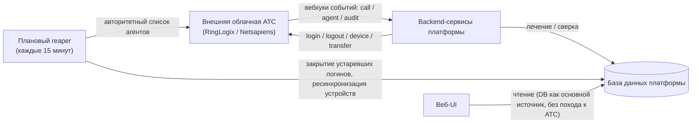

# Cloud PBX Integration for Contact-Center Queues & Agents / Интеграция облачной АТС для очередей и агентов контакт-центра

**Delivered by:** ASRP · **Role:** ASRP owned the PBX-integration workstream — design, implementation, and hardening · **Engagement type:** Independent contractor · **Domain:** Cloud telephony for freight logistics

**Исполнитель:** ASRP · **Роль:** ASRP полностью вела направление интеграции с АТС — проектирование, реализацию и доведение до боевой устойчивости · **Тип engagement:** независимый подрядчик · **Домен:** облачная телефония для грузовой логистики

## 1. Executive summary / Краткое резюме

**EN:**

ASRP designed and built the integration that lets a modern cloud communications platform operate on top of an **external cloud PBX** — RingLogix / Netsapiens[^netsapiens]. Organizations whose telephony already lives on that PBX keep using their existing PBX **queues (huntgroups), agents, and desk / mobile / soft-phone devices**, while the delivered platform becomes the single **system of record for the user interface**: agents log in and out of queues, pick a device, see who is on a call, and claim calls — all from one web screen, without switching to the PBX's own separate agent portal.

The core engineering challenge is that **two systems each own part of the truth**. The external PBX is authoritative for *live* telephony state (who is really in a queue, which device is registered right now); the platform database is authoritative for everything the UI reads. ASRP built the machinery that keeps those two views converged: **queue / agent-state management**, **device synchronization**, **call correlation** that ties a PBX call event back to the right platform call, and a **self-healing reconciliation layer** (inbound event webhooks plus a scheduled reaper) that repairs drift whenever a live event is missed.

This was the **largest project of the engagement** — a substantial subsystem that ASRP carried from an empty schema to a working, PBX-exercised system, and effectively a **single-owner subsystem** inside a larger team engagement (see §13).

**RU:**

ASRP спроектировала и построила интеграцию, позволяющую современной платформе коммуникаций работать поверх **внешней облачной АТС** — RingLogix / Netsapiens[^netsapiens-ru]. Организации, чья телефония уже живёт на этой АТС, продолжают пользоваться своими существующими **очередями АТС (huntgroups), агентами и устройствами — настольными телефонами, мобильными и софтфонами**, при этом поставленная платформа становится единой **системой учёта для пользовательского интерфейса**: агенты входят и выходят из очередей, выбирают устройство, видят, кто на линии, и забирают звонки — всё с одного веб-экрана, без переключения на отдельный агентский портал самой АТС.

Основной инженерный вызов в том, что **истина разделена между двумя системами**. Внешняя АТС является источником истины для *живого* состояния телефонии (кто реально находится в очереди, какое устройство сейчас зарегистрировано); база данных платформы является источником истины для всего, что читает UI. ASRP построила механизм, который удерживает эти два представления в сходящемся состоянии: **управление состоянием очередей и агентов**, **синхронизацию устройств**, **корреляцию звонков**, связывающую событие звонка от АТС с нужным звонком платформы, и **самовосстанавливающийся слой сверки** (входящие вебхуки событий плюс плановый «жнец»/reaper), который устраняет расхождение всякий раз, когда живое событие было пропущено.

Это был **самый крупный проект в рамках сотрудничества** — существенная подсистема, которую ASRP провела от пустой схемы до рабочей системы, проверенной на реальной АТС, и фактически **подсистема с единственным владельцем** внутри более крупного командного проекта (см. §13).

## 2. Business context & the problem / Бизнес-контекст и проблема

**EN:**

Many contact centers run their phone system on a hosted cloud PBX and are not going to rip it out — the numbers, the carrier relationships, and the agents' desk phones all live there. But the PBX's own agent tooling is thin, and it is a separate world from the modern web platform where dispatchers, supervisors, and analytics actually live.

The objective was to let those organizations **keep their PBX telephony but drive it from the platform UI** — without forcing the UI to make a slow round-trip to the PBX on every screen refresh, and without the two systems silently diverging when an event is dropped. Concretely:

- **Agents** need to log in and out of a PBX queue and choose which device rings, from the web UI.
- **Supervisors** need a live, trustworthy view of who is available and who is on a call.
- **Inbound calls** routed by the PBX into a queue need to appear as first-class calls on the platform, so an agent can see and claim them with full context.
- The platform must **stay correct even when the PBX misses a notification** — no ghost logins, no stuck "on a call" state.

The hard requirement running through all of this: the screens must be **fast and always answerable**, and the mirror of PBX state must be **eventually correct even when the network isn't cooperating**.

**RU:**

Многие контакт-центры строят свою телефонию на хостируемой облачной АТС и не собираются от неё отказываться — номера, отношения с оператором связи и настольные телефоны агентов живут именно там. Но собственная агентская функциональность АТС скудна, и это отдельный мир от современной веб-платформы, где на самом деле живут диспетчеры, супервайзеры и аналитика.

Цель состояла в том, чтобы позволить этим организациям **сохранить телефонию на АТС, но управлять ею из UI платформы** — без замедления UI из-за походов к АТС при каждом обновлении экрана и без незаметного расхождения двух систем при потере события. Конкретно:

- **Агентам** нужно входить и выходить из очереди АТС и выбирать, какое устройство звонит, прямо из веб-UI.
- **Супервайзерам** нужно живое, достоверное представление о том, кто доступен, а кто на звонке.
- **Входящие звонки**, маршрутизированные АТС в очередь, должны появляться как полноценные звонки на платформе, чтобы агент мог увидеть их и забрать со всем контекстом.
- Платформа должна **оставаться корректной, даже когда АТС пропускает уведомление** — никаких «зависших» логинов-призраков, никакого застрявшего состояния «на звонке».

Сквозное жёсткое требование: экраны должны быть **быстрыми и всегда отвечающими**, а зеркало состояния АТС должно быть **со временем корректным, даже когда сеть ведёт себя не идеально**.

## 3. What ASRP was asked to do / Что было поручено ASRP

**EN:**

The platform already had a call model, a web UI, and its own in-house queue routing. ASRP's mandate was to bolt an entire *external-PBX* world onto it cleanly:

1. **Model the PBX domain** in the platform database — queues, agents' devices, per-agent login state — as purpose-built tables plus a few columns on existing records.
2. **Let agents drive PBX queues from the UI** — queue login/logout with correct device selection, and provision an in-browser soft-phone.
3. **Make PBX-queue calls first-class** on the platform — correlate each PBX call event to the right platform call and auto-assign it to the answering agent.
4. **Keep the mirror honest** — a reconciliation layer that heals database state from PBX events and, as a backstop, a scheduled job that reconciles against the PBX's authoritative view.

The four capabilities below (§4–§6) are what shipped; §7 tells the war-stories of what went wrong getting there.

**RU:**

У платформы уже была модель звонков, веб-UI и собственная встроенная маршрутизация очередей. Мандат ASRP заключался в том, чтобы аккуратно пристроить к этому целый мир *внешней АТС*:

1. **Смоделировать домен АТС** в базе данных платформы — очереди, устройства агентов, состояние входа для каждого агента — в виде специально спроектированных таблиц плюс несколько колонок в существующих записях.
2. **Дать агентам управлять очередями АТС из UI** — вход/выход из очереди с корректным выбором устройства и предоставление софтфона прямо в браузере.
3. **Сделать звонки из очередей АТС полноценными** на платформе — сопоставлять каждое событие звонка от АТС с нужным звонком платформы и автоматически назначать его отвечающему агенту.
4. **Поддерживать честность зеркала** — слой сверки, который восстанавливает состояние базы данных из событий АТС, и, как резервный механизм, плановая задача, сверяющая состояние с авторитетным представлением АТС.

Четыре возможности ниже (§4–§6) — это то, что было поставлено; §7 рассказывает истории о том, что шло не так по пути.

## 4. System architecture / Архитектура системы

**EN:**

The design is deliberately **asymmetric about who owns the truth**, and that asymmetry is the key idea:

- The **external PBX** is authoritative for *live* external state — real queue membership and device registration.
- The **platform database** is authoritative for **UI reads**. Screens read from the database, never by calling the PBX on the hot path, so the UI stays fast and is always answerable.
- **Three convergence paths** keep the database mirror accurate: **direct mutations** (when the platform itself performs a login / logout / transfer), **inbound event webhooks** (the PBX pushes call / agent / audit events that heal the database in near-real-time), and a **scheduled reaper** (a periodic job that reconciles against the PBX's authoritative agent list to catch anything missed).

### Why a mirror + reaper + replay, instead of reading the PBX live?

The obvious naive design is: on every screen render, ask the PBX who's logged in and what devices are registered. ASRP rejected that, deliberately, for three reasons:

- **Latency and blast radius.** A supervisor dashboard refreshes constantly. Putting a third-party REST call on every read makes the UI as slow — and as *available* — as the PBX on its worst day. A dropped or throttled PBX response would blank the whole screen.
- **Rate limits and cost.** The PBX API is a shared, rate-limited resource. Fanning every UI read out to it does not scale to many concurrent supervisors.
- **The UI needs data the PBX doesn't hold.** Claim state, history, per-organization context, and correlation to platform call records only exist on the platform side.

So the platform keeps a **local mirror** it can read instantly, and treats the hard part — *keeping the mirror true* — as an explicit, multi-path convergence problem rather than pretending it away. Webhooks make the mirror fresh; the reaper makes it *eventually correct* even when a webhook is lost; direct mutations keep it correct on the happy path. No single path is a single point of failure. This is the whole architecture in one sentence: **read locally, converge continuously, and never let a reconciliation step destroy valid live state.**

**RU:**

Дизайн намеренно **асимметричен в вопросе о том, кто владеет истиной**, и именно эта асимметрия — ключевая идея:

- **Внешняя АТС** является источником истины для *живого* внешнего состояния — реального членства в очереди и регистрации устройств.
- **База данных платформы** является источником истины для **чтения в UI**. Экраны читают из базы данных, никогда не обращаясь к АТС на «горячем пути», поэтому UI остаётся быстрым и всегда отвечает.
- **Три пути сходимости** поддерживают точность зеркала в базе данных: **прямые мутации** (когда сама платформа выполняет вход/выход/перевод звонка), **входящие вебхуки событий** (АТС проталкивает события по звонкам/агентам/аудиту, которые почти в реальном времени лечат базу данных) и **плановый reaper** (периодическая задача, сверяющая состояние с авторитетным списком агентов АТС, чтобы уловить всё пропущенное).

### Почему зеркало + reaper + replay, а не чтение АТС в реальном времени?

Очевидный наивный дизайн: при каждом рендере экрана спрашивать у АТС, кто залогинен и какие устройства зарегистрированы. ASRP сознательно отвергла этот путь по трём причинам:

- **Задержка и радиус поражения.** Дашборд супервайзера обновляется постоянно. Размещение стороннего REST-вызова на каждом чтении делает UI таким же медленным — и таким же *доступным* — как АТС в её худший день. Оборванный или задросселенный ответ АТС обнулил бы весь экран.
- **Лимиты запросов и стоимость.** API АТС — это общий ресурс с ограничением частоты запросов. Направление к нему каждого чтения UI не масштабируется на множество одновременных супервайзеров.
- **UI нужны данные, которых у АТС нет.** Состояние «забрано», история, контекст по организации и корреляция с записями звонков платформы существуют только на стороне платформы.

Поэтому платформа держит **локальное зеркало**, которое можно читать мгновенно, и рассматривает самую сложную часть — *поддержание истинности зеркала* — как явную многопутевую задачу сходимости, а не игнорирует её. Вебхуки делают зеркало свежим; reaper делает его *со временем корректным* даже при потере вебхука; прямые мутации поддерживают корректность на счастливом пути. Ни один путь не является единой точкой отказа. Вся архитектура умещается в одном предложении: **читать локально, непрерывно сходиться и никогда не позволять шагу сверки разрушить достоверное живое состояние.**

### Аутентификация к АТС

Платформа общается с АТС через её REST API по протоколу **OAuth2**, с токеном, кэшируемым в Redis, который проактивно и безопасно обновляется под конкурентной нагрузкой (дедупликация внутри процесса плюс распределённая блокировка), а также с прозрачным одноразовым повтором при истечении срока действия токена. *(Более глубокие технические детали механики обновления/блокировки доступны по NDA.)*

## 5. A call in plain language (sample walkthrough) / Звонок простым языком (пример сценария)

**EN:**

Fictional but faithful to the real flow. *Dana* is a support agent at a freight brokerage whose phones run on the external PBX.

1. **Dana logs in.** She opens the platform, picks the **"Dispatch"** queue, and flips her status to available. The platform reads her devices, auto-selects her desk phone (she used it last), confirms with the PBX that the desk phone is genuinely a member of the Dispatch queue, tells the PBX to log her in, writes the login record, and re-reads the PBX to confirm both sides agree. Her status goes green on every supervisor's screen instantly.
2. **A call arrives.** A carrier dials the brokerage's number. The platform routes the call into the PBX Dispatch queue and — crucially — stamps the call record as a *PBX-queue call* and writes down the one identifier the PBX and the media gateway both agree on (see §6). The call appears in the queue on Dana's screen as claimable.
3. **Dana's phone rings and she answers.** The PBX rings the queue, her desk phone rings, she picks up. The PBX emits a call event ("this call is now active on extension 2XX"). The platform matches that event to Dana's on-screen call by the shared identifier, resolves *which agent* extension 2XX is, marks the call **Connected — Dana**, and stamps the answer time.
4. **Something drops.** Suppose the PBX never sends the "Dana logged out" event at end of shift. Fifteen minutes later the reaper walks the active logins, asks the PBX directly "is Dana still logged into Dispatch?", hears "no", and closes the stale login — no ghost agent left showing green.
5. **Soft-phone variant.** If Dana had chosen the in-browser phone instead of her desk phone, the platform would have provisioned a dedicated SIP device for her on the PBX — the rest of the flow is identical.

> 
>
> **Demo.** A narrated walkthrough of this integration — recorded on a dev environment with seeded, non-real data — is included in the portfolio and loads from the repo: [`demos/pbx_combined_final.mp4`](../../demos/pbx_combined_final/). It shows the platform's Calls UI beside the external-PBX portal while an agent logs in and out of the queue, switches the ringing device, and claims a queue call both from the web UI and on the device — with agent-presence and device-registration state re-syncing live (WebSocket-driven) as each action lands, plus the supervisor's agent-management view. The engagement's deeper console-instrumented recording and 20-plus further screen/phone recordings, call transcripts, and UI screenshots remain engagement evidence available under NDA.

**RU:**

Вымышленный, но достоверный по отношению к реальному потоку. *Дана* — агент поддержки в грузовой брокерской компании, чья телефония работает на внешней АТС.

1. **Дана входит в систему.** Она открывает платформу, выбирает очередь **«Dispatch»** и переключает свой статус на доступный. Платформа считывает её устройства, автоматически выбирает её настольный телефон (она пользовалась им последний раз), подтверждает у АТС, что настольный телефон действительно состоит в очереди Dispatch, сообщает АТС о её входе, записывает запись о входе и перечитывает состояние АТС, чтобы убедиться, что обе стороны согласны. Её статус мгновенно становится зелёным на экране каждого супервайзера.
2. **Поступает звонок.** Перевозчик набирает номер брокерской компании. Платформа маршрутизирует звонок в очередь Dispatch АТС и — что важно — помечает запись звонка как *звонок из очереди АТС* и записывает единственный идентификатор, о котором договорились и АТС, и медиашлюз (см. §6). Звонок появляется в очереди на экране Даны как доступный для взятия.
3. **Телефон Даны звонит, и она отвечает.** АТС прозванивает очередь, её настольный телефон звонит, она берёт трубку. АТС генерирует событие звонка («этот звонок теперь активен на добавочном номере 2XX»). Платформа сопоставляет это событие со звонком на экране Даны по общему идентификатору, определяет, *какому именно агенту* принадлежит добавочный номер 2XX, помечает звонок как **«Соединён — Дана»** и фиксирует время ответа.
4. **Что-то теряется.** Предположим, АТС так и не отправила событие «Дана вышла из системы» в конце смены. Через пятнадцать минут reaper обходит активные логины, напрямую спрашивает АТС «Дана всё ещё залогинена в Dispatch?», получает «нет» и закрывает устаревший логин — никакого агента-призрака, который бы продолжал светиться зелёным.
5. **Вариант с софтфоном.** Если бы Дана выбрала телефон прямо в браузере вместо настольного телефона, платформа предоставила бы ей выделенное SIP-устройство на АТС — остальной поток идентичен.

> 
>
> **Демо.** Разбор этой интеграции с закадровым комментарием — записанный на dev-окружении с фейковыми (не реальными) данными — включён в портфолио и грузится прямо из репозитория: [`demos/pbx_combined_final.mp4`](../../demos/pbx_combined_final/). На нём UI «Calls» платформы рядом с порталом внешней АТС: агент входит и выходит из очереди, переключает звонящее устройство и берёт звонок — из веб-UI и на устройстве, — а присутствие агента и регистрация устройств пере-синхронизируются в реальном времени (через WebSocket). Более глубокая console-инструментированная запись проекта и 20+ прочих экранных/телефонных записей, транскрипты и скриншоты остаются доказательствами проекта под NDA.

## 6. Call correlation (the hardest part) / Корреляция звонков (самая сложная часть)

**EN:**

The hardest part of the integration was keeping **phone state, queue state, and the supervisor's live view of both** in sync in real time: when the PBX routes an inbound call into a queue, that call has to show up as a real, claimable call on the platform, and every subsequent PBX event about it has to land on the **right** platform call and reach agent and supervisor screens correctly — with no ordering guarantee on when those signals arrive relative to each other.

The mechanism that makes this reliable is maintained in ASRP's engineering reference. Deeper technical detail is available under NDA.

**RU:**

Самой сложной частью интеграции было удержание в реальном времени синхронности **состояния телефона, состояния очереди и живого представления супервайзера об обоих**: когда АТС маршрутизирует входящий звонок в очередь, этот звонок должен появиться на платформе как реальный, доступный для взятия звонок, а каждое последующее событие АТС о нём должно попасть на **правильный** звонок платформы и корректно дойти до экранов агента и супервайзера — без какой-либо гарантии порядка прихода этих сигналов относительно друг друга.

Механизм, который делает это надёжным, описан в инженерном справочнике ASRP. Более глубокие технические детали доступны по NDA.

## 7. Engineering war-stories / Инженерные истории из боевых условий

**EN:**

The interesting parts of this project were the failure modes that only show up against a live third-party system. Three worth telling — each as problem → diagnosis → fix.

### 7.1 The event that beat us to the write (correlation race)

**Problem.** PBX-queue calls answer *very* fast. In production the PBX would emit its call event announcing that a queue call was already active **before** the platform had finished writing the correlation key for that call. The lookup in §6 would find nothing, and the call event — the one that assigns the call to the answering agent — was simply lost. Calls showed as unclaimed on-screen even though a human was already talking.

**Diagnosis.** This is a classic distributed race: two independent producers (the media gateway that gives us the correlation key, and the PBX that gives us the event to correlate) with no ordering guarantee between them. On slow calls the key won thanks to timing luck; on fast queue calls the event won. It was never going to be fixed by "just write faster."

**Fix — buffer and replay.** When a PBX call event can't be correlated yet, it is **buffered in Redis under the call's identifier with a ~1-hour TTL** instead of being dropped. The moment the correlation key *does* get written (from the gateway webhook, or from the gateway-API fallback added precisely because queue calls answer too fast for the webhook), the platform **replays** the buffered events for that call. The replay path **drains the buffer atomically**, re-processes each event with **per-item error isolation**, and **re-queues** any item that still can't be matched (extending the TTL) rather than losing it. The net effect: early, late, and duplicated PBX events are all safe, and correlation becomes order-independent. This buffer-and-replay path was the single most-hardened piece of the integration.

### 7.2 The database that fell behind the PBX (reverse-heal)

**Problem.** The mirror was built on an implicit assumption that the platform is "ahead" of the PBX — it logs an agent in, then the PBX confirms. But drift happens in the *other* direction too: an agent's device re-registers and the PBX considers them logged in to a queue, while the platform database has **no login record** at all (a missed event, a restart, a manual change on the PBX side). The agent was live on the PBX but invisible on the platform.

**Diagnosis.** Treating the database as strictly downstream of platform-initiated actions was wrong. The PBX is authoritative for live state, so *the platform must be willing to learn state it didn't itself create.*

**Fix — heal in both directions.** When a device-registration event arrives, the platform checks the PBX's authoritative agent list; if the PBX shows the agent logged in but the database has no login, it **creates the missing login record** (a "reverse heal"), and returns early so the general handler can't immediately overwrite it. Healing now works symmetrically — webhooks can *create* a missing login as readily as they *close* an invalid one — and every decision is validated against the PBX's authoritative list so a stale notification can't manufacture a phantom login. A dedicated **active-call protection** rule was added in the same area: an agent who looks "unavailable" but is actually mid-call is never logged out; the call event resolves their state instead.

### 7.3 The claim that survived a failed transfer (rollback)

**Problem.** Claiming a PBX-queue call is a two-step act: mark the call claimed in the database, then tell the PBX to transfer the live call to the agent's device. If the second step failed — the transfer returned unsuccessful, or the required routing data was missing — the *first* step had already committed. The result was a **silent false positive**: the platform showed the call claimed by an agent who never actually got connected.

**Diagnosis.** A local mutation and a remote side-effect were being treated as if they always succeed together. They don't, and the local state must not outlive a failed remote step.

**Fix — unclaim and throw.** The claim path now treats the PBX transfer as the point of no return. If `transfer-to-device` returns unsuccessful **or** throws **or** the required data (domain / extension / correlation id) is missing, the platform **rolls back the local claim** (unclaims the call) and **raises a claim-failed error** so the UI reflects reality. The whole claim is serialized under a distributed lock so two agents can't claim the same call concurrently. A false "claimed" state can no longer persist behind a failed transfer.

### 7.4 Built for multiple queues per organization

An organization can run more than one queue, and an agent can be logged into more than one of them at once — this was a ground-up design choice, not a retrofit. Queue-login state is keyed per **(organization, user, queue)** rather than per (organization, user), with the "only one active login" invariant enforced at that same granularity, so two different queue memberships for the same agent never collide. Device selection is scoped the same way: before letting an agent log into a specific queue with a specific device, the platform checks with the PBX that the device is genuinely a member of *that* queue's huntgroup, so a device valid for one queue can't silently be used to log into another.

One nuance ASRP is still refining: for organizations spanning **many** simultaneously active queues, there is a read/write source-of-truth scoping edge that gets more subtle as the queue count grows — an area of further refinement, called out here rather than papered over, not a shipped guarantee.

**RU:**

Самыми интересными частями этого проекта были сбои, которые проявляются только против живой сторонней системы. Стоит рассказать о трёх — каждая по схеме проблема → диагностика → исправление.

### 7.1 Событие, опередившее нашу запись (гонка при корреляции)

**Проблема.** Звонки из очередей АТС отвечаются *очень* быстро. В продакшене АТС генерировала своё событие звонка, объявляющее звонок в очереди уже активным, **до того**, как платформа успевала дописать ключ корреляции для этого звонка. Поиск из §6 не находил ничего, и событие звонка — то самое, что назначает звонок отвечающему агенту, — просто терялось. Звонки отображались как незабранные на экране, хотя человек уже разговаривал.

**Диагностика.** Это классическая распределённая гонка: два независимых производителя (медиашлюз, дающий нам ключ корреляции, и АТС, дающая нам событие для корреляции) без гарантии порядка между ними. На медленных звонках ключ выигрывал благодаря удаче со временем; на быстрых звонках из очереди выигрывало событие. Исправить это простым «пишите быстрее» было невозможно.

**Исправление — буферизация и повтор.** Когда событие звонка от АТС не может быть сопоставлено немедленно, оно **буферизуется в Redis под идентификатором звонка с TTL около 1 часа** вместо того, чтобы быть отброшенным. В момент, когда ключ корреляции *всё же* записывается (из вебхука шлюза или из резервного вызова API шлюза, добавленного именно потому, что звонки из очередей отвечаются слишком быстро для вебхука), платформа **повторно проигрывает** буферизованные события для этого звонка. Путь повтора **атомарно опустошает буфер**, повторно обрабатывает каждое событие с **изоляцией ошибок по элементам** и **ставит обратно в очередь** любой элемент, который всё ещё не удаётся сопоставить (продлевая TTL), вместо того чтобы его терять. Итоговый эффект: ранние, поздние и дублирующиеся события АТС безопасны, а корреляция становится не зависящей от порядка. Этот путь буферизации и повтора — самая доработанная часть всей интеграции.

### 7.2 База данных, отставшая от АТС (обратное лечение)

**Проблема.** Зеркало было построено на неявном предположении, что платформа «опережает» АТС — сначала она логинит агента, затем АТС подтверждает. Но расхождение случается и в *обратном* направлении: устройство агента перерегистрируется, и АТС считает его залогиненным в очередь, а в базе данных платформы **нет вообще никакой записи о входе** (пропущенное событие, перезапуск, ручное изменение на стороне АТС). Агент был активен на АТС, но невидим на платформе.

**Диагностика.** Считать базу данных строго нижестоящей по отношению к действиям, инициированным платформой, было ошибкой. АТС авторитетна для живого состояния, поэтому *платформа должна быть готова узнавать состояние, которое сама не создавала.*

**Исправление — лечение в обоих направлениях.** Когда приходит событие регистрации устройства, платформа проверяет авторитетный список агентов АТС; если АТС показывает, что агент залогинен, а в базе данных нет логина, платформа **создаёт недостающую запись о входе** («обратное лечение») и завершает обработку раньше, чтобы общий обработчик не перезаписал её немедленно. Теперь лечение работает симметрично — вебхуки могут как *создавать* недостающий логин, так и *закрывать* недействительный, — и каждое решение проверяется по авторитетному списку АТС, чтобы устаревшее уведомление не могло создать фантомный логин. В той же области было добавлено выделенное правило **защиты активного звонка**: агент, который выглядит «недоступным», но на самом деле находится в середине звонка, никогда не выводится из системы — его состояние разрешается событием звонка.

### 7.3 Взятие звонка, пережившее неудачный перевод (откат)

**Проблема.** Взятие звонка из очереди АТС — это действие в два шага: пометить звонок как взятый в базе данных, затем сказать АТС перевести живой звонок на устройство агента. Если второй шаг завершался неудачей — перевод возвращал неуспех, или отсутствовали необходимые данные маршрутизации, — то *первый* шаг уже был зафиксирован. Результатом становился **тихий ложноположительный результат**: платформа показывала звонок взятым агентом, который на самом деле никогда не был соединён.

**Диагностика.** Локальная мутация и удалённый побочный эффект трактовались так, будто они всегда завершаются успешно вместе. Это не так, и локальное состояние не должно переживать неудачный удалённый шаг.

**Исправление — снять взятие и выбросить ошибку.** Путь взятия звонка теперь трактует перевод АТС как точку невозврата. Если `transfer-to-device` возвращает неуспех, **или** выбрасывает исключение, **или** отсутствуют необходимые данные (домен / добавочный номер / идентификатор корреляции), платформа **откатывает локальное взятие** (снимает пометку «взято») и **поднимает ошибку неудачного взятия**, чтобы UI отражал реальность. Всё взятие целиком сериализуется под распределённой блокировкой, так что два агента не могут взять один и тот же звонок одновременно. Ложное состояние «взято» больше не может сохраняться за неудачным переводом.

### 7.4 Всё ещё дорабатывается (честно названо)

Для организаций, охватывающих **несколько очередей**, существует нюанс разграничения источника истины для чтения/записи, который ASRP определила как область для дальнейшей доработки — он назван здесь, а не замят.

## 8. Technology stack / Технологический стек

**EN:**

| Layer | Technology |
| --- | --- |
| External cloud PBX (integration target) | **RingLogix / Netsapiens**[^netsapiens] (REST API, OAuth2) |
| Backend | **TypeScript** on **Node.js / Bun** |
| Data access | **Drizzle ORM** (TypeScript, from a shared schema package) |
| Persistence | **MySQL** — **PlanetScale serverless** in production, **mysql2** driver against MySQL 9 for local development, with a **primary/replica** split |
| Caching, locks, buffers | **Redis** — token cache, distributed locks (Redlock), correlation-event replay buffers |
| Realtime to UI | **NATS** pub/sub → WebSocket → frontend |
| Scheduling | Cron service (the reconciliation reaper) |

> **"Which database did you use?"** → **MySQL**, via the **Drizzle ORM** in TypeScript. Production runs on **PlanetScale serverless** (MySQL-compatible); local development runs the **mysql2** driver against **MySQL 9**. A primary/replica split is used, and queue-state reads that must be authoritative are pinned to the **primary**.

**RU:**

| Слой | Технология |
| --- | --- |
| Внешняя облачная АТС (цель интеграции) | **RingLogix / Netsapiens**[^netsapiens-ru] (REST API, OAuth2) |
| Backend | **TypeScript** на **Node.js / Bun** |
| Доступ к данным | **Drizzle ORM** (TypeScript, из общего пакета схемы) |
| Хранение данных | **MySQL** — **PlanetScale serverless** в продакшене, драйвер **mysql2** против MySQL 9 для локальной разработки, с разделением на **primary/replica** |
| Кэширование, блокировки, буферы | **Redis** — кэш токенов, распределённые блокировки (Redlock), буферы повтора событий корреляции |
| Реалтайм в UI | **NATS** pub/sub → WebSocket → фронтенд |
| Планирование | Cron-сервис (reaper сверки) |

> **«Какую базу данных вы использовали?»** → **MySQL**, через **Drizzle ORM** в TypeScript. Продакшен работает на **PlanetScale serverless** (совместимом с MySQL); локальная разработка использует драйвер **mysql2** против **MySQL 9**. Используется разделение primary/replica, и чтения состояния очереди, которые должны быть авторитетными, закреплены за **primary**.

## 9. Data model / Модель данных

**EN:**

The integration is backed by a relational MySQL schema (Drizzle ORM). ASRP designed the following purpose-built tables (described conceptually — proprietary names and columns are generalized):

- **Device registry** — one row per PBX device per user: registration state (registered / unregistered), registration contact / IP / user-agent / expiry, the queue it belongs to, and last-seen / last-selected timestamps. Uniqueness enforced per (organization, user, device).
- **Device-registration history** — append-only registration snapshots for auditability, written only when the snapshot actually changes.
- **Current queue-login records** — one row per active login, with a **unique constraint guaranteeing at most one active login per (organization, user, queue)**, plus device, status, and login timestamp.
- **Queue-login history** — an archive of closed logins, so live-state tables stay small while history is preserved.
- **Queue (huntgroup) registry** — the set of queues per organization, linked to the phone-number configuration and an active flag.

ASRP also added a small number of **columns to existing platform tables**: a PBX-domain identifier on the organization, a PBX-extension identifier on the user, a per-number "this number is a PBX queue" flag, and — on the call record — the **indexed correlation key** and PBX-queue flag used by call correlation (§6), plus the answering-agent assignment and answer-time fields.

Data access is centralized in typed query helpers (create / close / replace login, sync devices, resolve organization-by-PBX-domain and user-by-PBX-extension), with authoritative queue-state reads pinned to the primary database.

**RU:**

Интеграция опирается на реляционную схему MySQL (Drizzle ORM). ASRP спроектировала следующие специально созданные таблицы (описаны концептуально — проприетарные имена и колонки обобщены):

- **Реестр устройств** — одна строка на устройство АТС на пользователя: состояние регистрации (зарегистрировано / не зарегистрировано), контакт регистрации / IP / user-agent / срок действия, очередь, к которой относится устройство, и метки времени последнего появления / последнего выбора. Уникальность обеспечена по (организация, пользователь, устройство).
- **История регистрации устройств** — журнал снимков регистрации только для добавления, для целей аудита, записываемый только тогда, когда снимок действительно меняется.
- **Текущие записи о входе в очередь** — одна строка на активный логин, с **уникальным ограничением, гарантирующим не более одного активного логина на (организация, пользователь, очередь)**, плюс устройство, статус и метка времени входа.
- **История входов в очередь** — архив закрытых логинов, чтобы таблицы живого состояния оставались маленькими, а история сохранялась.
- **Реестр очередей (huntgroups)** — набор очередей на организацию, связанный с конфигурацией номера телефона и флагом активности.

ASRP также добавила небольшое число **колонок в существующие таблицы платформы**: идентификатор домена АТС на организации, идентификатор добавочного номера АТС на пользователе, флаг «этот номер — очередь АТС» на номере, и — в записи звонка — **индексированный ключ корреляции** и флаг звонка из очереди АТС, используемые для корреляции звонков (§6), плюс поля назначения отвечающего агента и времени ответа.

Доступ к данным централизован в типизированных вспомогательных функциях запросов (создание / закрытие / замена логина, синхронизация устройств, разрешение организации по домену АТС и пользователя по добавочному номеру АТС), с авторитетными чтениями состояния очереди, закреплёнными за основной базой данных.

## 10. Reliability & operations / Надёжность и эксплуатация

**EN:**

- **Three-path convergence** — direct mutation, event webhooks, and the scheduled reaper together keep the mirror aligned with the PBX; no single path is a single point of failure.
- **Self-healing in both directions** — webhooks can *create* a missing login (reverse-heal, §7.2) as well as *close* an invalid one; the reaper independently reconciles against the PBX's authoritative agent list every **15 minutes**, single-flighted by a distributed Redis lock.
- **Active-call protection** — reconciliation never logs out an agent who is genuinely on a call, even if a transient signal suggests otherwise.
- **One-active-login invariant** — enforced at the database level (unique constraint) *and* by transactional login / replace helpers, so a race can't produce two active logins for the same queue.
- **Shared "effective login" definition** — a single predicate defines what "logged in" really means (accounting for available / manual / automatic states and whether a call is being delivered), used identically by the UI, the webhooks, and the reaper so they cannot drift apart.
- **Concurrency-safe token handling** — OAuth2 refresh guarded by an in-process promise *and* a distributed Redis lock, with proactive refresh and transparent one-shot `401` retry.
- **Out-of-order & duplicate event tolerance** — the correlation-event replay buffer makes early, late, or duplicated PBX events safe; failed items are isolated and re-queued rather than dropped (§7.1).
- **Failure-tolerant claims** — a failed PBX transfer rolls the local claim back rather than leaving a false "claimed" state (§7.3).
- **Realtime fan-out** — agent / queue changes publish over NATS to every relevant UI audience (per-user and per-group) so supervisor and agent screens stay live.

**RU:**

- **Трёхпутевая сходимость** — прямая мутация, вебхуки событий и плановый reaper вместе поддерживают согласованность зеркала с АТС; ни один путь не является единой точкой отказа.
- **Самовосстановление в обоих направлениях** — вебхуки могут как *создавать* недостающий логин (обратное лечение, §7.2), так и *закрывать* недействительный; reaper независимо сверяется с авторитетным списком агентов АТС каждые **15 минут**, с единственным исполнением под распределённой блокировкой Redis.
- **Защита активного звонка** — сверка никогда не выводит из системы агента, который действительно находится на звонке, даже если временный сигнал предполагает обратное.
- **Инвариант одного активного логина** — обеспечивается на уровне базы данных (уникальное ограничение) *и* транзакционными вспомогательными функциями входа / замены, так что гонка не может породить два активных логина для одной очереди.
- **Общее определение «эффективного входа»** — единый предикат определяет, что на самом деле значит «залогинен» (с учётом состояний доступен / вручную / автоматически и того, доставляется ли звонок), используемый одинаково UI, вебхуками и reaper, чтобы они не могли разойтись.
- **Конкурентно-безопасная обработка токенов** — обновление OAuth2 защищено промисом внутри процесса *и* распределённой блокировкой Redis, с проактивным обновлением и прозрачным одноразовым повтором при `401`.
- **Устойчивость к событиям не по порядку и дубликатам** — буфер повтора событий корреляции делает ранние, поздние или дублирующиеся события АТС безопасными; неудачные элементы изолируются и ставятся обратно в очередь, а не отбрасываются (§7.1).
- **Устойчивые к сбоям взятия звонков** — неудачный перевод АТС откатывает локальное взятие, вместо того чтобы оставить ложное состояние «взято» (§7.3).
- **Реалтайм-рассылка** — изменения агента / очереди публикуются через NATS для каждой релевантной аудитории UI (для конкретного пользователя и для группы), чтобы экраны супервайзера и агента оставались живыми.

## 11. Maturity & status / Зрелость и статус

**EN:**

Honest split of where the work stands.

**Built & iterated** (the four capabilities): agent queue login/logout with device auto-selection, device synchronization and soft-phone provisioning, call correlation with auto agent-assignment, and the webhook-plus-reaper self-healing layer. All are implemented and were exercised against the live external PBX.

**Hardened** (a dedicated mid-2026 engineering cycle): correlation replay-buffer robustness, distributed locking across the reaper and token refresh, huntgroup-scoping of device selection, simplification to DB-first reads on the hot path, and a transactional login model. ASRP also ran a self-initiated review-and-remediation pass over the subsystem as part of this cycle.

**Forward-looking:** the many-queues read/write scoping edge in §7.4 is an area of further refinement, not a shipped guarantee — it did not block the outcome below, since core multi-queue support (§7.4) is built and working, and the edge case only surfaces for organizations running many queues simultaneously.

**Overall.** The integration reached a working, PBX-exercised state and was piloted with a client (see §12 for what happened next). Development on this specific subsystem is currently **paused**: not because of a technical blocker, but because of a client-side build-vs-buy call made after the pilot (§12). The capability itself remains a supported part of the platform for organizations that are already running their telephony on the external PBX. This page does not claim production-at-scale or general-availability status.

**RU:**

Честное разделение того, на каком этапе находится работа.

**Построено и итеративно доработано** (четыре возможности): вход/выход агента из очереди с автовыбором устройства, синхронизация устройств и предоставление софтфона, корреляция звонков с автоматическим назначением агента, и слой самовосстановления на вебхуках плюс reaper. Всё это реализовано и было проверено на живой внешней АТС.

**Доведено до боевой устойчивости** (в рамках отдельного инженерного цикла в середине 2026 года): устойчивость буфера повтора корреляции, распределённая блокировка для reaper и обновления токена, привязка выбора устройства к huntgroup, упрощение до чтений в первую очередь из базы данных на горячем пути и транзакционная модель входа. ASRP также провела самостоятельно инициированный проход по анализу и устранению недостатков подсистемы в рамках этого цикла.

**Планы на будущее:** нюанс разграничения чтения/записи для нескольких очередей из §7.4 — это область дальнейшей доработки, а не поставленная гарантия; он не блокировал результат, описанный ниже, поскольку применяется только к организациям, охватывающим несколько очередей.

**В целом.** Интеграция достигла рабочего состояния, проверенного на живой АТС, и прошла пилот у клиента (см. §12 о том, что случилось дальше). Развитие этой конкретной подсистемы сейчас **приостановлено**: не из-за технического препятствия, а из-за решения клиента в пользу собственной разработки после пилота, принятого после пилота (§12). Сама возможность остаётся поддерживаемой частью платформы для организаций, уже работающих на телефонии этой внешней АТС. Эта страница не заявляет о статусе продакшена в масштабе или общей доступности.

## 12. Results & outcome / Результаты и итог

**EN:**

The integration was built and exercised end to end against the live external PBX: agents logging into PBX queues from the web UI, inbound queue calls surfacing as claimable calls and auto-assigning to the answering agent, and the self-healing layer repairing state after missed events.

It reached a pilot stage with a client. At that point, the client's economics favored a different path: routing calls through the platform's own **in-house queue engine** was cheaper to operate than running production traffic through the external PBX. Because the agent-facing UI had already been built and proven end-to-end against the external-PBX integration, switching that organization over to the platform's internally-developed queue flow reused that same frontend investment rather than starting from scratch — the front end didn't need to be rebuilt, only re-pointed at the in-house routing engine.

This was a **client-side build-vs-buy decision made after piloting**, not a technical failure of the integration — the external-PBX capability worked as designed and remains available on the platform for organizations that are already committed to running their telephony on that external PBX. No adoption or performance figures are claimed beyond the pilot, because none have been measured on production-scale traffic.

**RU:**

Интеграция была построена и проверена от начала до конца против живой внешней АТС: агенты входили в очереди АТС из веб-UI, входящие звонки из очереди появлялись как доступные для взятия звонки и автоматически назначались отвечающему агенту, а слой самовосстановления устранял расхождение состояния после пропущенных событий.

Проект дошёл до стадии пилота у клиента. На этом этапе экономика клиента склонилась в пользу другого пути: маршрутизация звонков через собственный **встроенный движок очередей** платформы оказалась дешевле в эксплуатации, чем пропуск продакшен-трафика через внешнюю АТС. Поскольку агентский UI уже был построен и проверен от начала до конца на интеграции с внешней АТС, переключение этой организации на внутреннюю разработку потока очередей платформы позволило переиспользовать те же инвестиции во фронтенд, а не начинать с нуля — фронтенд не нужно было перестраивать, только перенаправить на внутренний движок маршрутизации.

Это было **решение клиента в пользу собственной разработки, принятое после пилота**, а не техническая неудача интеграции — возможность внешней АТС работала так, как задумано, и остаётся доступной на платформе для организаций, уже привязанных к работе телефонии на этой внешней АТС. Никакие показатели внедрения или производительности не заявляются за пределами пилота, поскольку ни один не был измерен на продакшен-трафике в масштабе.

## 13. What ASRP delivered / Что поставила ASRP

**EN:**

ASRP owned the **entire external-PBX integration workstream** on top of the existing platform: commit history on the subsystem runs roughly **95%+ ASRP, with minor contributions from a couple of other engineers**, i.e.:

- Designed the asymmetric **source-of-truth model** (PBX authoritative for live state, database authoritative for UI) and the **three-path convergence** that keeps them aligned.
- Built the full **agent queue login/logout** flow with huntgroup-aware **device auto-selection** and two-sided confirmation.
- Built **device synchronization** (registration state, queue assignment, history snapshots) and **soft-phone SIP provisioning** with encrypted credential storage.
- Solved **call correlation** via the stable SIP-Call-ID chain, including the Redis-backed **replay buffer** for out-of-order / duplicate PBX events.
- Built the **webhook-driven healing** layer (including reverse-heal and active-call protection) and the **scheduled stale-login reaper** (distributed-lock, single-flight).
- Implemented the **OAuth2 PBX client** with concurrency-safe token refresh and transparent `401` retry.
- Made **claims failure-tolerant** — rolling back a local claim on a failed PBX transfer.
- Delivered **realtime UI updates** over NATS / WebSocket for agent and queue state.
- Led the mid-2026 **hardening cycle** that took the integration from a working prototype through a client pilot.

**RU:**

ASRP полностью вела **всё направление интеграции с внешней АТС** поверх существующей платформы, и это фактически была **подсистема с единственным владельцем** внутри более крупного командного проекта — история коммитов по этим путям подавляющим большинством принадлежит одному участнику (ASRP) против небольшого числа коммитов от одного другого члена команды, что согласуется с тем, что остальная часть проекта была командной работой, тогда как это направление ASRP вела от начала до конца:

- Спроектировала асимметричную **модель источника истины** (АТС авторитетна для живого состояния, база данных авторитетна для UI) и **трёхпутевую сходимость**, которая поддерживает их согласованность.
- Построила полный поток **входа/выхода агента из очереди** с учитывающим huntgroup **автовыбором устройства** и двусторонним подтверждением.
- Построила **синхронизацию устройств** (состояние регистрации, назначение очереди, снимки истории) и **SIP-предоставление софтфона** с зашифрованным хранением учётных данных.
- Решила задачу **корреляции звонков** через устойчивую цепочку SIP-Call-ID, включая **буфер повтора** на базе Redis для событий АТС не по порядку / дублирующихся.
- Построила слой **лечения на основе вебхуков** (включая обратное лечение и защиту активного звонка) и **плановый reaper устаревших логинов** (распределённая блокировка, единственное исполнение).
- Реализовала **OAuth2-клиент АТС** с конкурентно-безопасным обновлением токена и прозрачным повтором при `401`.
- Сделала **взятие звонков устойчивым к сбоям** — с откатом локального взятия при неудачном переводе АТС.
- Поставила **реалтайм-обновления UI** через NATS / WebSocket для состояния агента и очереди.
- Возглавила инженерный цикл доведения до боевой устойчивости в середине 2026 года, который провёл интеграцию от рабочего прототипа через пилот у клиента.

## 14. FAQ (for client conversations) / Часто задаваемые вопросы (для разговоров с клиентами)

**EN:**

**Q: What database did you use?**
MySQL via the Drizzle ORM in TypeScript — PlanetScale serverless in production and the mysql2 driver against MySQL 9 locally, with a primary/replica split and authoritative queue-state reads pinned to the primary.

**Q: Is this the same as your in-platform queue routing?**
No. The platform has its *own* in-house routing engine. This project integrates an **external** cloud PBX so organizations that already run their telephony there can drive their existing PBX queues and agents from the platform UI. They are two independent mechanisms, toggled per phone number.

**Q: Two systems each hold state — how do you keep them from diverging?**
An asymmetric source-of-truth model plus three convergence paths: the platform performs direct mutations, the PBX pushes event webhooks that heal the database in near-real-time, and a scheduled reaper reconciles against the PBX's authoritative agent list every 15 minutes to catch anything missed. Self-healing works in both directions.

**Q: How do you match a PBX call event to the right platform call?**
Via a stable-identifier chain: the external SIP Call-ID is the one id both the media gateway and the PBX agree on, so the platform writes it onto the call record as an indexed correlation key and matches PBX events against it. Events that arrive before the key is written are buffered in Redis and replayed once it's available.

**Q: What happens when the PBX misses sending an event?**
The 15-minute reaper independently reconciles state against the PBX's authoritative agent list, closing stale logins and re-syncing devices. Webhooks and the reaper are complementary — neither is a single point of failure.

**Q: Can it accidentally log someone out mid-call?**
No — reconciliation includes active-call protection and a shared "effective login" definition used consistently by the UI, webhooks, and the reaper, so a transient or stale signal can't close a valid on-call login.

**Q: How is authentication to the PBX handled?**
OAuth2 with a Redis-cached token, proactive refresh before expiry, in-process dedup plus a distributed Redis lock so multiple instances never refresh simultaneously, and a transparent one-shot retry on token expiry.

**Q: What was the hardest problem?**
Call correlation — specifically a race where fast-answering PBX queue calls emit their call event before the platform has written the correlation key. Solved with a buffer-and-replay design (§7.1).

**Q: Why isn't this in active development anymore?**
It's paused, not abandoned: after a client pilot, the economics favored routing that client's calls through the platform's own in-house queue engine instead, and the front-end work built for this integration carried over directly. The external-PBX capability itself still works and remains available for organizations already on that external PBX.

**RU:**

**В: Какую базу данных вы использовали?**
MySQL через Drizzle ORM в TypeScript — PlanetScale serverless в продакшене и драйвер mysql2 против MySQL 9 локально, с разделением primary/replica и авторитетными чтениями состояния очереди, закреплёнными за primary.

**В: Это то же самое, что ваша внутриплатформенная маршрутизация очередей?**
Нет. У платформы есть *своя собственная* встроенная маршрутизация. Этот проект интегрирует **внешнюю** облачную АТС, чтобы организации, уже использующие её для телефонии, могли управлять своими существующими очередями и агентами АТС из UI платформы. Это два независимых механизма, переключаемых для каждого номера телефона отдельно.

**В: Две системы хранят состояние — как вы не даёте им разойтись?**
Асимметричная модель источника истины плюс три пути сходимости: платформа выполняет прямые мутации, АТС проталкивает вебхуки событий, которые почти в реальном времени лечат базу данных, а плановый reaper сверяется с авторитетным списком агентов АТС каждые 15 минут, чтобы уловить всё пропущенное. Самовосстановление работает в обоих направлениях.

**В: Как вы сопоставляете событие звонка от АТС с нужным звонком платформы?**
Через цепочку устойчивого идентификатора: внешний SIP Call-ID — это единственный идентификатор, о котором договорились и медиашлюз, и АТС, поэтому платформа записывает его в запись звонка как индексированный ключ корреляции и сопоставляет с ним события АТС. События, приходящие до записи ключа, буферизуются в Redis и воспроизводятся, как только он становится доступен.

**В: Что происходит, когда АТС пропускает отправку события?**
15-минутный reaper независимо сверяет состояние с авторитетным списком агентов АТС, закрывая устаревшие логины и ресинхронизируя устройства. Вебхуки и reaper дополняют друг друга — ни один из них не является единой точкой отказа.

**В: Может ли это случайно вывести кого-то из системы посреди звонка?**
Нет — сверка включает защиту активного звонка и общее определение «эффективного входа», используемое единообразно UI, вебхуками и reaper, так что временный или устаревший сигнал не может закрыть достоверный логин на звонке.

**В: Как обрабатывается аутентификация к АТС?**
OAuth2 с токеном, кэшируемым в Redis, проактивным обновлением до истечения срока, дедупликацией внутри процесса плюс распределённой блокировкой Redis, чтобы несколько инстансов никогда не обновляли токен одновременно, и прозрачным одноразовым повтором при истечении срока действия токена.

**В: Какая проблема была самой сложной?**
Корреляция звонков — конкретно гонка, при которой быстро отвечающие звонки из очереди АТС генерируют своё событие звонка до того, как платформа записала ключ корреляции. Решена с помощью дизайна с буферизацией и повтором (§7.1).

**В: Почему это больше не находится в активной разработке?**
Проект приостановлен, а не заброшен: после пилота у клиента экономика склонилась в пользу маршрутизации звонков этого клиента через собственный встроенный движок очередей платформы, и фронтенд-работа, построенная для этой интеграции, перешла напрямую. Сама возможность внешней АТС по-прежнему работает и остаётся доступной для организаций, уже использующих эту внешнюю АТС.

---

**EN:**

*Case study prepared by ASRP, describing work delivered for WireBee. Proprietary source, internal identifiers, internal URLs, and security-operational details are omitted; deeper technical detail is available on request.*

**RU:**

*Описание проекта, подготовленное ASRP; описывает работу, выполненную для WireBee. Проприетарный исходный код, внутренние идентификаторы, внутренние URL и операционно-эксплуатационные детали безопасности опущены; более глубокие технические детали — по запросу.*

---

[^netsapiens]: **RingLogix / Netsapiens** — a commercial white-label cloud PBX / UCaaS platform (hosted call queues, huntgroups, SIP devices, and a REST API) that telecom service providers resell to their own business customers. Named here only as the third-party integration target; it is a public product. <https://www.netsapiens.com>

[^netsapiens-ru]: **RingLogix / Netsapiens** — коммерческая white-label платформа облачной АТС / UCaaS (хостируемые очереди звонков, huntgroups, SIP-устройства и REST API), которую телеком-провайдеры перепродают собственным бизнес-клиентам. Упомянута здесь исключительно как цель сторонней интеграции; это публичный продукт. <https://www.netsapiens.com>
