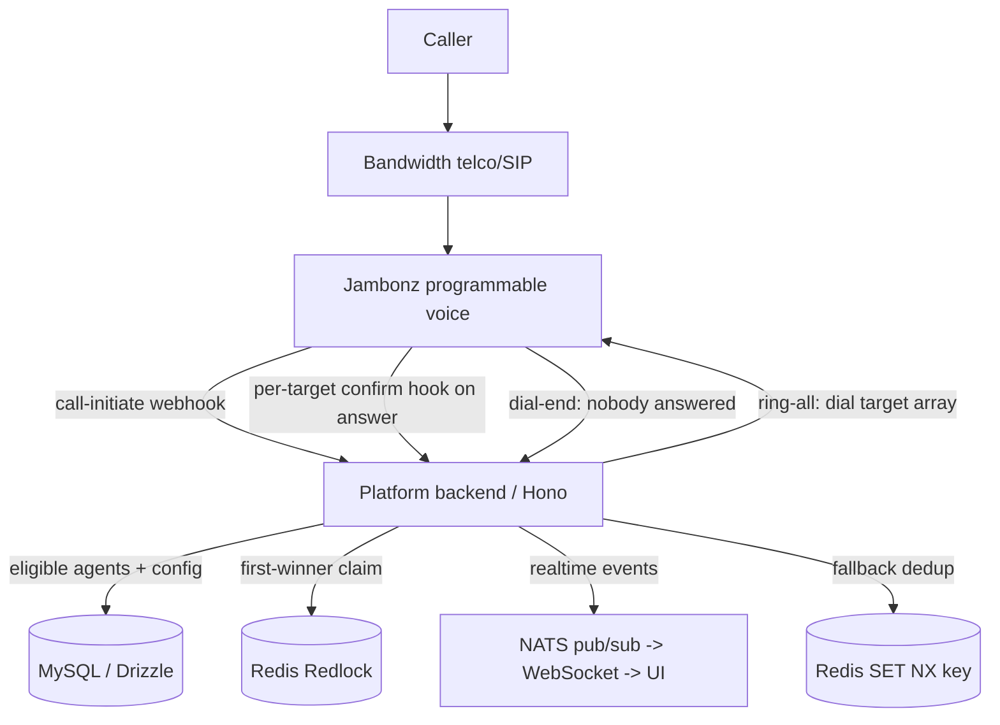
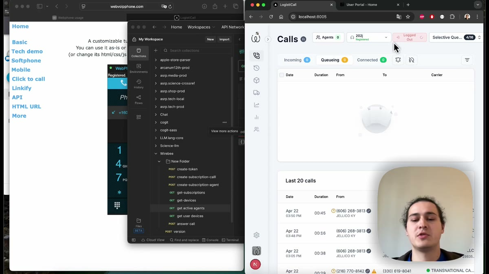

# In-House Ring-All Call Routing ("Smart Queue") / Собственная система маршрутизации вызовов Ring-All («Smart Queue»)

**Delivered by:** ASRP · **Role:** ASRP owned the call-routing subsystem end to end (design, implementation, roadmap) · **Engagement type:** Independent contractor · **Domain:** Cloud telephony for freight logistics

**Реализовано:** ASRP · **Роль:** ASRP полностью владела подсистемой маршрутизации вызовов (проектирование, реализация, roadmap) · **Тип сотрудничества:** независимый подрядчик · **Домен:** облачная телефония для грузовой логистики

---

## 1. Executive summary / Краткое резюме

**EN:**

ASRP designed and built an in-house **ring-all call-distribution system** — internally "Smart Queue" — for a cloud telephony platform serving freight logistics. When a call arrives on a routing-enabled number, the platform **rings every logged-in agent of the organization simultaneously**. The **first agent whose leg is answered claims the call**; all other legs are dropped, the caller and the winning agent are bridged, and if nobody answers a configurable fallback route fires.

The distinctive engineering property is **deterministic first-to-answer under a race**: two agents can answer within milliseconds of each other and exactly one wins, with no double-answer and no dropped caller. That reliability is the product of three mechanisms working together, not a single trick: every claim attempt is **serialized inside a Redis distributed lock (Redlock)**, so the first answer to acquire the lock wins and every later one is hung up cleanly; a **two-level feature gate** (organization and per-number) is **re-checked at three independent points** — call entry, claim, and fallback — so a mid-call configuration change can never strand a call on an inconsistent path; and the fallback route itself is made **idempotent** via a Redis deduplication key, so a retried or duplicate webhook can't route the same caller twice. §5 and §11 walk through each mechanism in full.

Smart Queue is a **pilot** — a candidate to replace the platform's incumbent external-PBX hunt-group. The core routing, claim, gating, presence, and fallback are built and exercised by an automated test suite; the primary hardening focus before a production cutover is answer-detection edge cases on outbound carrier routes (see §13–14). Notably, the current architecture is the *second* one ASRP built for this feature: an initial proof-of-concept was merged, then **fully reverted**, then rebuilt on a different design — the story in §8.

**RU:**

ASRP спроектировала и построила собственную систему распределения вызовов по принципу **ring-all** — внутреннее название «Smart Queue» — для облачной телефонной платформы, обслуживающей грузовую логистику. Когда звонок поступает на номер с включённой маршрутизацией, платформа **одновременно звонит всем залогиненным агентам организации**. **Первый агент, чья линия отвечает, забирает вызов**; все остальные линии сбрасываются, звонящий и агент-победитель соединяются, а если никто не отвечает — срабатывает настраиваемый резервный маршрут (fallback).

Отличительное инженерное свойство — **детерминированная гарантия «первый ответивший побеждает» при гонке**: два агента могут ответить с разницей в миллисекунды, и побеждает ровно один, без двойного ответа и без потери звонящего. Эта гарантия обеспечивается одним глаголом (verb) **Jambonz**[^jambonz-ru] `dial` с массивом `target[]`, хуком подтверждения (confirm hook) на каждую цель и распределённой блокировкой **Redis** (Redlock), которая сериализует захват вызова. Весь путь закрыт двумя независимыми feature-флагами и опирается на собственную базу данных MySQL платформы — это намеренно **полностью собственный (in-house)** механизм, а **не** внешняя hunt-group PBX или сторонний ACD.

Smart Queue — это **пилот**, кандидат на замену действующей hunt-group внешней PBX платформы. Основная логика маршрутизации, захвата вызова, гейтинга, присутствия (presence) и fallback построены и покрыты автоматизированным набором тестов; главный фокус доработки перед переходом в продакшн — граничные случаи детекции ответа на исходящих carrier-маршрутах (см. §13–14). Примечательно, что нынешняя архитектура — уже **вторая**, которую ASRP построила для этой функции: изначальный прототип (POC) был влит в основную ветку, затем **полностью откачен**, а затем перестроен по другой архитектуре — история в §8.

## 2. Business context & the problem / Бизнес-контекст и проблема

**EN:**

The platform routes inbound carrier calls to human agents, and it already had an in-house queue — a **first-generation, pull-model** one. A queued call was parked and surfaced to the whole organization in the platform UI; an available agent **clicked to claim** it, and the platform then dialed that agent and bridged the caller. It already leaned on a Redis lock so that if two agents clicked at nearly the same moment, exactly one won. That model worked for a team watching the screen, but it is fundamentally **reactive**: no phone rings on its own, so a call waits until a human notices it and clicks.

The business wanted the opposite ergonomics — **every available agent's phone ringing at once** the instant a call arrives, plus live presence and supervisor visibility over who is on a call and how each call was routed. That capability was first delivered by leaning on an **external cloud PBX** hunt-group. It gave the ring-and-route behavior, but it put the parts that matter most — queue behavior, agent presence, and which agent "got" the call — **outside** the platform, where they were hard to observe, extend, or reconcile with the platform's own real-time agent and supervisor UIs. Presence in the external PBX and presence in the platform UI became two sources of truth that could disagree.

The objective was to bring that ring-all behavior **back inside the platform** — a platform-native queue that:

- rings all available agents at once (minimal wait, no serial hunt down a list),
- lets the fastest agent win **deterministically**, with no double-answers,
- is driven by the platform's **own** database and agent-presence state (one source of truth),
- pushes real-time status to the agent and supervisor UIs, and
- falls back safely when no agent is available.

**RU:**

Платформа маршрутизирует входящие звонки перевозчиков на агентов-людей, и у неё уже была собственная очередь — **первого поколения, по модели pull**. Звонок в очереди «парковался» и показывался всей организации в UI платформы; свободный агент **кликал, чтобы забрать** его, и платформа затем набирала этого агента и соединяла звонящего. Эта модель уже опиралась на блокировку Redis, так что если два агента кликали почти одновременно, побеждал ровно один. Модель работала для команды, следящей за экраном, но она принципиально **реактивна**: телефон сам по себе не звонит, поэтому звонок ждёт, пока человек его заметит и кликнет.

Бизнесу была нужна противоположная эргономика — **чтобы телефоны всех свободных агентов звонили одновременно** в момент поступления вызова, плюс живое присутствие (presence) и видимость для супервайзера — кто на звонке и как каждый звонок был маршрутизирован. Эта возможность была впервые реализована за счёт **внешней облачной PBX** hunt-group. Она давала поведение «звони всем и маршрутизируй», но выносила самые важные части — поведение очереди, присутствие агентов и то, кто «получил» звонок — **за пределы** платформы, где их было трудно наблюдать, расширять или сверять с собственными real-time UI платформы для агентов и супервайзеров. Присутствие во внешней PBX и присутствие в UI платформы стали двумя источниками истины, которые могли расходиться.

Задача состояла в том, чтобы вернуть это поведение ring-all **внутрь платформы** — сделать очередь платформо-нативной, которая:

- одновременно звонит всем доступным агентам (минимальное ожидание, без последовательного обзвона по списку),
- позволяет самому быстрому агенту побеждать **детерминированно**, без двойных ответов,
- управляется **собственной** базой данных и состоянием присутствия агентов платформы (единый источник истины),
- пушит статус в реальном времени в UI агента и супервайзера, и
- безопасно уходит в fallback, когда ни один агент не доступен.

## 3. Why build it in-house (architecture rationale) / Почему строили in-house (обоснование архитектуры)

**EN:**

The obvious alternative was to keep leaning on the external PBX/ACD, or adopt another off-the-shelf contact-center product. ASRP's recommendation was to build the queue **inside** the platform, for concrete reasons rather than preference:

- **One source of truth for presence.** Agent login/logout already lived in the platform. An external hunt-group maintains its *own* presence, so the platform UI and the PBX drift out of sync. An in-house queue reads the same login state the UI shows.
- **Observability and control.** Every routing decision — who was eligible, who was rung, who won the race, why a fallback fired — is a structured event in the platform's own logs and database, not an opaque outcome from a third party.
- **The claim semantics are specific.** "Ring everyone, first *answer* wins, guarantee exactly one winner, drop the rest, fall back idempotently" is a precise contract. Owning the dial and the lock lets that contract be enforced and tested directly; delegating it to a PBX means inheriting whatever that PBX happens to do.
- **Extensibility.** Ring timeout, max agents, per-number enablement, custom messages, and future analytics are all reachable because the mechanism is code the team owns.

The tradeoff — accepted deliberately — is that the platform now owns hard telephony problems (simultaneous-answer races, answer supervision, fallback idempotency) that a PBX would have hidden. §8 and §14 are honest about where that bites.

**RU:**

Очевидной альтернативой было продолжать опираться на внешнюю PBX/ACD или взять готовый продукт контакт-центра. Рекомендация ASRP — строить очередь **внутри** платформы, и на это были конкретные причины, а не просто предпочтение:

- **Единый источник истины для присутствия.** Логин/логаут агента уже жили в платформе. Внешняя hunt-group ведёт *своё собственное* присутствие, из-за чего UI платформы и PBX расходятся. Собственная очередь читает то же состояние логина, что показывает UI.
- **Наблюдаемость и контроль.** Каждое решение по маршрутизации — кто был подходящим кандидатом, кому звонили, кто выиграл гонку, почему сработал fallback — это структурированное событие в собственных логах и базе данных платформы, а не непрозрачный результат от третьей стороны.
- **Семантика захвата вызова специфична.** «Позвонить всем, первый *ответ* побеждает, гарантированно ровно один победитель, остальных сбросить, fallback идемпотентно» — это точный контракт. Владение набором номера и блокировкой позволяет обеспечить и напрямую протестировать этот контракт; передача его PBX означает наследование того, что эта PBX делает по своему усмотрению.
- **Расширяемость.** Таймаут звонка, максимум агентов, включение по номеру, кастомные сообщения и будущая аналитика — всё это достижимо, потому что механизм является кодом, которым владеет команда.

Компромисс — принятый осознанно — в том, что теперь платформа сама владеет сложными телефонными проблемами (гонки при одновременном ответе, супервизия ответа, идемпотентность fallback), которые PBX бы скрыла. §8 и §14 честно говорят о том, где это создаёт трудности.

## 4. System architecture / Архитектура системы

**EN:**

The call spine is `Caller → Bandwidth (telco/SIP)[^bandwidth] → Jambonz (programmable voice) → platform backend`. The backend makes the routing decision per call and returns Jambonz verbs; Jambonz executes the ring-all dial and calls back into the backend at each decision point (answer, dial-end).

```
Caller ──▶ Bandwidth ──▶ Jambonz ──▶ Platform backend
                            │             │
                            │   routing decision (verbs)
                            ▼             ▼
                    ring-all dial   MySQL (agents, config,
                    target[A1..An]   call state) + Redis lock
                            │             │
                    first answered leg ──▶ claim (Redlock)
                            │
                    bridge Caller ↔ winning agent
                    (or → fallback route if nobody answers)
```

### Component roles



| Component | Responsibility |
| --- | --- |
| **Jambonz** | Primary voice engine. Executes ring-all as one `dial` verb with a `target[]` array; invokes a per-target confirmation hook when a leg answers; bridges the winning legs; drives fallback via the dial-end action hook. |
| **Bandwidth** | Telco / SIP carrier. Auxiliary hold-audio verbs (BXML) are also supported. |
| **Platform backend** (TypeScript, Hono web framework) | Routing decisions, eligibility, claim, fallback, feature gating, event broadcast. |
| **MySQL (Drizzle ORM)** | Agent presence, per-user/per-number routing config, live call state. |
| **Redis** | Distributed lock (Redlock) for the claim race; a separate key for fallback deduplication. |
| **NATS + WebSockets** | Real-time queue / claim / agent-status events to the agent and supervisor UIs. |

**RU:**

Хребет вызова: `Звонящий → Bandwidth (телефония/SIP)[^bandwidth-ru] → Jambonz (программируемая голосовая связь) → бэкенд платформы`. Бэкенд принимает решение о маршрутизации для каждого звонка и возвращает verbs Jambonz; Jambonz выполняет ring-all dial и обращается обратно в бэкенд в каждой точке принятия решения (ответ, конец набора).

```
Caller ──▶ Bandwidth ──▶ Jambonz ──▶ Platform backend
                            │             │
                            │   routing decision (verbs)
                            ▼             ▼
                    ring-all dial   MySQL (agents, config,
                    target[A1..An]   call state) + Redis lock
                            │             │
                    first answered leg ──▶ claim (Redlock)
                            │
                    bridge Caller ↔ winning agent
                    (or → fallback route if nobody answers)
```

### Роли компонентов


| Компонент | Ответственность |
| --- | --- |
| **Jambonz** | Основной голосовой движок. Выполняет ring-all как единый verb `dial` с массивом целей `target[]`; вызывает хук подтверждения для конкретной цели, когда линия отвечает; соединяет выигравшие линии; управляет fallback через action hook на конец набора. |
| **Bandwidth** | Телеком/SIP-оператор. Также поддерживаются вспомогательные verbs фоновой музыки (BXML). |
| **Бэкенд платформы** (TypeScript, веб-фреймворк Hono) | Решения по маршрутизации, право участия, захват вызова, fallback, feature-гейтинг, рассылка событий. |
| **MySQL (Drizzle ORM)** | Присутствие агентов, конфигурация маршрутизации по пользователю/номеру, состояние звонка в реальном времени. |
| **Redis** | Распределённая блокировка (Redlock) для гонки захвата; отдельный ключ для дедупликации fallback. |
| **NATS + WebSockets** | События очереди/захвата/статуса агента в реальном времени для UI агента и супервайзера. |

## 5. How the routing works / Как работает маршрутизация

**EN:**

Ring-all is a **single Jambonz `dial` verb with a `target[]` array** and a per-target `confirmHook`. Acceptance is **automatic on answer** via that hook, with no keypad step for the agent (see §8 for why). When an agent's leg answers, the backend acquires a **Redis Redlock** keyed to the call and, inside the lock, records the first answerer as the winner and bridges the caller to them; any later answer finds the call already claimed and its leg is cleanly hung up. That lock is what guarantees exactly one winner even when two agents answer within milliseconds of each other. If nobody answers within the ring timeout, a dial-end hook fires an **idempotent** fallback route (§11).

The full step-by-step flow — the fixed routing order, the gating checkpoints, eligibility selection, the per-target hook payload, the exact claim / bridge / hangup responses, and the call-sequence diagram — is maintained in ASRP's engineering reference. Deeper technical detail is available under NDA.

**RU:**

Ring-all — это **единый verb Jambonz `dial` с массивом `target[]`** и `confirmHook` на каждую цель. Подтверждение происходит **автоматически при ответе** через этот хук, без шага с нажатием клавиши для агента (почему — см. §8). Когда линия агента отвечает, бэкенд получает **Redis Redlock**, привязанный к звонку, и внутри блокировки фиксирует первого ответившего как победителя и соединяет звонящего с ним; любой последующий ответ обнаруживает, что звонок уже захвачен, и его линия аккуратно завершается. Именно эта блокировка гарантирует ровно одного победителя, даже если два агента отвечают с разницей в миллисекунды. Если никто не отвечает в течение таймаута звонка, хук конца набора запускает **идемпотентный** fallback-маршрут (§11).

Полный пошаговый поток — фиксированный порядок маршрутизации, контрольные точки гейтинга, отбор подходящих кандидатов, payload хука на цель, точные ответы захвата/соединения/сброса линии и диаграмма последовательности вызова — поддерживается в инженерном справочнике ASRP. Более глубокие технические детали доступны по NDA.

## 6. A sample call, in plain language / Пример звонка простыми словами

**EN:**

A carrier dials a broker's number that has Smart Queue enabled. Two agents — call them **Priya** and **Sam** — are both logged in and eligible.

1. The call lands. The backend checks the two feature flags, finds Priya and Sam eligible, marks the call "in smart queue", and tells Jambonz to ring **both** of their phones at once. Their UIs light up with the incoming call.
2. Both phones ring. Priya reaches for hers about **half a second** before Sam. She answers.
3. Priya's answered leg fires her confirm hook. The backend takes the lock on this call, sees it is unclaimed, and writes "Call claimed by Priya". It returns an empty response, and Jambonz bridges the caller straight to Priya. Her UI flips to "on call".
4. A beat later Sam answers too. **His** confirm hook fires — but the backend takes the lock, sees the call is *already* claimed by Priya, and returns a hangup. Sam's leg drops cleanly; his UI clears. He never hears dead air or talks over Priya.
5. The caller and Priya are now talking. From the caller's side it was one ring and a pickup — they never knew two phones rang.

If neither Priya nor Sam had answered within the ring timeout, the dial would end without a bridge, the fallback path would fire exactly once (guarded against duplicate webhooks), and the caller would be routed to the configured fallback destination — or hear a graceful "unable to connect" message if none is set.

> [](../../demos/pbx_combined_final/)
>
> **Demo.** The agent and supervisor screens that surface this ring-all behaviour are the **same frontend** built for the external-PBX integration and later re-pointed at this in-house engine rather than rebuilt (see the PBX-integration case study, §12). The narrated walkthrough of that shared UI — recorded on a dev environment with seeded, non-real data — is included in the portfolio and loads from the repo: [`demos/pbx_combined_final.mp4`](../../demos/pbx_combined_final/). A rougher production-style capture of a real inbound call routed through the in-house Smart Queue (shown with the live `smartQueue` backend routing logs) remains engagement evidence available under NDA. They sit within a broader engagement evidence archive — 20-plus screen and phone recordings, plus call transcripts and UI screenshots — all retained under NDA.

**RU:**

Перевозчик набирает номер брокера с включённым Smart Queue. Два агента — назовём их **Прия** и **Сэм** — оба залогинены и подходят.

1. Звонок поступает. Бэкенд проверяет два feature-флага, находит Прию и Сэма подходящими, помечает звонок как «в smart queue» и говорит Jambonz звонить **обоим** телефонам одновременно. Их UI загораются входящим звонком.
2. Оба телефона звонят. Прия тянется к своему телефону примерно на **полсекунды** раньше Сэма. Она отвечает.
3. Отвеченная линия Прии вызывает её хук подтверждения. Бэкенд берёт блокировку по этому звонку, видит, что он не захвачен, и записывает «Звонок захвачен Прией». Он возвращает пустой ответ, и Jambonz соединяет звонящего напрямую с Прией. Её UI переключается на «на звонке».
4. Чуть позже отвечает и Сэм. Срабатывает **его** хук подтверждения — но бэкенд берёт блокировку, видит, что звонок *уже* захвачен Прией, и возвращает команду сброса. Линия Сэма аккуратно обрывается; его UI очищается. Он никогда не слышит тишину и не говорит поверх Прии.
5. Звонящий и Прия теперь разговаривают. Со стороны звонящего это выглядело как один звонок и снятие трубки — они никогда не узнали, что звонило два телефона.

Если бы ни Прия, ни Сэм не ответили в течение таймаута звонка, набор завершился бы без соединения, fallback-путь сработал бы ровно один раз (защищённый от дублирующихся webhook'ов), и звонящий был бы направлен на настроенное резервное направление — либо услышал бы вежливое сообщение «не удаётся соединить», если оно не настроено.

> [](../../demos/pbx_combined_final/)
>
> **Демо.** Экраны агента и супервайзера, через которые проявляется это поведение ring-all, — это **тот же фронтенд**, что был построен для интеграции с внешней АТС и позже перенаправлен на этот in-house-движок, а не переписан заново (см. кейс pbx-integration, §12). Разбор этого общего UI с закадровым комментарием — записанный на dev-окружении с фейковыми (не реальными) данными — включён в портфолио и грузится прямо из репозитория: [`demos/pbx_combined_final.mp4`](../../demos/pbx_combined_final/). Более «сырая» боевая запись реального входящего звонка через собственный Smart Queue (с живыми backend-логами `smartQueue`) остаётся доказательством проекта под NDA. Они входят в более широкий архив доказательств проекта — 20+ экранных и телефонных записей, плюс транскрипты звонков и скриншоты UI, — хранящийся под NDA.

## 7. What ASRP built / Что построила ASRP

**EN:**

- A **ring-all dial mechanism** as Jambonz programmable-voice verbs: a single `dial` verb targeting an array of agent destinations, each with its own per-target confirm hook.
- A **first-to-answer claim** protected by a Redis Redlock, so exactly one agent leg wins and the rest are hung up.
- A **two-level feature gate** (organization flag + per-number flag) checked consistently at call entry, at claim time, and on the fallback path.
- **Agent presence**: database-backed login/logout with a self-service toggle for agents and a management view for supervisors, plus a login-history archive.
- **Real-time events** pushed to the UI over NATS pub/sub and WebSockets (queue initiated, call claimed, agent status).
- **Safe fallback**: an idempotent path that routes the caller to a configured fallback destination, or plays a graceful message if none is configured.
- **tRPC procedures** and UI toggles for agent login and supervisor agent management.

**RU:**

- **Механизм ring-all dial** как verbs программируемой голосовой связи Jambonz: единый verb `dial`, нацеленный на массив адресатов-агентов, каждый со своим хуком подтверждения.
- **Захват вызова «первый ответивший»**, защищённый Redis Redlock, так что ровно один агент побеждает, а остальные линии сбрасываются.
- **Двухуровневый feature-гейт** (флаг организации + флаг по номеру), проверяемый согласованно при входе звонка, при захвате и на пути fallback.
- **Присутствие агентов**: логин/логаут на основе базы данных с переключателем самообслуживания для агентов и представлением управления для супервайзеров, плюс архив истории логинов.
- **События в реальном времени**, отправляемые в UI через NATS pub/sub и WebSockets (очередь инициирована, звонок захвачен, статус агента).
- **Безопасный fallback**: идемпотентный путь, который направляет звонящего на настроенное резервное направление или проигрывает вежливое сообщение, если оно не настроено.
- **Процедуры tRPC** и переключатели UI для логина агента и управления агентами супервайзером.

## 8. Engineering story: the queue we shipped, killed, and rebuilt / Инженерная история: очередь, которую выпустили, убили и перестроили

**EN:**

The most instructive part of this project is that the architecture in §4–5 is **not** the first one that was built and merged.

**Problem.** Design a queue that rings agents and lets one of them take the call, deterministically.

**First attempt (POC, merged).** The initial proof-of-concept solved it with a **conference bridge plus an explicit "Press 1 to accept"**: rung agents joined a conference, and an agent pressed a key to confirm they were taking the call. It came with its own confirmation and outbound routes, a dedicated events table, a database migration, and a large (~2,400-line) design document. It was completed and **merged**.

**The pivot.** That entire merge was then **fully reverted** — the service, both confirmation routes, the outbound route, the migration, the events table, and the design doc were all removed in a single revert, and the codebase returned to having no Smart Queue at all. The reason was a delivery decision, not a technical dead-end: the same ring-all-and-route need was **already being met on the external-PBX path** built in parallel (§2), so rather than keep hardening a brand-new in-house voice mechanism, the team shipped on the PBX and **shelved** the in-house queue. It was set aside, not abandoned.

**Rebuild (current design).** The in-house approach was later **revived** and rebuilt from scratch on a deliberately different architecture: no conference bridge and **no keypad step**. Instead, a single `dial` with a `target[]` array, a per-target confirm hook, and a Redlock-serialized claim (§5). Acceptance became **automatic on answer** — the fastest pickup wins the lock — because forcing every agent to "Press 1" added friction to the fast path the queue exists to optimize. The data model was kept intentionally lean: the rebuild sat on top of the **first-generation pull queue's** existing config table and Redis-lock claim (§2), adding **zero new columns** to that table and introducing only the agent-login and login-history tables it genuinely needed.

**The honest twist.** Removing "Press 1" is the right call for agent UX, but it is exactly what makes answer supervision hard: without a human keypress, the system infers "a human answered" from the carrier's answer signal — and some routes signal "answered" before a person is actually on the line. That is the primary hardening item before production (§14). The team knows the discarded design would have side-stepped it, and still chose the better UX, which frames the remaining work precisely rather than pretending it away.

**RU:**

Самая поучительная часть этого проекта в том, что архитектура из §4–5 — это **не** первая архитектура, которая была построена и влита в основную ветку.

**Проблема.** Спроектировать очередь, которая звонит агентам и позволяет одному из них принять звонок детерминированно.

**Первая попытка (POC, влита).** Изначальный прототип решал это через **конференц-мост плюс явное «Нажмите 1, чтобы принять»**: вызываемые агенты присоединялись к конференции, и агент нажимал клавишу, чтобы подтвердить, что он берёт звонок. Он поставлялся со своими собственными маршрутами подтверждения и исходящими маршрутами, отдельной таблицей событий, миграцией базы данных и большим (~2400 строк) проектным документом. Он был завершён и **влит в основную ветку**.

**Разворот.** Весь этот merge был затем **полностью откачен** — сервис, оба маршрута подтверждения, исходящий маршрут, миграция, таблица событий и проектный документ были удалены одним ревертом, и кодовая база вернулась к состоянию без какого-либо Smart Queue. Причина была решением по срокам поставки, а не техническим тупиком: та же потребность в ring-all-и-маршрутизации уже **удовлетворялась на пути внешней PBX**, построенном параллельно (§2), поэтому вместо продолжения доработки совершенно нового собственного голосового механизма команда выпустила решение на PBX и **отложила** собственную очередь. Её отложили, а не забросили.

**Перестройка (текущая архитектура).** Собственный подход был позже **возрождён** и перестроен с нуля по намеренно другой архитектуре: без конференц-моста и **без шага с клавиатурой**. Вместо этого — единый `dial` с массивом `target[]`, хук подтверждения на каждую цель и захват, сериализованный через Redlock (§5). Подтверждение стало **автоматическим при ответе** — самый быстрый ответ забирает блокировку — потому что принуждение каждого агента «нажать 1» добавляло трение на быстром пути, который очередь и призвана оптимизировать. Модель данных сохранили намеренно скромной: перестройка легла поверх существующей таблицы конфигурации **pull-очереди первого поколения** и её захвата через блокировку Redis (§2), добавив **ноль новых колонок** в эту таблицу и введя только таблицы логина агента и истории логинов, которые действительно были нужны.

**Честный поворот.** Убрать «Нажмите 1» — правильное решение для UX агента, но именно это и делает супервизию ответа сложной: без нажатия клавиши человеком система выводит «человек ответил» из сигнала ответа оператора связи — а некоторые маршруты сигнализируют «отвечено» до того, как человек реально взял трубку. Это главный пункт доработки перед продакшном (§14). Команда знает, что отброшенная конструкция обошла бы эту проблему стороной, и всё равно выбрала лучший UX, что точно формулирует оставшуюся работу, а не делает вид, что её нет.

## 9. Technology stack / Технологический стек

**EN:**

| Layer | Technology |
| --- | --- |
| Programmable voice / media | **Jambonz** (ring-all `dial` with `target[]`, per-target confirm hook, dial-end action hook) |
| Telco / SIP | **Bandwidth** (also used for auxiliary BXML hold audio) |
| Backend | **TypeScript** on the **Hono** web framework, running on the **Bun** runtime |
| Persistence | **MySQL** via the **Drizzle ORM** |
| Distributed coordination | **Redis** — Redlock for the claim race; a `SET NX` key for fallback dedup |
| Realtime | **NATS** pub/sub → WebSocket server → agent / supervisor UI |
| API surface to UI | **tRPC** procedures (status, login toggle, supervisor agent management) |

**On the database:** **MySQL**, accessed through the **Drizzle ORM** in TypeScript from a shared schema package. The platform runs a **dual connection strategy** selected by environment — **PlanetScale's serverless driver** against MySQL in production, and the **`mysql2`** driver against a local MySQL (MySQL 9) for development — both using the same Drizzle schema, with reads directable at a replica connection.

**RU:**

| Слой | Технология |
| --- | --- |
| Программируемая голосовая связь / медиа | **Jambonz** (ring-all `dial` с `target[]`, хук подтверждения на цель, action hook на конец набора) |
| Телефония / SIP | **Bandwidth** (также используется для вспомогательного BXML hold-audio) |
| Бэкенд | **TypeScript** на веб-фреймворке **Hono**, работающий на рантайме **Bun** |
| Хранение данных | **MySQL** через **Drizzle ORM** |
| Распределённая координация | **Redis** — Redlock для гонки захвата; ключ `SET NX` для дедупликации fallback |
| Реальное время | **NATS** pub/sub → сервер WebSocket → UI агента/супервайзера |
| API-поверхность для UI | Процедуры **tRPC** (статус, переключатель логина, управление агентами супервайзером) |

**О базе данных:** **MySQL**, доступ через **Drizzle ORM** на TypeScript из общего пакета схемы. Платформа использует **стратегию с двумя видами подключения**, выбираемую по окружению — **serverless-драйвер PlanetScale** к MySQL в продакшне и драйвер **`mysql2`** к локальной MySQL (MySQL 9) для разработки — оба используют одну и ту же схему Drizzle, при этом чтения можно направлять на реплику.

## 10. Data model / Модель данных

**EN:**

The feature is backed by the platform's relational MySQL schema (Drizzle ORM). Its defining trait is restraint: the rebuild **reused the first-generation pull queue's per-agent routing-config table without adding any columns**, and introduced only the tables it genuinely needed — **agent login state** (who is currently logged in and therefore eligible to be rung) and a **login-history archive** (the live row is moved here on logout). A per-number enablement flag lives on the phone-number configuration, and the platform's central call-state table carries the routing fields this feature populates (status, claimed user, bridged leg id + answer time, a claimable flag, a queue-hold timestamp). Per-organization and per-number configuration is stored as **JSON, not columns**.

The full table-by-table schema — keys, indexes, and the JSON configuration shape — is maintained in ASRP's engineering reference. Deeper technical detail is available under NDA.

**RU:**

Функция опирается на реляционную схему MySQL платформы (Drizzle ORM). Её отличительная черта — сдержанность: перестройка **переиспользовала таблицу конфигурации маршрутизации по агенту из pull-очереди первого поколения без добавления каких-либо колонок** и ввела только те таблицы, которые действительно были нужны — **состояние логина агента** (кто сейчас залогинен и, следовательно, подходит для вызова) и **архив истории логинов** (живая строка переносится сюда при логауте). Флаг включения по номеру живёт в конфигурации телефонного номера, а центральная таблица состояния звонка платформы несёт поля маршрутизации, которые заполняет эта функция (статус, захвативший пользователь, id соединённой линии + время ответа, флаг возможности захвата, отметка времени постановки в очередь). Конфигурация по организации и по номеру хранится как **JSON, а не колонки**.

Полная таблица-за-таблицей схема — ключи, индексы и форма JSON-конфигурации — поддерживается в инженерном справочнике ASRP. Более глубокие технические детали доступны по NDA.

## 11. Reliability & operations / Надёжность и эксплуатация

**EN:**

- **Two-level feature gate, enforced everywhere.** Both an organization flag and a per-number flag must be true, and the gate is re-checked at three independent points — call entry, claim confirm, and fallback — so a mid-call configuration change cannot strand a call on an inconsistent path. Rejections are logged with a clear reason.
- **Deterministic claim under race.** A Redis Redlock keyed to the call serializes concurrent answers; the "already claimed" check inside the lock makes a second winner impossible. Losing legs are cleanly hung up.
- **Idempotent fallback.** The fallback path is guarded by a Redis `SET NX` key (2-hour TTL) so duplicate or retried dial-end webhooks route the caller at most once. With no fallback destination configured, the caller hears a graceful message rather than dead air, and the missing route is logged.
- **Graceful "no agents" behavior.** A call can be marked claimable even when no agent is logged in, allowing a manual claim from the UI instead of a hard failure.
- **Structured lifecycle logging.** Every stage emits a structured event (dial initiation, dial initiated, confirm accepted/rejected, claimed, fallback routing/skipped, unable-to-connect, caller-hangup cleanup) for traceability.

**RU:**

- **Двухуровневый feature-гейт, применяемый повсеместно.** И флаг организации, и флаг по номеру должны быть истинными, и гейт перепроверяется в трёх независимых точках — при входе звонка, при подтверждении захвата и при fallback — так что изменение конфигурации в середине звонка не может «застрять» звонок на несогласованном пути. Отказы логируются с чёткой причиной.
- **Детерминированный захват при гонке.** Redis Redlock, привязанный к звонку, сериализует конкурирующие ответы; проверка «уже захвачено» внутри блокировки делает второго победителя невозможным. Проигравшие линии аккуратно сбрасываются.
- **Идемпотентный fallback.** Путь fallback защищён ключом Redis `SET NX` (TTL 2 часа), так что дублирующиеся или повторные webhook'и конца набора маршрутизируют звонящего максимум один раз. Если резервное направление не настроено, звонящий слышит вежливое сообщение вместо тишины, а отсутствующий маршрут логируется.
- **Изящное поведение при отсутствии агентов.** Звонок может быть помечен как доступный для захвата, даже если ни один агент не залогинен, что позволяет ручной захват из UI вместо жёсткого отказа.
- **Структурированное логирование жизненного цикла.** Каждый этап генерирует структурированное событие (инициация набора, набор инициирован, подтверждение принято/отклонено, захвачено, маршрутизация fallback/пропущена, не удалось соединить, очистка при обрыве звонящим) для трассируемости.

## 12. Design parameters / Параметры конфигурации

**EN:**

The routing behavior is driven by explicit, **configurable** parameters rather than hard-coded constants — the number of agents rung per call, the ring timeout, the claim-lock lease, and the fallback-deduplication window are all tunable per organization or per number, with sensible defaults. These are configuration defaults verified against the delivered source, **not** measured performance figures — no real-traffic metrics have been captured yet (see §13). The exact default values are recorded in ASRP's engineering reference (available under NDA).

**RU:**

Поведение маршрутизации управляется явными, **настраиваемыми** параметрами, а не жёстко заданными константами — количество агентов, которым звонят на звонок, таймаут звонка, срок аренды блокировки захвата и окно дедупликации fallback — всё это настраивается по организации или по номеру, с разумными значениями по умолчанию. Это конфигурационные значения по умолчанию, проверенные по исходникам поставки, а **не** измеренные показатели производительности — реальных метрик на живом трафике пока не собрано (см. §13). Точные значения по умолчанию зафиксированы в инженерном справочнике ASRP (доступен по NDA).

## 13. Results & outcome / Результаты и итоги

**EN:**

The ring-all path, first-answer claim, feature gate, agent presence (login/logout/history), realtime events, and fallback are all implemented and exercised by an automated test suite. The suite covers the scenarios that matter: no logged-in agents → hold for a manual claim; one agent → claim via the confirm hook; two agents racing → exactly one wins the lock; dial failure → fallback; caller hangup while ringing → clean cleanup with no claim or fallback.

Smart Queue is positioned as a **pilot and a candidate to replace the incumbent external-PBX hunt-group**. As of the engagement it had **not** been measured on production call volume, so this page makes no claims about time-to-answer, drop rate, or utilization against the old queue — those numbers do not exist yet, and we would rather say so than invent them.

**RU:**

Путь ring-all, захват первым ответом, feature-гейт, присутствие агентов (логин/логаут/история), события реального времени и fallback — всё реализовано и покрыто автоматизированным набором тестов. Набор охватывает значимые сценарии: нет залогиненных агентов → удержание для ручного захвата; один агент → захват через хук подтверждения; два агента в гонке → побеждает ровно один; сбой набора → fallback; звонящий обрывает звонок во время дозвона → чистая очистка без захвата и без fallback.

Smart Queue позиционируется как **пилот и кандидат на замену действующей hunt-group внешней PBX**. На момент проекта она **не** была измерена на продакшн-объёме звонков, поэтому эта страница не делает заявлений о времени до ответа, доле сброшенных звонков или загрузке агентов по сравнению со старой очередью — этих цифр пока не существует, и лучше сказать об этом прямо, чем их выдумывать.

## 14. Maturity & roadmap / Зрелость и roadmap

**EN:**

Honest split of what is shipped versus designed:

**LIVE / built and tested (behind the feature gate):** ring-all dial, deterministic first-answer claim under the Redlock, the two-level feature gate, database-backed agent presence (login/logout/history), realtime queue/claim/status events, idempotent fallback, and the manual-claim path when no agent is logged in. All covered by the automated suite.

**Primary hardening focus before a production cutover:** **answer-detection edge cases** on outbound carrier/PBX routes. Because acceptance is automatic on answer (no keypad — see §8), the "connected" transition must correspond to a *real human* answer on every route type; making that robust across carrier and PBX routes is the main item standing between pilot and production.
**Designed / roadmap (next increments):**
- **Configuration UI** — enablement, group assignment, ring timeout, max agents, and fallback are database/JSON-driven today; a self-service admin UI is the natural next step.
- **Durable queue-event history** — a dedicated event store (attempted targets, ring/no-answer/busy outcomes, claim races, answer-rate metrics) to unlock analytics and observability dashboards beyond today's structured logs.
- **Supervisor / device parity** — device selector, registration status, last-selected device, and per-device on-call presence, to reach full parity with the incumbent external queue.
- **State-progression refinement** — richer lifecycle progression surfaced to the UI (incoming → waiting → connected → completed) across all hangup and fallback permutations.

**RU:**

Честное разделение того, что уже выпущено, и того, что только спроектировано:

**LIVE / построено и протестировано (за feature-гейтом):** ring-all dial, детерминированный захват первым ответом под Redlock, двухуровневый feature-гейт, присутствие агентов на основе базы данных (логин/логаут/история), события очереди/захвата/статуса в реальном времени, идемпотентный fallback и путь ручного захвата, когда ни один агент не залогинен. Всё покрыто автоматизированным набором тестов.

**Главный фокус доработки перед переходом в продакшн:** **граничные случаи детекции ответа** на исходящих carrier/PBX-маршрутах. Поскольку подтверждение автоматическое при ответе (без клавиатуры — см. §8), переход в состояние «соединено» должен соответствовать *реальному* ответу человека на каждом типе маршрута; сделать это надёжным на всех carrier- и PBX-маршрутах — главный пункт, отделяющий пилот от продакшна.
**Спроектировано / roadmap (следующие шаги):**
- **UI конфигурации** — включение, назначение групп, таймаут звонка, максимум агентов и fallback сегодня управляются через базу данных/JSON; UI самообслуживания для администраторов — естественный следующий шаг.
- **Устойчивая история событий очереди** — выделенное хранилище событий (попытавшиеся цели, результаты звонка/неответа/занято, гонки захвата, метрики доли ответов) для аналитики и дашбордов наблюдаемости за пределами сегодняшнего структурированного логирования.
- **Паритет по супервайзерам / устройствам** — селектор устройства, статус регистрации, последнее выбранное устройство и присутствие «на звонке» по устройству, чтобы достичь полного паритета с действующей внешней очередью.
- **Доработка прогрессии состояний** — более детальная прогрессия жизненного цикла, отображаемая в UI (входящий → ожидание → соединено → завершено) для всех вариантов обрыва звонка и fallback.

## 15. What ASRP delivered / Что реализовала ASRP

**EN:**

ASRP owned the **entire Smart Queue subsystem** on top of the platform's existing call model — the ring-all verbs, eligibility queries, claim service, feature gate, agent-login schema and CRUD, realtime events, tRPC procedures, and UI toggles.

- Designed and implemented the in-house **ring-all routing** (single Jambonz `dial` with a `target[]` array + per-target confirm hook).
- Built the **first-to-answer claim** with a Redis Redlock and an **idempotent fallback** (Redis `SET NX`).
- Authored the **two-level feature gate** (organization + per-number flags), enforced at entry, claim, and fallback.
- Designed the **agent-presence data model** (login state + history archive) and its CRUD, plus the eligibility query joining groups, per-agent routing config, and login state.
- Implemented **real-time WebSocket/NATS events** and the **tRPC procedures** and **UI toggles** for agent self-login and supervisor management.
- Owned the full **POC → revert → rebuild** lifecycle, including the deliberate redesign away from the conference-bridge / keypad-confirm prototype toward the lock-based automatic-claim model (§8).
- Wrote the **automated test suite** covering the core routing scenarios.

**RU:**

ASRP владела **всей подсистемой Smart Queue** поверх существующей модели звонков платформы — verbs ring-all, запросы на право участия, сервис захвата, feature-гейт, схему и CRUD логина агента, события реального времени, процедуры tRPC и переключатели UI.

- Спроектировала и реализовала собственную **маршрутизацию ring-all** (единый Jambonz `dial` с массивом `target[]` + хук подтверждения на цель).
- Построила **захват «первый ответивший»** с Redis Redlock и **идемпотентный fallback** (Redis `SET NX`).
- Разработала **двухуровневый feature-гейт** (флаги организации + по номеру), применяемый при входе, захвате и fallback.
- Спроектировала **модель данных присутствия агента** (состояние логина + архив истории) и её CRUD, а также запрос на право участия, соединяющий группы, конфигурацию маршрутизации по агенту и состояние логина.
- Реализовала **события WebSocket/NATS в реальном времени**, а также **процедуры tRPC** и **переключатели UI** для самостоятельного логина агента и управления супервайзером.
- Владела полным жизненным циклом **POC → откат → перестройка**, включая осознанный редизайн от прототипа с конференц-мостом/подтверждением клавиатурой к модели автоматического захвата на блокировке (§8).
- Написала **автоматизированный набор тестов**, покрывающий основные сценарии маршрутизации.

## 16. FAQ (for client conversations) / FAQ (для разговоров с клиентами)

**EN:**

**Q: Is this an external PBX or a third-party ACD?**
No — it is a fully in-house queue built on Jambonz verbs plus the platform's own database and Redis. It was specifically built to bring queue logic, agent presence, and claim behavior inside the platform rather than delegating them to an external PBX hunt-group.

**Q: Does the agent press a key to accept the call?**
No. All logged-in agents ring simultaneously and acceptance is automatic on answer via a per-target confirm hook. The fastest answer wins. An earlier prototype used "Press 1 to accept"; it was reverted and the mechanism was rebuilt without a keypad step (§8).

**Q: What stops two agents from both getting the same call?**
A Redis distributed lock (Redlock) keyed to the call. The first answered leg claims it inside the lock; any later leg finds the call already claimed and is hung up. Exactly one winner, deterministically.

**Q: What happens if no agent answers?**
An idempotent fallback path routes the caller to a configured fallback destination; if none is configured, the caller hears a graceful "unable to connect" message. Duplicate or retried webhooks cannot double-route.

**Q: How do you turn it on or off?**
Two independent flags — one at the organization level and one per phone number. Both must be enabled, and the gate is re-checked at call entry, at claim, and at fallback.

**Q: What database did you use?**
MySQL via the Drizzle ORM in TypeScript. Production uses PlanetScale's serverless driver; local development uses the `mysql2` driver against MySQL. Redis backs the claim lock and fallback deduplication.

**Q: Is it in production?**
It is a pilot — a candidate to replace the incumbent external-PBX hunt-group — with answer-detection hardening as the main item before a production cutover. No real-traffic metrics have been captured yet (§13).

**Q: How is it tested?**
An automated suite covers the key scenarios: no logged-in agents (hold for manual claim), one agent (claim via confirm hook), two agents racing (exactly one wins the lock), dial failure (fallback), and caller hangup while ringing (clean cleanup).

**RU:**

**В: Это внешняя PBX или сторонний ACD?**
Нет — это полностью собственная очередь, построенная на verbs Jambonz плюс собственной базе данных платформы и Redis. Она была построена специально для того, чтобы перенести логику очереди, присутствие агентов и поведение захвата внутрь платформы, а не делегировать их внешней hunt-group PBX.

**В: Агент нажимает клавишу, чтобы принять звонок?**
Нет. Все залогиненные агенты звонят одновременно, а подтверждение происходит автоматически при ответе через хук подтверждения на цель. Побеждает самый быстрый ответ. Более ранний прототип использовал «Нажмите 1, чтобы принять»; он был откачен, и механизм был перестроен без шага с клавиатурой (§8).

**В: Что не даёт двум агентам получить один и тот же звонок?**
Распределённая блокировка Redis (Redlock), привязанная к звонку. Первая ответившая линия захватывает его внутри блокировки; любая более поздняя линия обнаруживает, что звонок уже захвачен, и сбрасывается. Ровно один победитель, детерминированно.

**В: Что происходит, если ни один агент не отвечает?**
Идемпотентный путь fallback направляет звонящего на настроенное резервное направление; если оно не настроено, звонящий слышит вежливое сообщение «не удаётся соединить». Дублирующиеся или повторные webhook'и не могут маршрутизировать дважды.

**В: Как включить или выключить это?**
Два независимых флага — один на уровне организации и один по номеру телефона. Оба должны быть включены, и гейт перепроверяется при входе звонка, при захвате и при fallback.

**В: Какую базу данных вы использовали?**
MySQL через Drizzle ORM на TypeScript. Продакшн использует serverless-драйвер PlanetScale; локальная разработка использует драйвер `mysql2` к MySQL. Redis обеспечивает блокировку захвата и дедупликацию fallback.

**В: Это в продакшне?**
Это пилот — кандидат на замену действующей hunt-group внешней PBX — с доработкой детекции ответа как главным пунктом перед переходом в продакшн. Реальных метрик трафика пока не собрано (§13).

**В: Как это тестируется?**
Автоматизированный набор покрывает ключевые сценарии: нет залогиненных агентов (удержание для ручного захвата), один агент (захват через хук подтверждения), два агента в гонке (побеждает ровно один), сбой набора (fallback) и обрыв звонящим во время дозвона (чистая очистка).

---

**EN:**

*Case study prepared by ASRP, describing work delivered for WireBee. Proprietary source paths, internal identifiers, and unresolved-defect / risk-register content are omitted; deeper technical detail is available on request.*

**RU:**

*Описание проекта, подготовленное ASRP; описывает работу, выполненную для WireBee. Проприетарные пути в исходном коде, внутренние идентификаторы и содержание нерешённых дефектов/реестра рисков опущены; более глубокие технические детали — по запросу.*

---

[^jambonz]: **Jambonz** — an open-source programmable-voice / CPaaS platform that bridges telephony (SIP/PSTN carriers) to applications, acting as the media gateway between the phone network and the backend. <https://jambonz.org>

[^bandwidth]: **Bandwidth** — a US communications carrier / CPaaS providing SIP trunking and PSTN connectivity (phone numbers and voice) — the telco layer that carries the actual phone call. <https://www.bandwidth.com>

[^jambonz-ru]: **Jambonz** — платформа программируемой голосовой связи / CPaaS с открытым исходным кодом, которая связывает телефонию (SIP/PSTN операторов) с приложениями, выступая в роли медиа-шлюза между телефонной сетью и бэкендом. <https://jambonz.org>

[^bandwidth-ru]: **Bandwidth** — американский оператор связи / CPaaS-провайдер, предоставляющий SIP-транкинг и подключение к PSTN (телефонные номера и голос) — телеком-слой, который непосредственно переносит телефонный звонок. <https://www.bandwidth.com>